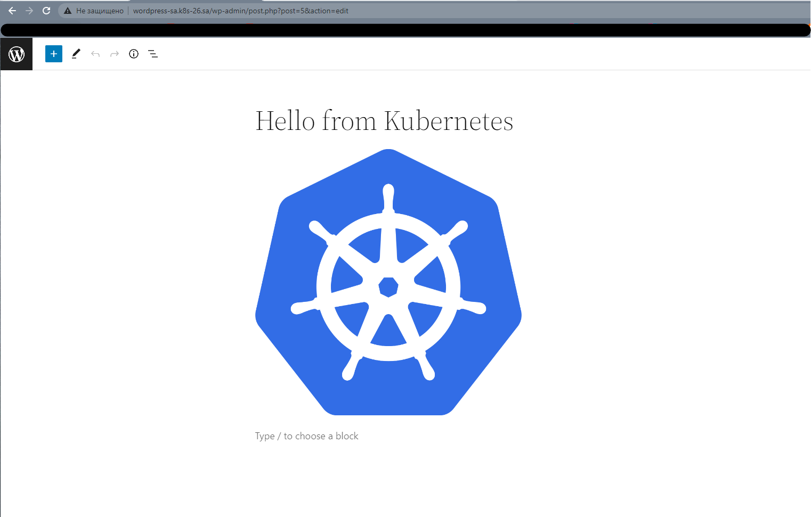
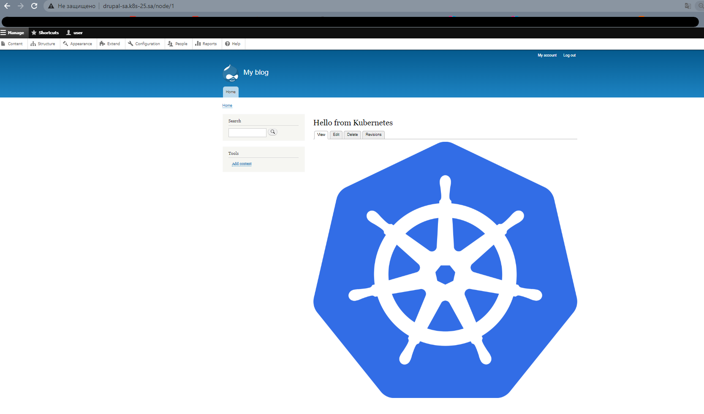

## Print-screen of wordpress :
<br>

## Print-screen of drupal :
<br>


## History of helm run commands :

```
1 helm repo add bitnami https://charts.bitnami.com/bitnami
2 helm repo add nfs-subdir-external-provisioner https://kubernetes-sigs.github.io/ nfs-subdir-external-provisioner
3 helm repo update
4 helm install nfs-subdir-external-provisioner nfs-subdir-external-provisioner/nfs-subdir-external-provisioner --set nfs.server=192.168.37.105 --set nfs.path=/mnt/IT-Academy/nfs-data/sa2-20-22/Nikolai_Kunai
5 helm install my-wordpress --set global.storageClass=nfs-client wordpressUsername=admin bitnami/wordpress
6 helm install my-drupal  --set global.storageClass=nfs-client,drupal.username=admin bitnami/drupal
```