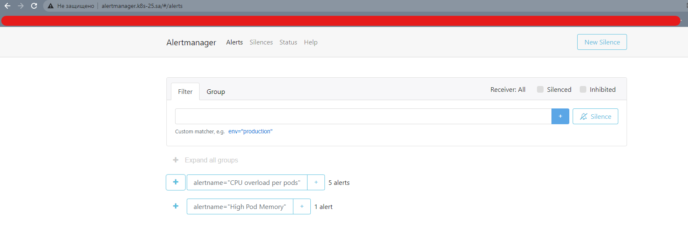
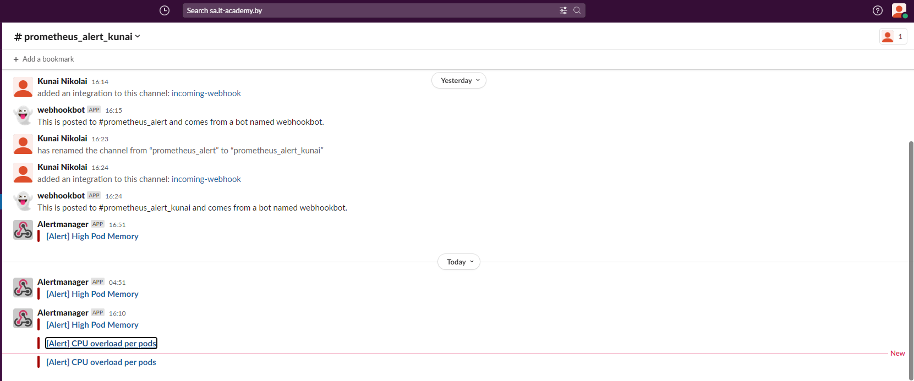
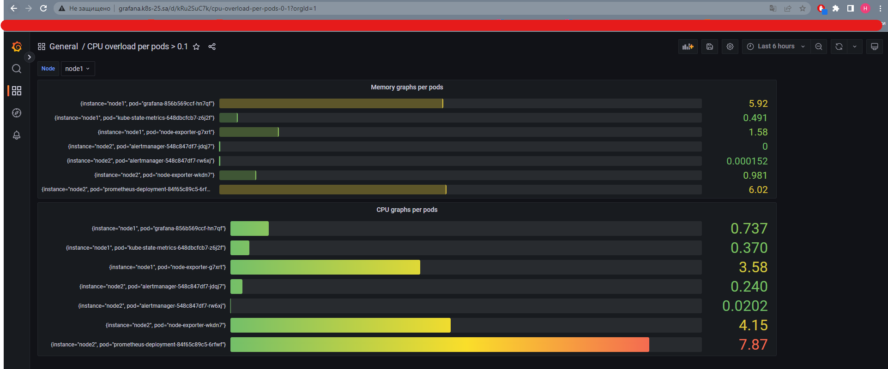

# 15. Technical and service monitoring

## Prometheus web UI:
<br>

## Alert manager web UI:
<br>

## Slack notification for Alert manager:
<br>

## Dashboard with CPU and memory graphs per pods:
```
sum(rate(container_memory_usage_bytes{name!="",namespace="monitoring"}[3m])) BY (instance, pod) / 1024 / 1024
sum(rate(container_cpu_usage_seconds_total{name!="",namespace="monitoring"}[3m])) BY (instance, pod) * 100
```

<br>

