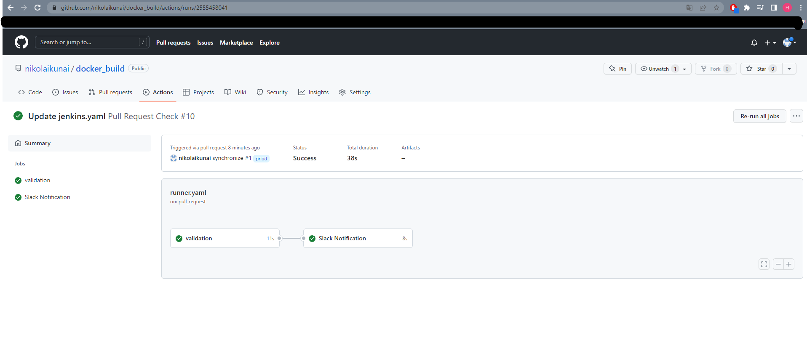
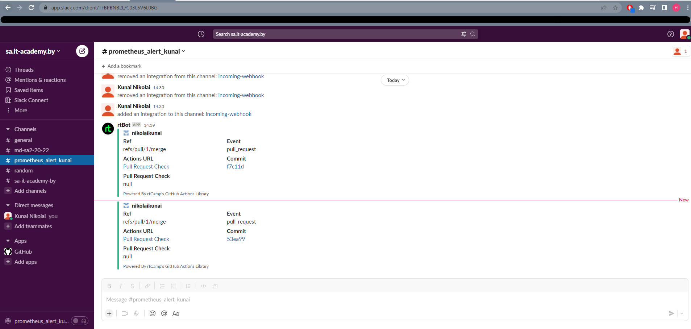

## CI for testing Kubernetes manifests

```
name: Pull Request Check

on: [pull_request]

jobs:
  validation:
    runs-on: self-hosted
    steps:
    - uses: actions/checkout@master
    - name: test manifests folder
      uses: instrumenta/kubeval-action@master
      with: 
       files: ./manifests
  slackNotification:
    needs: validation
    name: Slack Notification
    runs-on: ubuntu-latest
    steps:
    - uses: actions/checkout@v2
    - name: Slack Notification
      uses: rtCamp/action-slack-notify@v2
      env:
        SLACK_COLOR: ${{ job.status }}
        SLACK_TITLE: Pull Request Check
        SLACK_WEBHOOK: ${{ secrets.SLACK_WEBHOOK }}
```

## Screen of github actions:
<br>


## Screen of alerts:
<br>
<br>
<br>
<br>
<br>
<br>
<br>
<br>
<br>

## Logs files of each tasks are located in the corresponding folders.