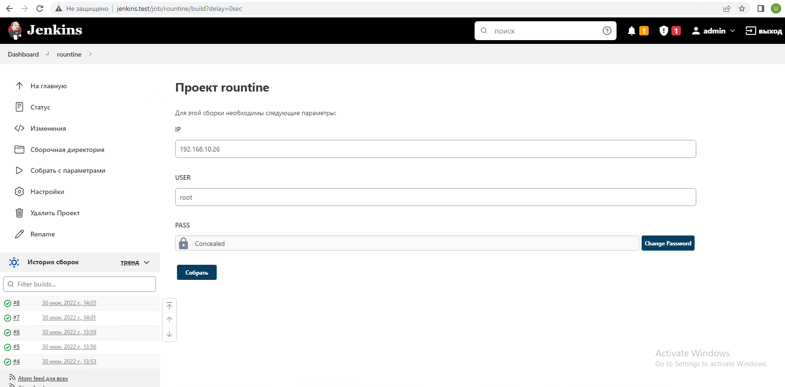

# 19.Jenkins.Routine

## Output Jenkins task: 

```
Started by user admin
Running as SYSTEM
Building in workspace /var/lib/jenkins/workspace/rountine
[rountine] $ /bin/bash /tmp/jenkins327067850716042661.sh
-----------CHECKING PING  CONNECTION  TO THE HOST-----------
PING 192.168.10.26 (192.168.10.26) 56(84) bytes of data.
64 bytes from 192.168.10.26: icmp_seq=1 ttl=64 time=0.398 ms
64 bytes from 192.168.10.26: icmp_seq=2 ttl=64 time=0.300 ms
64 bytes from 192.168.10.26: icmp_seq=3 ttl=64 time=0.492 ms
64 bytes from 192.168.10.26: icmp_seq=4 ttl=64 time=0.321 ms

--- 192.168.10.26 ping statistics ---
4 packets transmitted, 4 received, 0% packet loss, time 3061ms
rtt min/avg/max/mdev = 0.300/0.377/0.492/0.075 ms
-----------CHECKING SSH CONNECTION TO THE HOST-----------
host is accessible via SSH
-----------INSTALL NMAP-----------
E: Invalid operation udpdate
Reading package lists...
Building dependency tree...
Reading state information...
The following packages were automatically installed and are no longer required:
  geoip-database libgeoip1 libhiredis0.14 libluajit-5.1-2 libluajit-5.1-common
Use 'sudo apt autoremove' to remove them.
Suggested packages:
  ncat ndiff zenmap
The following NEW packages will be installed:
  nmap
0 upgraded, 1 newly installed, 0 to remove and 85 not upgraded.
debconf: unable to initialize frontend: Dialog
debconf: (Dialog frontend will not work on a dumb terminal, an emacs shell buffer, or without a controlling terminal.)
debconf: falling back to frontend: Readline
debconf: unable to initialize frontend: Readline
debconf: (This frontend requires a controlling tty.)
debconf: falling back to frontend: Teletype
dpkg-preconfigure: unable to re-open stdin: 
Need to get 0 B/1,662 kB of archives.
After this operation, 4,499 kB of additional disk space will be used.
Selecting previously unselected package nmap.
(Reading database ... 
(Reading database ... 5%
(Reading database ... 10%
(Reading database ... 15%
(Reading database ... 20%
(Reading database ... 25%
(Reading database ... 30%
(Reading database ... 35%
(Reading database ... 40%
(Reading database ... 45%
(Reading database ... 50%
(Reading database ... 55%
(Reading database ... 60%
(Reading database ... 65%
(Reading database ... 70%
(Reading database ... 75%
(Reading database ... 80%
(Reading database ... 85%
(Reading database ... 90%
(Reading database ... 95%
(Reading database ... 100%
(Reading database ... 183830 files and directories currently installed.)
Preparing to unpack .../nmap_7.80+dfsg1-2build1_amd64.deb ...
Unpacking nmap (7.80+dfsg1-2build1) ...
Setting up nmap (7.80+dfsg1-2build1) ...
Processing triggers for man-db (2.9.1-1) ...
Nmap version 7.80 ( https://nmap.org )
Platform: x86_64-pc-linux-gnu
Compiled with: liblua-5.3.3 openssl-1.1.1d nmap-libssh2-1.8.2 libz-1.2.11 libpcre-8.39 libpcap-1.9.1 nmap-libdnet-1.12 ipv6
Compiled without:
Available nsock engines: epoll poll select
-----------CHECKS ONLINE HOSTS IN NETWORK-----------
Starting Nmap 7.80 ( https://nmap.org ) at 2022-06-30 14:10 UTC
Nmap scan report for 192.168.10.22
Host is up (0.0014s latency).
Nmap scan report for 192.168.10.23
Host is up (0.077s latency).
Nmap scan report for 192.168.10.24
Host is up (0.0020s latency).
Nmap scan report for 192.168.10.25
Host is up (0.0014s latency).
Nmap scan report for 192.168.10.26
Host is up (0.0011s latency).
Nmap scan report for 192.168.10.28
Host is up (0.0014s latency).
Nmap scan report for 192.168.10.29
Host is up (0.0014s latency).
Nmap scan report for 192.168.10.34
Host is up (0.0016s latency).
Nmap scan report for 192.168.10.35
Host is up (0.0013s latency).
Nmap scan report for 192.168.10.37
Host is up (0.0022s latency).
Nmap scan report for 192.168.10.41
Host is up (0.00011s latency).
Nmap scan report for 192.168.10.44
Host is up (0.0012s latency).
Nmap scan report for 192.168.10.47
Host is up (0.00085s latency).
Nmap done: 46 IP addresses (13 hosts up) scanned in 1.50 seconds
-----------Remove nmap-----------
Reading package lists...
Building dependency tree...
Reading state information...
The following packages were automatically installed and are no longer required:
  geoip-database libblas3 libgeoip1 libhiredis0.14 liblinear4 liblua5.3-0
  libluajit-5.1-2 libluajit-5.1-common lua-lpeg nmap-common
Use 'sudo apt autoremove' to remove them.
The following packages will be REMOVED:
  nmap*
0 upgraded, 0 newly installed, 1 to remove and 85 not upgraded.
After this operation, 4,499 kB disk space will be freed.
(Reading database ... 
(Reading database ... 5%
(Reading database ... 10%
(Reading database ... 15%
(Reading database ... 20%
(Reading database ... 25%
(Reading database ... 30%
(Reading database ... 35%
(Reading database ... 40%
(Reading database ... 45%
(Reading database ... 50%
(Reading database ... 55%
(Reading database ... 60%
(Reading database ... 65%
(Reading database ... 70%
(Reading database ... 75%
(Reading database ... 80%
(Reading database ... 85%
(Reading database ... 90%
(Reading database ... 95%
(Reading database ... 100%
(Reading database ... 183859 files and directories currently installed.)
Removing nmap (7.80+dfsg1-2build1) ...
Processing triggers for man-db (2.9.1-1) ...
-----------PRINT LIST OF ONLINE HOSTS-----------
# Nmap 7.80 scan initiated Thu Jun 30 14:10:34 2022 as: nmap -sP -n -oN /var/lib/jenkins/nmap.txt 192.168.10.20-65
Nmap scan report for 192.168.10.22
Host is up (0.0014s latency).
Nmap scan report for 192.168.10.23
Host is up (0.077s latency).
Nmap scan report for 192.168.10.24
Host is up (0.0020s latency).
Nmap scan report for 192.168.10.25
Host is up (0.0014s latency).
Nmap scan report for 192.168.10.26
Host is up (0.0011s latency).
Nmap scan report for 192.168.10.28
Host is up (0.0014s latency).
Nmap scan report for 192.168.10.29
Host is up (0.0014s latency).
Nmap scan report for 192.168.10.34
Host is up (0.0016s latency).
Nmap scan report for 192.168.10.35
Host is up (0.0013s latency).
Nmap scan report for 192.168.10.37
Host is up (0.0022s latency).
Nmap scan report for 192.168.10.41
Host is up (0.00011s latency).
Nmap scan report for 192.168.10.44
Host is up (0.0012s latency).
Nmap scan report for 192.168.10.47
Host is up (0.00085s latency).
# Nmap done at Thu Jun 30 14:10:35 2022 -- 46 IP addresses (13 hosts up) scanned in 1.50 seconds
-----------DELETE FILE-----------
Finished: SUCCESS
```

## Parameters: host IP and credentials:
<br>