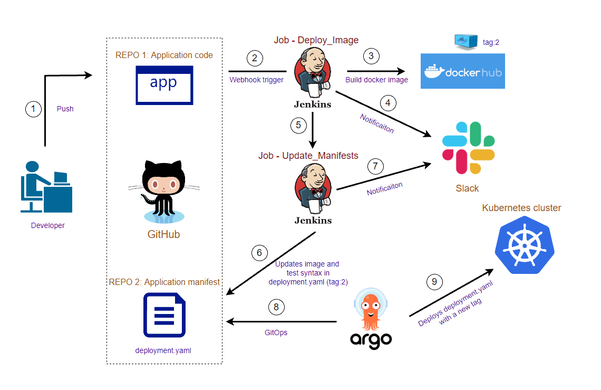

# Project report

## Project's reporter: Nikolai Kunai

## Group number: md-sa2-20-22

## Description of application for deployment:

- Application: Wordpress

- Programming language: PHP

- DB: MySQL

## Pipeline. High Level Design:

 

## Technologies which were used in project:

- Orchestration: Kubernetes.

- Automation tools: Argocd.

- SCM: Github.

- Notification: Slack.

- Other tools: Docker.
 
## CI/CD description:

After developer pushes a new changes to "Application code" repository in main branch, github weebhook triggers "Deploy_image" job on the jenkins server. It clones repo with a new changes, builds docker image with a new tag, pushes this image to dockerhub registry, notifies about job status in a slack channel and transfers a new tag to "Update_Manifests" job. This job updates container image in deployment manifest, tests syntax of manifest, pushes a new changes to "Application manifest" repository and notifies about job status in a slack channel. After Argo CD detects changes in deployment manifest, it updates container image in current deployment in the Kubernetes cluster.

## Rollback flow description and implementation:

With Argo CD we can rollback to any code or application version in our Git repository history

## Links

Project repository:

- [app](https://github.com/nikolaikunai/sa_project_wp.git)
- [manifests](https://github.com/nikolaikunai/sa_project_wp_manifests.git)