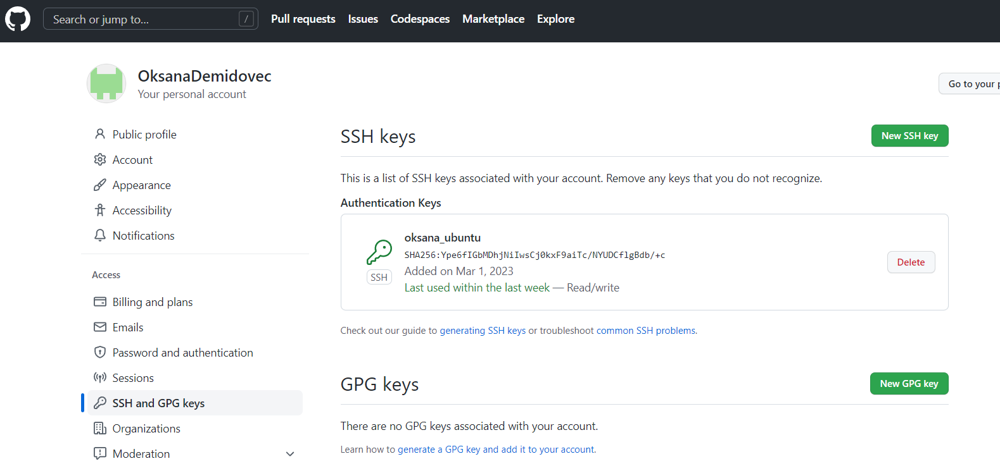
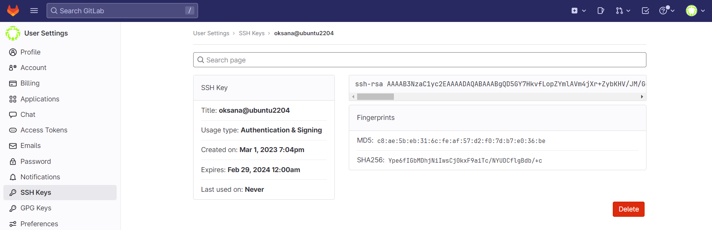
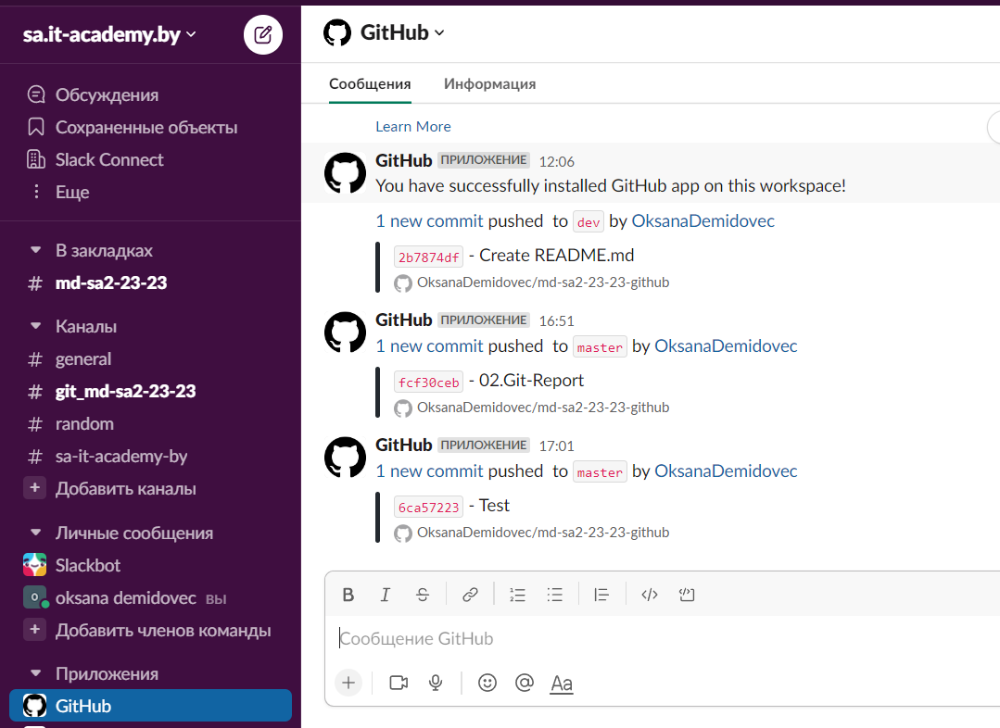
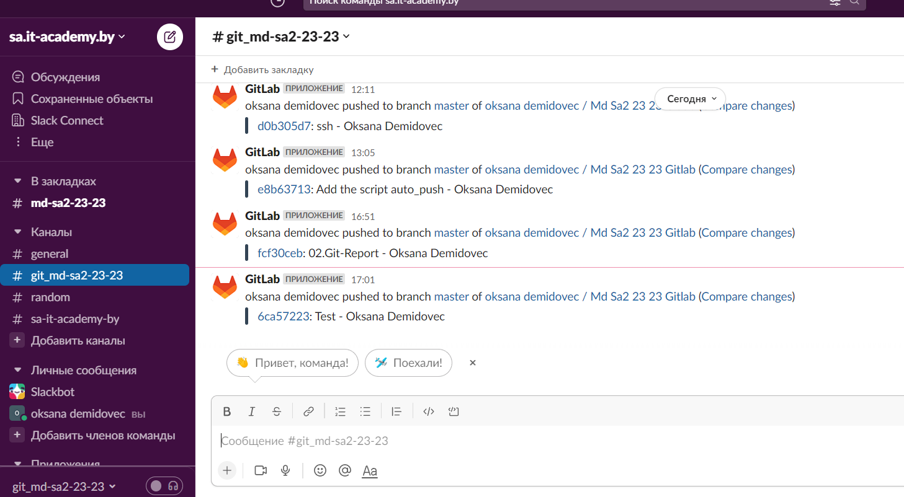
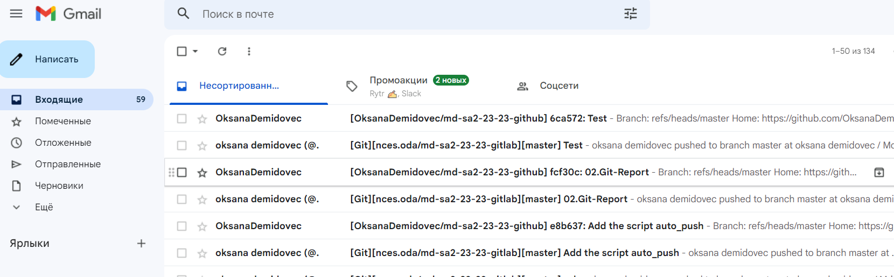

# **03.Git.Hosting**

## Create remote empty repositories
[GitHub](https://github.com/OksanaDemidovec/md-sa2-23-23-github)
[GitLab](https://gitlab.com/nces.oda/md-sa2-23-23-gitlab)

## Add ssh key(s) to use ssh authentication



## Push your local repository into remote repositories each all, one by one
```bash
git remote add origin-gitlab-my git@gitlab.com:nces.oda/md-sa2-23-23-gitlab.git
git remote add origin-github-my git@github.com:OksanaDemidovec/md-sa2-23-23-github.git
git config --global user.email "nces.oda@gmail.com"
git config --global user.name "Oksana Demidovec"
git push -u origin-github-my --all
git push -u origin-gitlab-my --all
```

## Create slack/email integration push/commit events





## Automate pushing your changes to all remote repositories (bash/python/go.. scripts)
create alias for script in your shell
use loop, list of origins should be extracted automatically

```bash
#!/bin/bash

# Get the list of remote repositories
remote_list=$(git remote)

# Loop for  the list of remote repositories
for remote_name in $remote_list
do
# Push changes to the remote repository
git push $remote_name
done

```