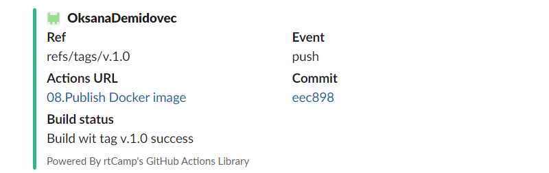

# 08. Docker. Docker compose

Automate build for your API image using Github Action
build docker image only when tag was set
push image to docker hub and github container register
slack notification when build failed/success with image name/tag

## Workflow

```
name: 08.Publish Docker image
on:
  push:
    tags:
      - 'v*' 
jobs:
  push_to_registries:
    name: Push Docker image
    runs-on: ubuntu-latest
    permissions:
      packages: write
      contents: read
    steps:
      - name: Check out the repo
        uses: actions/checkout@v3
      - name: Docker meta - extract data
        id: meta
        uses: docker/metadata-action@v4
        with:
          images: |
            ghcr.io/OksanaDemidovec/docker_build
            oksanademidovec/sa.it-academy.by 
      - name: Log in to the Container registry
        uses: docker/login-action@v1
        with:
          registry: ghcr.io
          username: ${{ github.actor }}
          password: ${{ secrets.CR_TOKEN }}
      - name: Log in to the Docker hub
        uses: docker/login-action@v2
        with:
          username: ${{ secrets.DOCKERHUB_USERNAME }}
          password: ${{ secrets.DOCKERHUB_TOKEN }}      
      - name: Build and push Docker images
        uses: docker/build-push-action@v2
        with:
          context: .
          push: true
          tags: ${{ steps.meta.outputs.tags }}
            
      - name: Slack SUCCESS Notification
        uses: rtCamp/action-slack-notify@v2
        if: success()
        env:
          SLACK_CHANNEL: "#git_md-sa2-23-23"
          SLACK_COLOR: '${{ job.status }}'
          SLACK_ICON: https://github.com/rtCamp.png?size=48
          SLACK_MESSAGE: 'Build wit tag ${{github.ref_name}} success '
          SLACK_TITLE: Build status
          SLACK_USERNAME: incoming-webhook
          SLACK_WEBHOOK: ${{ secrets.SLACK_WEBHOOK }}
      - name: Slack FAIL Notification
        uses: rtCamp/action-slack-notify@v2
        if: failure()
        env:
          SLACK_CHANNEL: "#git_md-sa2-23-23"
          SLACK_COLOR: '${{ job.status }}'
          SLACK_ICON: https://avatars.slack-edge.com/temp/2023-04-04/5047162897927_64e65181837c0ae8bd74.jpg
          SLACK_MESSAGE: 'Build with tag ${{github.ref_name}} failed '
          SLACK_TITLE: Build status
          SLACK_USERNAME: incoming-webhook
          SLACK_WEBHOOK: ${{ secrets.SLACK_WEBHOOK }}
      
```
## Links
[GitHub_action](https://github.com/OksanaDemidovec/docker_build/actions/runs/4693348558)
[GitHub_package](https://github.com/users/OksanaDemidovec/packages/container/docker_build/85281767?tag=v.1.0)
[DockerHub_package](https://github.com/users/OksanaDemidovec/packages/container/docker_build/85281767?tag=v.1.0)

## Notifications


