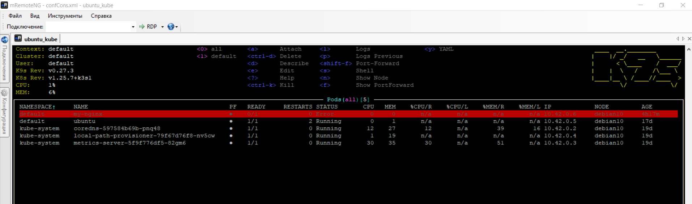
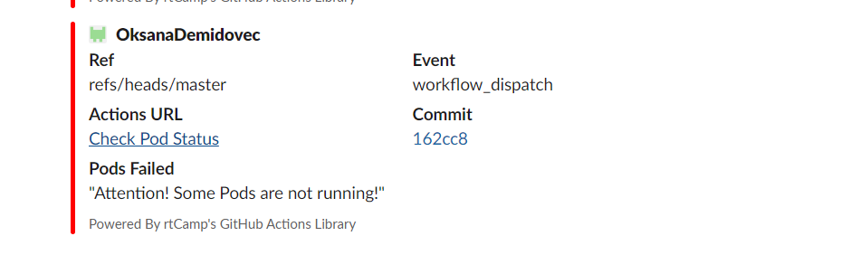

# 10. Kubernetes installation (WS)
## Localhost
### kubectl
```bash
curl -LO "https://dl.k8s.io/release/$(curl -L -s https://dl.k8s.io/release/stable.txt)/bin/linux/amd64/kubectl"
sudo install -o root -g root -m 0755 kubectl /usr/local/bin/kubectl
chmod +x kubectl
mkdir -p ~/.local/bin
mv ./kubectl ~/.local/bin/kubectl
kubectl version --short

Flag --short has been deprecated, and will be removed in the future. The --short output will become the default.
Client Version: v1.26.3
Kustomize Version: v4.5.7
Server Version: v1.25.7+k3s1
```
### Go
```bash
sudo ls -l /usr/local/go
wget https://go.dev/dl/go1.20.2.linux-amd64.tar.gz
sudo rm -rf /usr/local/go && sudo tar -C /usr/local -xzf go1.20.2.linux-amd64.tar.gz
export PATH=$PATH:/usr/local/go/bin
go version

go version go1.20.2 linux/amd64

```

### K9S
```bash
wget https://github.com/derailed/k9s/releases/download/v0.27.3/k9s_Linux_amd64.tar.gz
tar -C /usr/local/bin -xzf k9s_Linux_amd64.tar.gz
k9s
```

### K9S Screen


## Kubernetes host

```
NAMESPACE     NAME                                      READY   STATUS    RESTARTS       AGE
kube-system   coredns-597584b69b-pnq48                  1/1     Running   0              19d
kube-system   local-path-provisioner-79f67d76f8-nv5cw   1/1     Running   0              19d
kube-system   metrics-server-5f9f776df5-82gm6           1/1     Running   0              19d
default       ubuntu                                    1/1     Running   2 (3d7h ago)   17d
default       my-nginx                                  0/1     Error     0              4h32m

```

## GitHub

### Workflow for Check pod`s status

```yaml
name: Check Pod Status
on:
  workflow_dispatch:
  #schedule:
   # - cron: '*/1 * * * *'
jobs:
  pod-check:
    runs-on: ubuntu-latest
    steps:
      - name: Check Pods
        run: |
          mkdir ~/.ssh
          eval `ssh-agent -s`
          ssh-add - <<< "${{ secrets.SSH_KEY }}"
          ssh-keyscan -p 22510 ${{ secrets.BASTION_IP }} >> ~/.ssh/known_hosts
          ssh -p 22510 ${{ secrets.BASTION_USER }}@${{ secrets.BASTION_IP}} ssh-keyscan ${{ secrets.HOST_IP }} >> ~/.ssh/known_hosts
          ssh -o ProxyCommand="ssh -p 22510 -W %h:%p ${{ secrets.BASTION_USER }}@${{ secrets.BASTION_IP }}" ${{ secrets.HOST_USER }}@${{ secrets.HOST_IP }} "kubectl get pods -A" >> pods.log
          #kubectl get pods -A
          pods=$(cat pods.log | awk '{if ($4 != "Running") print $1, $2, $3, $4}')
          echo "$pods" 
          echo "$pods" | tail -n +2 >> GITHUB.OUTPUT
      - name: Slack FAIL Notification
        uses: rtCamp/action-slack-notify@v2
        if: steps.check.outputs.pods != 1
        env:
          SLACK_CHANNEL: "#git_md-sa2-23-23"
          SLACK_COLOR: "#ff0000"
          SLACK_ICON: https://www.cloud4y.ru/upload/medialibrary/ab2/5.jpeg
          SLACK_MESSAGE: |-
            "Attention! Some Pods are not running!"
          SLACK_TITLE: Pods Failed
          SLACK_USERNAME: k9s
          SLACK_WEBHOOK: ${{ secrets.SLACK_WEBHOOK }}
      - name: Upload artifacts
        uses: actions/upload-artifact@v3
        with:
          name: changes-info
          path: |
            pods.log
```
[Git_Action](https://github.com/OksanaDemidovec/md-sa2-23-23-github/actions/runs/4650835063/jobs/8230066211)

### Screen from Slack



