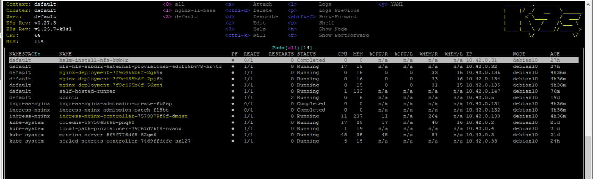
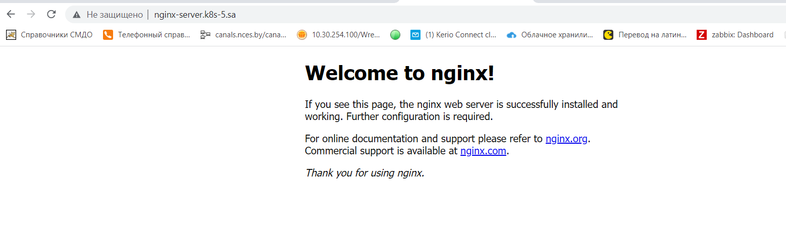
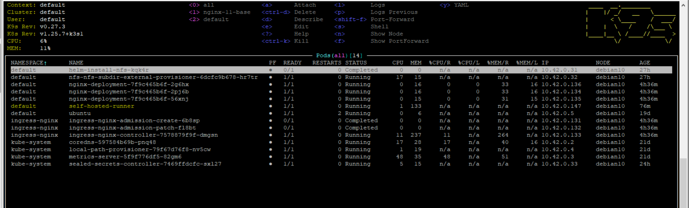

# 11. Kubernetes. Basic objects

Main task:

Create deployment of nginx service:

replicas: 3
set resources for pods
deployment shouldn't have any outage (service is available all time)
ingress rule for host name (nginx-test.k8s-<NUMBER>.sa)

## Commands for deploy
```bash
kubectl apply -f ingress-controller.yaml
kubectl apply -f hw_app.yaml
```

## Manifest for app
```yaml
---
apiVersion: apps/v1
kind: Deployment
metadata:
  name: nginx-deployment
spec:
  selector:
    matchLabels:
      app: nginx
  replicas: 3
  strategy:
    type: RollingUpdate
    rollingUpdate:
      maxSurge: "50%"
      maxUnavailable: "0%"
  template:
    metadata:
      labels:
        app: nginx
    spec:
      containers:
      - name: nginx
        image: nginx:latest
        ports:
        - containerPort: 80
        resources:
          requests:
            cpu: 50m
            memory: 50Mi
          limits:
            cpu: 100m
            memory: 100Mi

---
apiVersion: v1
kind: Service
metadata:
  name: nginx
  labels:
    run: nginx-service
spec:
        #type: LoadBalancer
  ports:
  - port: 80
    protocol: TCP
  selector:
    app: nginx

---
apiVersion: networking.k8s.io/v1
kind: Ingress
metadata:
  name: ingress-sa
  annotations:
    kubernetes.io/ingress.class: nginx
    nginx.ingress.kubernetes.io/server-alias: "nginx-server.k8s-5.sa"
spec:
  rules:
    - host: nginx-server.k8s-5.sa
      http:
        paths:
          - path: /
            pathType: Prefix
            backend:
              service:
                name: nginx
                port:
                  number: 80
```
[Manifest for ingress-controller](ingress-controller.yaml)

### Screens





## Additional task:

deploy pod inside k8s which should be connected to github as self-hosted runner

## Commands for deploy

```bash
kubectl apply -f pod_exec.yaml

```

## Manifest for pod with self-hosted runner

```yaml
apiVersion: v1
kind: Pod
metadata:
  name: self-hosted-runner
spec:
  containers:
  - name: ubuntu
    image: ghcr.io/pluhin/busy-box
    command: ["/bin/sh","-c"]
    args:
      - mkdir actions-runner && cd actions-runner;
        curl -o actions-runner-linux-x64-2.303.0.tar.gz -L https://github.com/actions/runner/releases/download/v2.303.0/actions-runner-linux-x64-2.303.0.tar.gz;
        export RUNNER_ALLOW_RUNASROOT='1';
        tar xzf ./actions-runner-linux-x64-2.303.0.tar.gz;
        ./config.sh --name ubuntu_runner_busy-box --labels linux,runner,busy-box --runnergroup default --url https://github.com/OksanaDemidovec/md-sa2-23-23-github --token A537YX2VJUN5S6ZLZYVYT3TEGU6YO;
        ./run.sh;

```
[workflow.yaml](workflow.yaml)

[Git_Action](https://github.com/OksanaDemidovec/md-sa2-23-23-github/actions/runs/4666407074/jobs/8260965349)

### Pod screen


