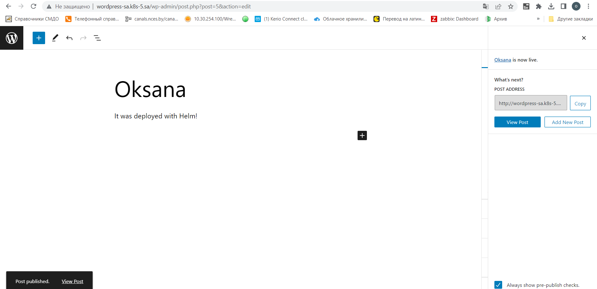
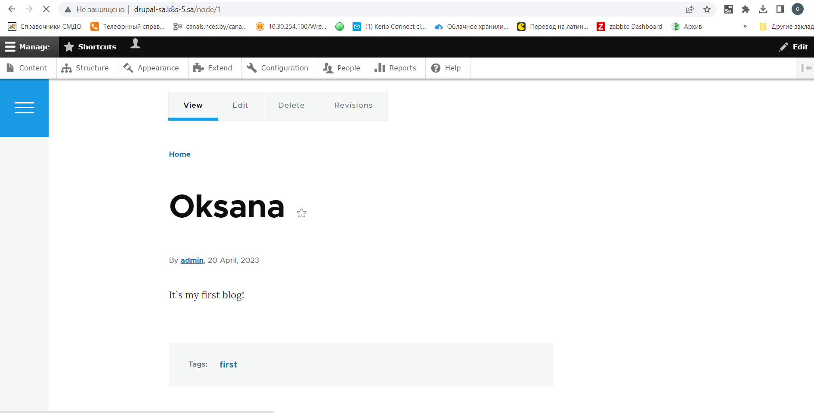

# 13.Kubernetes.Helm

Deploy in your K8s cluster the following applications using helm charts from public repositories:

Wordpress
Drupal
Please disable DBs deployment for these deployment and use ansible DBs provisioning from ansible workshop

All these applications should have addresses like http://<APP_NAME>.k8s-<LAST_OCTET_YOUR_K8S_MEMBER>.sa

After deployment you have to login to both application and create dummy article with your name as title
## Before
We need nfs and bd before deploy

[ansible-playbook](maria_db.yaml)

[ansible-inventory](inv.yaml)

[nfs_manifest](nfs.yaml)

Add to file hosts: 178.124.206.53 joomla-sa.k8s-5.sa wordpress-sa.k8s-5.sa drupal-sa.k8s-5.sa

## Wordpress

### Commands

```bash
ansible-playbook -i inv.yaml maria_db.yaml -e name_db=bitnami_wordpress -e user_db=bn_wordpress -e pass_db=bn_wordpress
helm install sa-wordpress  --set mariadb.enabled=false,externalDatabase.host=192.168.201.5,externalDatabase.password=bn_wordpress,externalDatabase.user=bn_wordpress,externalDatabase.database=bitnami_wordpress,global.storageClass=nfs,wordpressUsername=admin,wordpressPassword=wordpress my-repo/wordpress
kubectl apply -f wordpress_ingress.yaml
```
### Ingress file

```yaml
---
apiVersion: networking.k8s.io/v1
kind: Ingress
metadata:
  name: ingress-wordpress
  annotations:
    kubernetes.io/ingress.class: nginx
spec:
  rules:
    - host: wordpress-sa.k8s-5.sa
      http:
        paths:
          - path: /
            pathType: Prefix
            backend:
              service:
                name: sa-wordpress
                port:
                  number: 80
```


## Drupal

```bash
ansible-playbook -i inv.yaml maria_db.yaml -e name_db=bitnami_drupal -e user_db=bn_drupal -e pass_db=bn_drupal
helm install sa-drupal  --set mariadb.enabled=false,externalDatabase.host=192.168.201.5,externalDatabase.password=bn_drupal,externalDatabase.user=bn_drupal,externalDatabase.database=bitnami_drupal,global.storageClass=nfs,drupalUsername=admin,drupalPassword=drupal my-repo/drupal
kubectl apply -f drupal_ingress.yaml
```
### Ingress file

```yaml
---
apiVersion: networking.k8s.io/v1
kind: Ingress
metadata:
  name: ingress-drupal
  annotations:
    kubernetes.io/ingress.class: nginx
spec:
  rules:
    - host: drupal-sa.k8s-5.sa
      http:
        paths:
          - path: /
            pathType: Prefix
            backend:
              service:
                name: sa-drupal
                port:
                  number: 80
```


