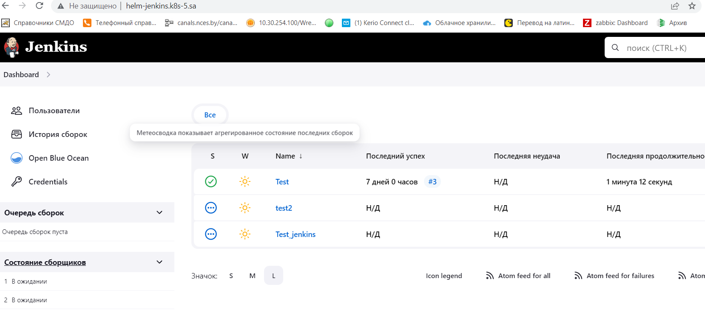

# 14. Kubernetes application deployment

Finish application deployment
Create helm package for your Jenkins application
all variables should be inside variable file
publish helm on your repository


## 1.Create helm-chart
```bash
helm create jenkins
```

## 2. Edit files

### Chart

```yaml
apiVersion: v2
name: jenkins
description: A Helm chart for Kubernetes

type: application

version: 0.1.0

appVersion: "1.16.0"
```

### Values
```yaml
# Default values for jenkins.
# This is a YAML-formatted file.
# Declare variables to be passed into your templates.

replicaCount: 1
namespace: ci-cd
name: jenkins

image:
  repository: jfrog.it-academy.by/public/jenkins-ci:odemidovec
  pullPolicy: IfNotPresent
  # Overrides the image tag whose default is the chart appVersion.
  tag: "latest"

masterport: 8080
slaveport: 50000
ingressport: 8080
serveralias: "helm-jenkins.k8s-5.sa"

env:
  JAVA_OPTS: "-Djenkins.install.runSetupWizard=false"
  CASC_JENKINS_CONFIG: "/var/jenkins_home/casc_configs/jenkins.yaml"
ConfigMap:
  volumeMounts:
    - name: jenkins-auth-config
      mountPath: /var/jenkins_home/init.groovy.d/basic-security.groovy
      subPath: basic-security.groovy
    - name: jenkins-config-yaml
      mountPath: /var/jenkins_home/casc_configs/jenkins.yaml
      subPath: jenkins.yaml
    - name: jenkins-config
      mountPath: /var/jenkins_home
  volumes:
    - name: jenkins-auth-config
      configMap:
        name: basic-security
    - name: jenkins-config-yaml
      configMap:
        name: jenkins-config
    - name: jenkins-config
      nfs:
        server: 192.168.37.105
        path: /mnt/IT-Academy/nfs-data/sa2-23-23/odemidovec/jenkins
ingress:
  enabled: true
ingresshost: helm-jenkins.k8s-5.sa
resources:
  limits:
    cpu: 2000m
    memory: 3072Mi
  requests:
    cpu: 2000m
    memory: 2048Mi
autoscaling:
  enabled: false
  minReplicas: 1
  maxReplicas: 100
  targetCPUUtilizationPercentage: 80

```

### Deployment
```yaml
---
apiVersion: v1
kind: Namespace
metadata:
  name: {{ .Values.namespace }}
---
apiVersion: apps/v1
kind: Deployment
metadata:
  name: {{ .Values.name }}
  namespace: {{ .Values.namespace }}
spec:
  replicas: 1
  selector:
    matchLabels:
      app:  {{ .Values.name }}
  template:
    metadata:
      labels:
        app:  {{ .Values.name }}
    spec:
      containers:
        - name:  {{ .Values.name }}
          image: "{{ .Values.image.repository }}"
          imagePullPolicy: {{ .Values.image.pullPolicy }}
          env:
            - name: JAVA_OPTS
              value: {{ .Values.env.JAVA_OPTS }}
            - name: CASC_JENKINS_CONFIG
              value: {{ .Values.env.CASC_JENKINS_CONFIG }}
          ports:
            - name: http
              containerPort: {{ .Values.masterport }}
            - name: jnlp
              containerPort: {{ .Values.slaveport }}
          securityContext:
            runAsUser: 0
          resources:
            {{- toYaml .Values.resources | nindent 12 }}
          volumeMounts:
            {{- toYaml .Values.ConfigMap.volumeMounts | nindent 12 }}
      volumes:
        {{- toYaml .Values.ConfigMap.volumes | nindent 8 }}

---
apiVersion: v1
kind: ConfigMap
metadata:
  name: basic-security
  namespace: {{ .Values.namespace }}
data:
  basic-security.groovy: |
    #!groovy
    import jenkins.model.*
    import hudson.security.*
    def instance = Jenkins.getInstance()
    println "--> creating local user 'admin'"
    def password = System.getenv("PASS")
    def hudsonRealm = new HudsonPrivateSecurityRealm(false)
    hudsonRealm.createAccount('admin',"admin")
    instance.setSecurityRealm(hudsonRealm)
    def strategy = new FullControlOnceLoggedInAuthorizationStrategy()
    strategy.setAllowAnonymousRead(true)
    instance.setAuthorizationStrategy(strategy)
    instance.save()
---
apiVersion: v1
kind: ConfigMap
metadata:
  name: jenkins-config
  namespace: {{ .Values.namespace }}
data:
  jenkins.yaml: |
        jenkins:
          numExecutors: 2
          clouds:
          - kubernetes:
              containerCapStr: "10"
              maxRequestsPerHostStr: "32"
              jenkinsUrl: "http://jenkins:8080"
              name: "kubernetes"
              namespace: "ci-cd"
              skipTlsVerify: true
        credentials:
          system:
            domainCredentials:
            - credentials:
              - usernamePassword:
                  description: "Githubuser"
                  id: "some_randome"
                  password: "PMcAQa3TKS6MnkM"
                  scope: GLOBAL
                  username: "OksanaDemidovec"
        unclassified:
          location:
            adminAddress: "nces.oda@gmail.com"
            url: "http://jenkins.k8s-5.sa/"
          shell:
            shell: "/bin/bash"
```
### Service
```yaml
---
apiVersion: v1
kind: Service
metadata:
  name: {{ .Values.name }}
  namespace: {{ .Values.namespace }}
spec:
  ports:
    - name: master
      port: {{ .Values.masterport }}
      targetPort: {{ .Values.masterport }}
    - name: slave
      port: {{ .Values.slaveport }}
      targetPort: {{ .Values.slaveport }}
  selector:
    app: {{ .Values.name }}
```

### ServiceAccount
```yaml
---
apiVersion: rbac.authorization.k8s.io/v1
kind: ClusterRoleBinding
metadata:
  name: {{ .Values.name }}
  namespace: {{ .Values.namespace }}
roleRef:
  apiGroup: rbac.authorization.k8s.io
  kind: ClusterRole
  name: cluster-admin
subjects:
- kind: ServiceAccount
  name: default
  namespace: {{ .Values.namespace }}

```
### Ingress
```yaml
---
apiVersion: networking.k8s.io/v1
kind: Ingress
metadata:
  name: ingress-{{ .Values.name }}
  namespace: {{ .Values.namespace }}
  annotations:
    kubernetes.io/ingress.class: nginx
    nginx.ingress.kubernetes.io/server-alias: {{ .Values.serveralias }}
spec:
  rules:
    - host: {{ .Values.serveralias }}
      http:
        paths:
          - path: /
            pathType: Prefix
            backend:
              service:
                name: {{ .Values.name }}
                port:
                  number: {{ .Values.ingressport }}

```
## 3. Create package and install

```bash
helm package jenkins
mv jenkins-0.1.0.tgz ../helm-releases/
cd ..
git add helm-source/
git add helm-releases/
git commit -m "Update jenkins 1.0"
git push origin 
helm install jenkins helm23-23/jenkins

```
## Helm repository

[Helm_repository](https://github.com/OksanaDemidovec/helm-23-23)
## Screens
