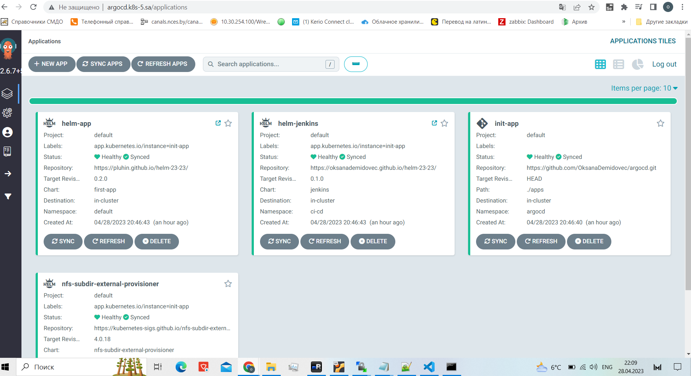
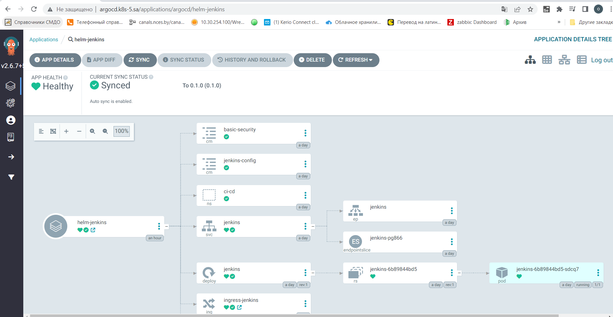
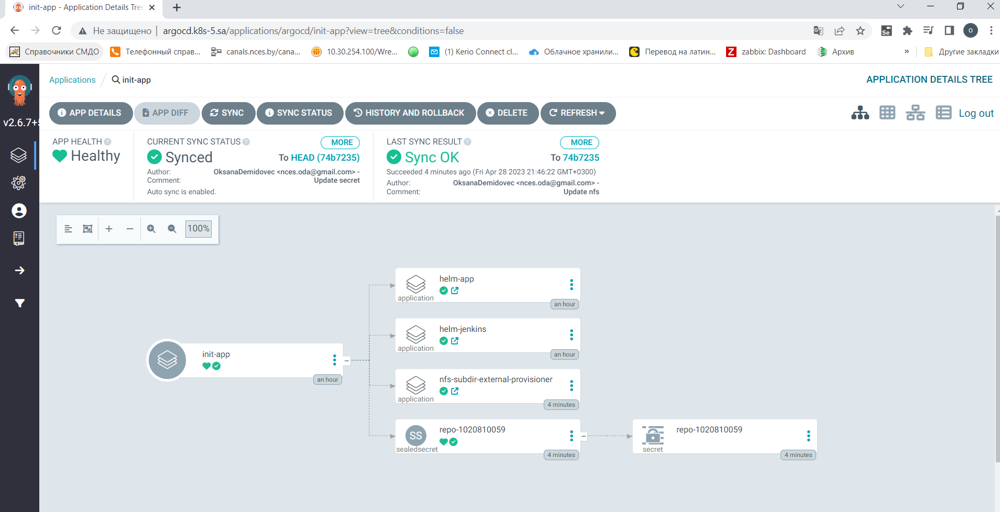

# 15. Kubernetes CI CD

deploy ArgoCD into your cluster
add your repositories with helm packages as source for deployment
create separate repository which contains application manifests for ArgoCD 
	application objects
	git secrets objects as sealsecret objects
add this repository as project for your applications

## Repositories

[helm-repository](https://github.com/OksanaDemidovec/helm-23-23/tree/main/helm-releases)

[agrocd-repository](https://github.com/OksanaDemidovec/argocd)

## Screens

