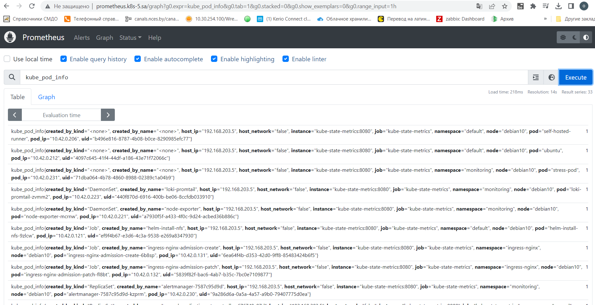
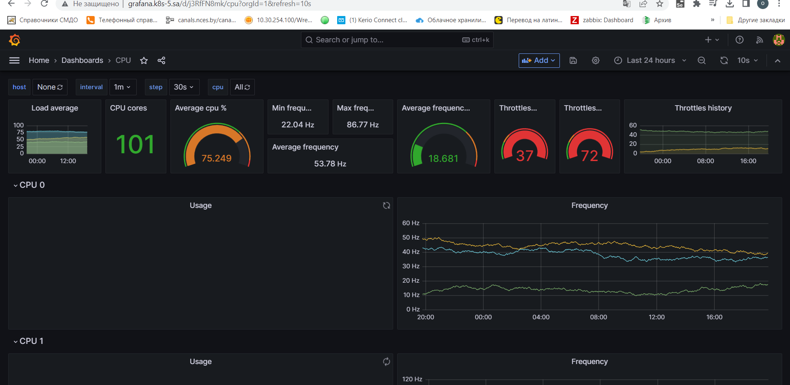
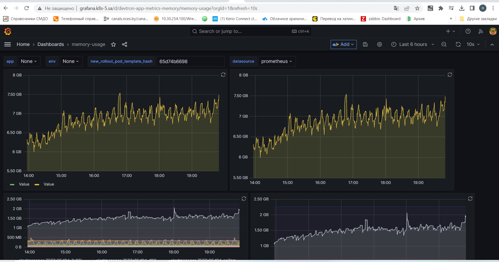

# 16. Technical and service monitoring

Deploy Prometheus + Alert manager

Setup slack notification for Alert manager

Add alert for CPU overload per pods
Emulate payload to test alert
Thresholds can be any value as you wish
Expose Prometheus web UI

Deploy Grafana

Add Prometheus as metrics source

Create dashboard with CPU and memory graphs per pods

## Prometheus and Alert Manager

[manifest_prometheus](prometheus.yaml)

[manifest_alert_manager](alert-manager.yaml)

[manifest_ksm](ksm.yaml)

[manifest_node_exporter](node-exporter.yaml)

## Grafana

[manifest_grafana](grafana.yaml)

