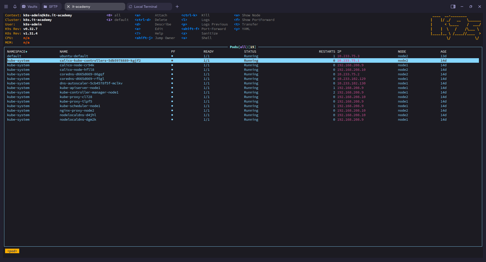
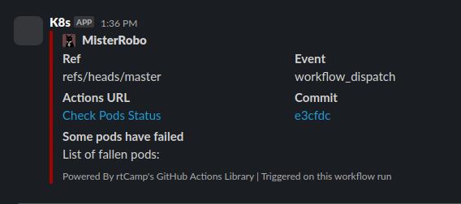

# 10.Kubernetes.Installation
## Homework Assignment 1. K8s Installation
### Localhost:
- Install kubectl for local run
```bash
➜  curl -LO https://dl.k8s.io/release/`curl -LS https://dl.k8s.io/release/stable.txt`/bin/linux/amd64/
➜  chmod +x kubectl
➜  sudo mv kubectl /usr/local/bin/kubectl
➜  kubectl version --client
Client Version: v1.32.0
Kustomize Version: v5.5.0
```
- Install k9s to maintain cluster
```bash
➜  wget  https://github.com/derailed/k9s/releases/download/v0.32.7/k9s_linux_amd64.deb
➜  sudo dpkg -i k9s_linux_amd64.deb
➜  k9s version
 ____  __.________       
|    |/ _/   __   \______
|      < \____    /  ___/
|    |  \   /    /\___ \ 
|____|__ \ /____//____  >
        \/            \/ 

Version:    v0.32.7
Commit:     6b5d24f5741a1789fb97ba3e11f0ee868d93459d
Date:       2024-11-16T20:22:28Z
```
- Print-screen of k9s with pods in all namespaces


### Kubernetes host

- Finish workshop deployment if it is not done yet
- Deploy shell pod in default namespace which you can you use for internal checks inside the cluster

[pod.yaml](pod.yaml)


### Monitoring of cluster:

[.github/workflows/check-pods-status.yml](https://github.com/MisterRobo/sa.it-academy.by_10.Kubernetes.Installation/blob/master/.github/workflows/check-pods-status.yml)

[Action](https://github.com/MisterRobo/sa.it-academy.by_10.Kubernetes.Installation/actions/runs/13050512937/job/36409533911)

