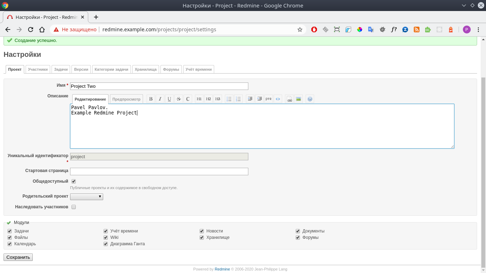
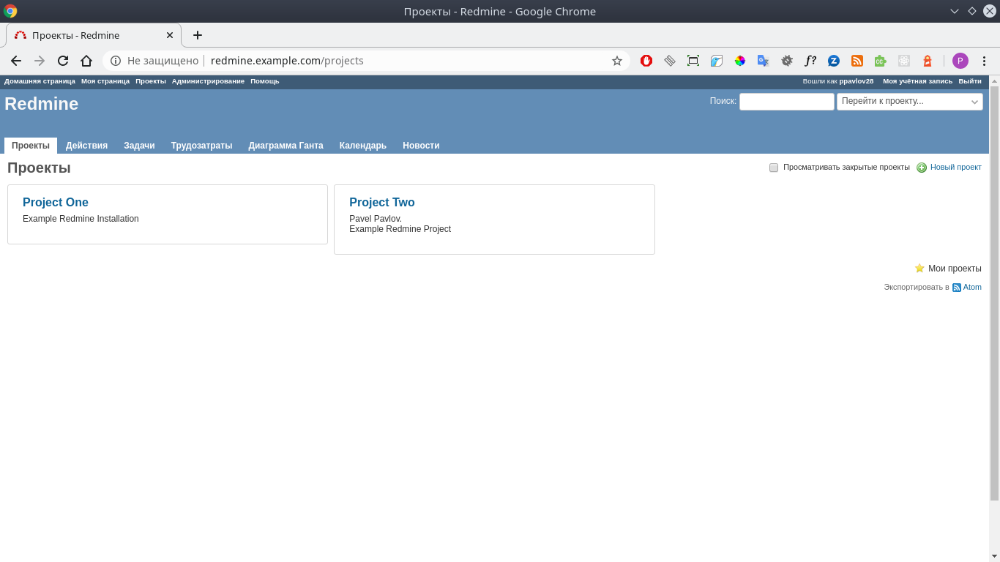

# 09.Ansible.workshop

### Ansible workshop playbook out
```
ppa@yas-m09:~/Documents/labs/09.Ansible.workshop$ ansible-playbook play.yaml -i inventory.yaml -e "sshuser=ansuser"

PLAY [all] **********************************************************************************************************************************************************************************

TASK [Gathering Facts] **********************************************************************************************************************************************************************
ok: [redmine]

TASK [Ping] *********************************************************************************************************************************************************************************
ok: [redmine]

TASK [Pre-task | HW info] *******************************************************************************************************************************************************************
ok: [redmine] => 
  msg:
  - 'Hostname: ubuntu'
  - 'Arch: x86_64'
  - 'CPU Core: 1'
  - 'RAM: 3945'
  - ''

TASK [Pre-task | apt update repository cache] ***********************************************************************************************************************************************
changed: [redmine]

TASK [Pre-task | Install Redmine dependences] ***********************************************************************************************************************************************
ok: [redmine]

TASK [mysql : MySQL. Install and setup] *****************************************************************************************************************************************************
changed: [redmine]

RUNNING HANDLER [mysql : restart mysql] *****************************************************************************************************************************************************
changed: [redmine]

TASK [mysql : mysql_db] *********************************************************************************************************************************************************************
changed: [redmine]

TASK [mysql : mysql_user] *******************************************************************************************************************************************************************
changed: [redmine]

TASK [redmine : Redmine. Clone repository] **************************************************************************************************************************************************
changed: [redmine]

TASK [redmine : Redmine. Change permissions] ************************************************************************************************************************************************
changed: [redmine]

TASK [redmine : Redmine. Change permissions] ************************************************************************************************************************************************
changed: [redmine]

TASK [redmine : Config database] ************************************************************************************************************************************************************
changed: [redmine]

TASK [redmine : Redmine. Setup 01] **********************************************************************************************************************************************************
changed: [redmine]

TASK [redmine : Session store secret generation] ********************************************************************************************************************************************
changed: [redmine]

TASK [redmine : Redmine. Setup 02] **********************************************************************************************************************************************************
changed: [redmine]

TASK [redmine : Configuration files for virtualhost] ****************************************************************************************************************************************
changed: [redmine]

RUNNING HANDLER [redmine : restart apache] **************************************************************************************************************************************************
changed: [redmine]

TASK [redmine : Add redmine.example.com to host file] ***************************************************************************************************************************************
changed: [redmine]

TASK [redmine : uri] ************************************************************************************************************************************************************************
ok: [redmine]

TASK [redmine : lineinfile] *****************************************************************************************************************************************************************
changed: [redmine]

PLAY RECAP **********************************************************************************************************************************************************************************
redmine                    : ok=21   changed=16   unreachable=0    failed=0    skipped=0    rescued=0    ignored=0   

Playbook run took 0 days, 0 hours, 2 minutes, 41 seconds
ppa@yas-m09:~/Documents/labs/09.Ansible.workshop$ 
```
### Redmine screenshot



