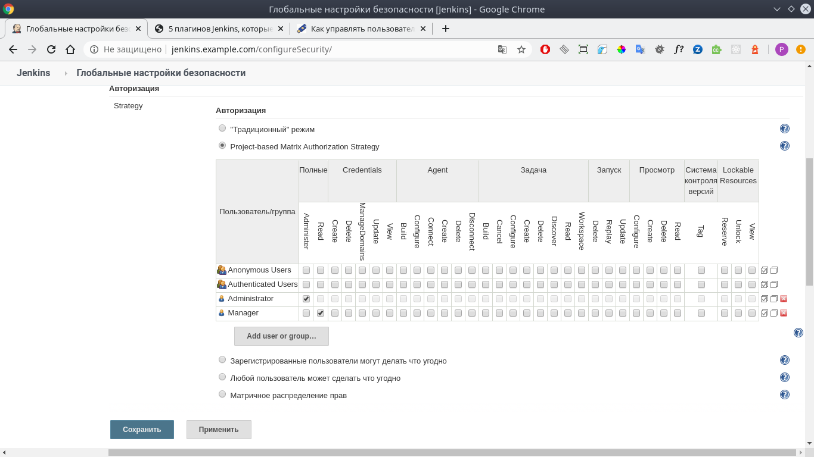
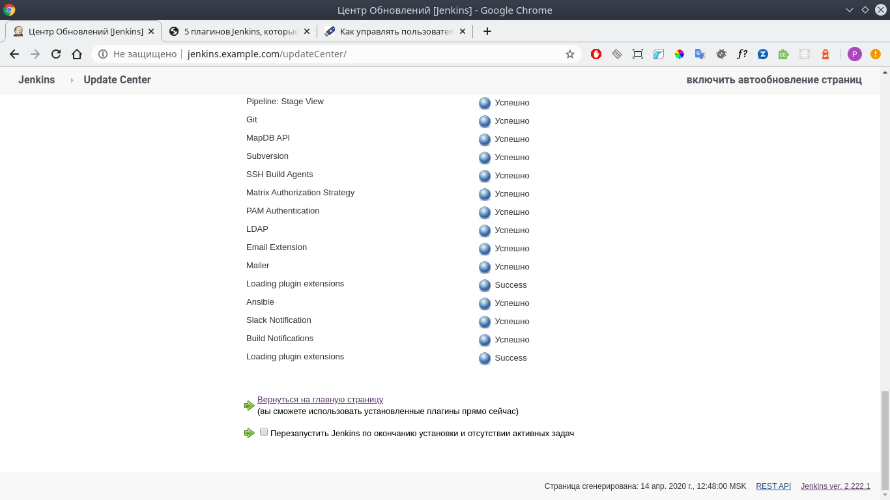

# 10.Jenkins.Start
### Playbook out
```
ppa@yas-m09:~/Documents/tmp/10.Jenkins.Start$ ansible-playbook play.yaml -i inventory.yaml

PLAY [all] ***************************************************************************************************************************

TASK [Gathering Facts] ***************************************************************************************************************
[WARNING]: Platform linux on host jenkins is using the discovered Python interpreter at /usr/bin/python, but future installation of
another Python interpreter could change this. See
https://docs.ansible.com/ansible/2.9/reference_appendices/interpreter_discovery.html for more information.
ok: [jenkins]

TASK [Ping] **************************************************************************************************************************
ok: [jenkins]

TASK [Update repo cache] *************************************************************************************************************
[WARNING]: Updating cache and auto-installing missing dependency: python-apt
ok: [jenkins]

TASK [jenkins : Install prerequisted] ************************************************************************************************
changed: [jenkins]

TASK [jenkins : Add jenkins repo key] ************************************************************************************************
changed: [jenkins]

TASK [jenkins : Add jenkins repo] ****************************************************************************************************
changed: [jenkins]

TASK [jenkins : Update repo cache] ***************************************************************************************************
ok: [jenkins]

TASK [jenkins : Install jenkins] *****************************************************************************************************
changed: [jenkins]

TASK [jenkins : Install nginx] *******************************************************************************************************
changed: [jenkins]

TASK [jenkins : Delete default nginx config] *****************************************************************************************
changed: [jenkins]

TASK [jenkins : Copy config file] ****************************************************************************************************
changed: [jenkins]

TASK [jenkins : Enable nginx config for Jenkins] *************************************************************************************
changed: [jenkins]

TASK [jenkins : Check nginx config] **************************************************************************************************
changed: [jenkins]

TASK [jenkins : debug] ***************************************************************************************************************
ok: [jenkins] => 
  msg:
    changed: true
    cmd: |-
      nginx -t
    delta: '0:00:00.053985'
    end: '2020-04-14 12:36:44.738629'
    failed: false
    rc: 0
    start: '2020-04-14 12:36:44.684644'
    stderr: |-
      nginx: the configuration file /etc/nginx/nginx.conf syntax is ok
      nginx: configuration file /etc/nginx/nginx.conf test is successful
    stderr_lines:
    - 'nginx: the configuration file /etc/nginx/nginx.conf syntax is ok'
    - 'nginx: configuration file /etc/nginx/nginx.conf test is successful'
    stdout: ''
    stdout_lines: []

TASK [jenkins : Restart nginx] *******************************************************************************************************
changed: [jenkins]

TASK [jenkins : Add reccord in local hosts file] *************************************************************************************
changed: [jenkins]

TASK [jenkins : Check connect to the jenkins] ****************************************************************************************
ok: [jenkins]

TASK [Get code] **********************************************************************************************************************
changed: [jenkins]

TASK [debug] *************************************************************************************************************************
ok: [jenkins] => 
  msg: Jenkins is available at http://jenkins.example.com with next code d47e22b3ca0147038a8e7706863f64b1

PLAY RECAP ***************************************************************************************************************************
jenkins                    : ok=19   changed=12   unreachable=0    failed=0    skipped=0    rescued=0    ignored=0   

Playbook run took 0 days, 0 hours, 2 minutes, 48 seconds
ppa@yas-m09:~/Documents/tmp/10.Jenkins.Start$ 
```
### Jenkins screenshot


