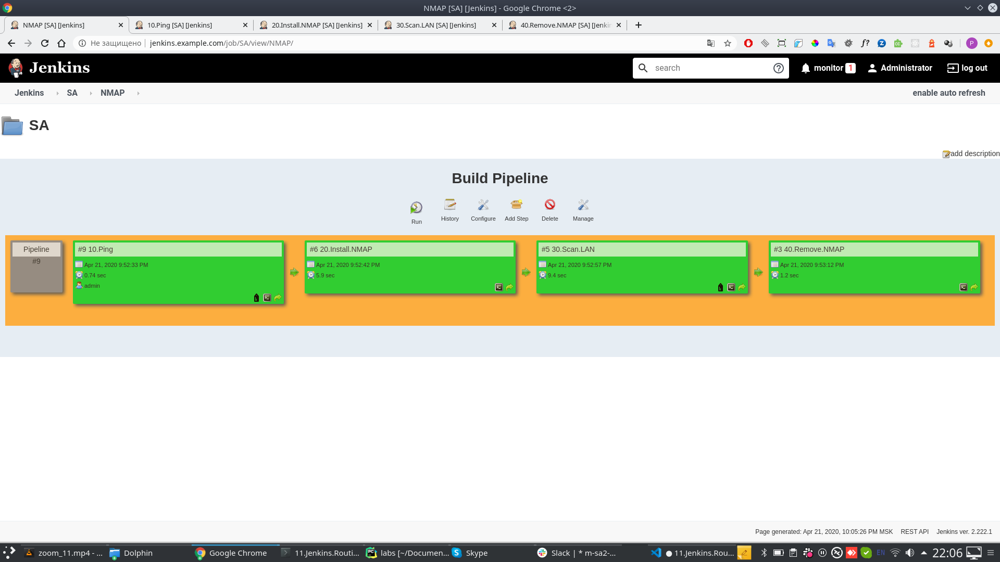

# 11.Jenkins.Routine

### Task 10.Ping
```
Started by user Administrator
Running as SYSTEM
Building on master in workspace /var/lib/jenkins/workspace/SA/10.Ping
[10.Ping] $ ansible all -i /tmp/inventory15590844081236569553.ini -m ping -f 5 --private-key /tmp/ssh16516874487187699228.key -u jenkins
[WARNING]: Platform linux on host 192.168.244.40 is using the discovered Python
interpreter at /usr/bin/python, but future installation of another Python
interpreter could change this. See https://docs.ansible.com/ansible/2.9/referen
ce_appendices/interpreter_discovery.html for more information.
192.168.244.40 | SUCCESS => {
    "ansible_facts": {
        "discovered_interpreter_python": "/usr/bin/python"
    }, 
    "changed": false, 
    "ping": "pong"
}
Triggering a new build of SA » 20.Install.NMAP
Finished: SUCCESS
```

### Task 20.Install.NMAP
```
Started by upstream project "SA/10.Ping" build number 9
originally caused by:
 Started by user Administrator
Running as SYSTEM
Building remotely on node1 in workspace /var/lib/jenkins/workspace/SA/20.Install.NMAP
[20.Install.NMAP] $ /bin/bash /tmp/jenkins18210748121636853649.sh
Hit:1 http://security.debian.org/debian-security buster/updates InRelease
Hit:2 http://deb.debian.org/debian buster InRelease
Get:3 http://deb.debian.org/debian buster-updates InRelease [49.3 kB]
Fetched 49.3 kB in 0s (158 kB/s)
Reading package lists...
Reading package lists...
Building dependency tree...
Reading state information...
The following additional packages will be installed:
  libblas3 libgfortran5 liblinear3 liblua5.3-0 libpcap0.8 libquadmath0
  nmap-common
Suggested packages:
  liblinear-tools liblinear-dev ncat ndiff zenmap
The following NEW packages will be installed:
  libblas3 libgfortran5 liblinear3 liblua5.3-0 libpcap0.8 libquadmath0 nmap
  nmap-common
debconf: unable to initialize frontend: Dialog
debconf: (Dialog frontend will not work on a dumb terminal, an emacs shell buffer, or without a controlling terminal.)
debconf: falling back to frontend: Readline
debconf: unable to initialize frontend: Readline
debconf: (This frontend requires a controlling tty.)
debconf: falling back to frontend: Teletype
dpkg-preconfigure: unable to re-open stdin: 
0 upgraded, 8 newly installed, 0 to remove and 2 not upgraded.
Need to get 0 B/6,955 kB of archives.
After this operation, 30.0 MB of additional disk space will be used.
Selecting previously unselected package libquadmath0:amd64.
(Reading database ... 
(Reading database ... 5%
(Reading database ... 10%
(Reading database ... 15%
(Reading database ... 20%
(Reading database ... 25%
(Reading database ... 30%
(Reading database ... 35%
(Reading database ... 40%
(Reading database ... 45%
(Reading database ... 50%
(Reading database ... 55%
(Reading database ... 60%
(Reading database ... 65%
(Reading database ... 70%
(Reading database ... 75%
(Reading database ... 80%
(Reading database ... 85%
(Reading database ... 90%
(Reading database ... 95%
(Reading database ... 100%
(Reading database ... 37696 files and directories currently installed.)
Preparing to unpack .../0-libquadmath0_8.3.0-6_amd64.deb ...
Unpacking libquadmath0:amd64 (8.3.0-6) ...
Selecting previously unselected package libgfortran5:amd64.
Preparing to unpack .../1-libgfortran5_8.3.0-6_amd64.deb ...
Unpacking libgfortran5:amd64 (8.3.0-6) ...
Selecting previously unselected package libblas3:amd64.
Preparing to unpack .../2-libblas3_3.8.0-2_amd64.deb ...
Unpacking libblas3:amd64 (3.8.0-2) ...
Selecting previously unselected package liblinear3:amd64.
Preparing to unpack .../3-liblinear3_2.1.0+dfsg-4_amd64.deb ...
Unpacking liblinear3:amd64 (2.1.0+dfsg-4) ...
Selecting previously unselected package liblua5.3-0:amd64.
Preparing to unpack .../4-liblua5.3-0_5.3.3-1.1_amd64.deb ...
Unpacking liblua5.3-0:amd64 (5.3.3-1.1) ...
Selecting previously unselected package libpcap0.8:amd64.
Preparing to unpack .../5-libpcap0.8_1.8.1-6_amd64.deb ...
Unpacking libpcap0.8:amd64 (1.8.1-6) ...
Selecting previously unselected package nmap-common.
Preparing to unpack .../6-nmap-common_7.70+dfsg1-6_all.deb ...
Unpacking nmap-common (7.70+dfsg1-6) ...
Selecting previously unselected package nmap.
Preparing to unpack .../7-nmap_7.70+dfsg1-6_amd64.deb ...
Unpacking nmap (7.70+dfsg1-6) ...
Setting up libpcap0.8:amd64 (1.8.1-6) ...
Setting up libquadmath0:amd64 (8.3.0-6) ...
Setting up libgfortran5:amd64 (8.3.0-6) ...
Setting up nmap-common (7.70+dfsg1-6) ...
Setting up liblua5.3-0:amd64 (5.3.3-1.1) ...
Setting up libblas3:amd64 (3.8.0-2) ...
update-alternatives: using /usr/lib/x86_64-linux-gnu/blas/libblas.so.3 to provide /usr/lib/x86_64-linux-gnu/libblas.so.3 (libblas.so.3-x86_64-linux-gnu) in auto mode
Setting up liblinear3:amd64 (2.1.0+dfsg-4) ...
Setting up nmap (7.70+dfsg1-6) ...
Processing triggers for man-db (2.8.5-2) ...
Processing triggers for libc-bin (2.28-10) ...
Triggering a new build of SA » 30.Scan.LAN
Finished: SUCCESS
```
### 30.Scan.LAN
```
Started by upstream project "SA/20.Install.NMAP" build number 6
originally caused by:
 Started by upstream project "SA/10.Ping" build number 9
 originally caused by:
  Started by user Administrator
Running as SYSTEM
Building remotely on node1 in workspace /var/lib/jenkins/workspace/SA/30.Scan.LAN
[30.Scan.LAN] $ /bin/bash /tmp/jenkins240700635177776713.sh
Starting Nmap 7.70 ( https://nmap.org ) at 2020-04-21 14:52 EDT
Nmap scan report for 192.168.244.1
Host is up (0.00027s latency).
Nmap scan report for 192.168.244.30
Host is up (0.00012s latency).
Nmap scan report for fs5.mediagroup.local (192.168.244.31)
Host is up (0.00032s latency).
Nmap scan report for 192.168.244.33
Host is up (0.00065s latency).
Nmap scan report for 192.168.244.35
Host is up (0.000082s latency).
Nmap scan report for 192.168.244.39
Host is up (0.00036s latency).
Nmap scan report for 192.168.244.40
Host is up (0.00023s latency).
Nmap done: 256 IP addresses (7 hosts up) scanned in 9.45 seconds
Triggering a new build of SA » 40.Remove.NMAP
Finished: SUCCESS
```
### 40.Remove.NMAP
```
Started by upstream project "SA/30.Scan.LAN" build number 5
originally caused by:
 Started by upstream project "SA/20.Install.NMAP" build number 6
 originally caused by:
  Started by upstream project "SA/10.Ping" build number 9
  originally caused by:
   Started by user Administrator
Running as SYSTEM
Building remotely on node1 in workspace /var/lib/jenkins/workspace/SA/40.Remove.NMAP
[40.Remove.NMAP] $ /bin/bash /tmp/jenkins9414159690425178788.sh
Reading package lists...
Building dependency tree...
Reading state information...
The following packages will be REMOVED:
  libblas3* libgfortran5* liblinear3* liblua5.3-0* libpcap0.8* libquadmath0*
  nmap* nmap-common*
0 upgraded, 0 newly installed, 8 to remove and 2 not upgraded.
After this operation, 30.0 MB disk space will be freed.
(Reading database ... 
(Reading database ... 5%
(Reading database ... 10%
(Reading database ... 15%
(Reading database ... 20%
(Reading database ... 25%
(Reading database ... 30%
(Reading database ... 35%
(Reading database ... 40%
(Reading database ... 45%
(Reading database ... 50%
(Reading database ... 55%
(Reading database ... 60%
(Reading database ... 65%
(Reading database ... 70%
(Reading database ... 75%
(Reading database ... 80%
(Reading database ... 85%
(Reading database ... 90%
(Reading database ... 95%
(Reading database ... 100%
(Reading database ... 38564 files and directories currently installed.)
Removing nmap (7.70+dfsg1-6) ...
Removing liblinear3:amd64 (2.1.0+dfsg-4) ...
Removing libblas3:amd64 (3.8.0-2) ...
Removing libgfortran5:amd64 (8.3.0-6) ...
Removing liblua5.3-0:amd64 (5.3.3-1.1) ...
Removing libpcap0.8:amd64 (1.8.1-6) ...
Removing libquadmath0:amd64 (8.3.0-6) ...
Removing nmap-common (7.70+dfsg1-6) ...
Processing triggers for man-db (2.8.5-2) ...
Processing triggers for libc-bin (2.28-10) ...
Finished: SUCCESS
```
