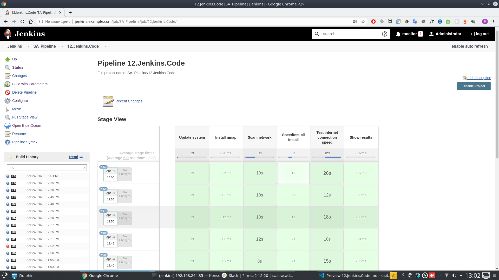

# 12.Jenkins.Code



## Pipeline script
```groovy
pipeline {
    agent { label 'node1' }
    triggers {
        cron('H */1 * * *')
    }
    stages {
        stage('Update system') {
            when {
                equals expected: "yes", actual: "${params.UPDATE_SYSTEM}"
            }
            steps {
                sh """
                sudo apt-get update
                sudo apt-get upgrade -y
                """
            }
        }
        stage('Install nmap') {
            when {
                equals expected: "yes", actual: "${params.INSTALL_NMAP}"
            }
            steps {
                sh "sudo apt-get install -y nmap"
            }
        }
        stage('Scan network') {
            steps {
                sh """
                date >> scan.log
                nmap -sn -PS ${params.SCAN_TO} | grep "Nmap done" >> scan.log
                echo "\n" >> scan.log
                """
            }
        }
        stage('Speedtest-cli install') {
            when {
                equals expected: "yes", actual: "${params.INSTALL_ST}"
            }
            steps {
                sh """
                sudo apt-get install gnupg1 apt-transport-https dirmngr
                sudo apt-key adv --keyserver keyserver.ubuntu.com --recv-keys 379CE192D401AB61
                echo "deb https://ookla.bintray.com/debian buster main" | sudo tee  /etc/apt/sources.list.d/speedtest.list
                sudo apt-get update
                sudo apt-get install speedtest
                """
            }
        }
        stage('Test internet connection speed') {
            when {
                equals expected: "yes", actual: "${params.ICS_TEST}"
            }
            steps {
                sh """
                date >> speedtest.log
                speedtest --accept-license --accept-gdpr | grep -E "(Latency|Download|Upload)" >> speedtest.log
                echo "\n" >> speedtest.log
                """
            }
        }
        stage('Show results') {
            steps {
                echo "Scan results"
                sh """
                cat scan.log
                
                cat speedtest.log
                """
            }
        }
    }
    post {
        success {
            slackSend (color: '#00FF00', message: "SUCCESSFUL: Job '${env.JOB_NAME} [${env.BUILD_NUMBER}]' (${env.BUILD_URL})")
        }
        failure {
            slackSend (color: '#FF0000', message: "FAILED: Job '${env.JOB_NAME} [${env.BUILD_NUMBER}]' (${env.BUILD_URL})")
        }
    }
}
```
## Pipeline console out
```
Started by user Administrator
Running in Durability level: MAX_SURVIVABILITY
[Pipeline] Start of Pipeline
[Pipeline] node
Still waiting to schedule task
‘node1’ is offline
Running on node1 in /var/lib/jenkins/workspace/SA_Pipeline/12.Jenkins.Code
[Pipeline] {
[Pipeline] stage
[Pipeline] { (Update system)
[Pipeline] sh
+ sudo apt-get update
Get:1 http://security.debian.org/debian-security buster/updates InRelease [65.4 kB]
Hit:2 http://deb.debian.org/debian buster InRelease
Get:3 http://deb.debian.org/debian buster-updates InRelease [49.3 kB]
Get:4 http://security.debian.org/debian-security buster/updates/main Sources [108 kB]
Get:5 http://security.debian.org/debian-security buster/updates/main amd64 Packages [187 kB]
Get:6 http://security.debian.org/debian-security buster/updates/main Translation-en [100 kB]
Fetched 510 kB in 1s (473 kB/s)
Reading package lists...
+ sudo apt-get upgrade -y
Reading package lists...
Building dependency tree...
Reading state information...
Calculating upgrade...
The following packages will be upgraded:
  libssl1.1 openssl
2 upgraded, 0 newly installed, 0 to remove and 0 not upgraded.
Need to get 2,383 kB of archives.
After this operation, 1,024 B of additional disk space will be used.
Get:1 http://security.debian.org/debian-security buster/updates/main amd64 libssl1.1 amd64 1.1.1d-0+deb10u3 [1,538 kB]
Get:2 http://security.debian.org/debian-security buster/updates/main amd64 openssl amd64 1.1.1d-0+deb10u3 [844 kB]
apt-listchanges: Reading changelogs...
debconf: unable to initialize frontend: Dialog
debconf: (Dialog frontend will not work on a dumb terminal, an emacs shell buffer, or without a controlling terminal.)
debconf: falling back to frontend: Readline
debconf: unable to initialize frontend: Readline
debconf: (This frontend requires a controlling tty.)
debconf: falling back to frontend: Teletype
dpkg-preconfigure: unable to re-open stdin: 
Fetched 2,383 kB in 0s (8,678 kB/s)
(Reading database ... 
(Reading database ... 5%
(Reading database ... 10%
(Reading database ... 15%
(Reading database ... 20%
(Reading database ... 25%
(Reading database ... 30%
(Reading database ... 35%
(Reading database ... 40%
(Reading database ... 45%
(Reading database ... 50%
(Reading database ... 55%
(Reading database ... 60%
(Reading database ... 65%
(Reading database ... 70%
(Reading database ... 75%
(Reading database ... 80%
(Reading database ... 85%
(Reading database ... 90%
(Reading database ... 95%
(Reading database ... 100%
(Reading database ... 37288 files and directories currently installed.)
Preparing to unpack .../libssl1.1_1.1.1d-0+deb10u3_amd64.deb ...
Unpacking libssl1.1:amd64 (1.1.1d-0+deb10u3) over (1.1.1d-0+deb10u2) ...
Preparing to unpack .../openssl_1.1.1d-0+deb10u3_amd64.deb ...
Unpacking openssl (1.1.1d-0+deb10u3) over (1.1.1d-0+deb10u2) ...
Setting up libssl1.1:amd64 (1.1.1d-0+deb10u3) ...
debconf: unable to initialize frontend: Dialog
debconf: (Dialog frontend will not work on a dumb terminal, an emacs shell buffer, or without a controlling terminal.)
debconf: falling back to frontend: Readline
Setting up openssl (1.1.1d-0+deb10u3) ...
Processing triggers for man-db (2.8.5-2) ...
Processing triggers for libc-bin (2.28-10) ...
[Pipeline] }
[Pipeline] // stage
[Pipeline] stage
[Pipeline] { (Install nmap)
[Pipeline] sh
+ sudo apt-get install -y nmap
Reading package lists...
Building dependency tree...
Reading state information...
The following additional packages will be installed:
  libblas3 libgfortran5 liblinear3 liblua5.3-0 libpcap0.8 libquadmath0
  nmap-common
Suggested packages:
  liblinear-tools liblinear-dev ncat ndiff zenmap
The following NEW packages will be installed:
  libblas3 libgfortran5 liblinear3 liblua5.3-0 libpcap0.8 libquadmath0 nmap
  nmap-common
0 upgraded, 8 newly installed, 0 to remove and 0 not upgraded.
Need to get 6,955 kB of archives.
After this operation, 30.0 MB of additional disk space will be used.
Get:1 http://deb.debian.org/debian buster/main amd64 libquadmath0 amd64 8.3.0-6 [133 kB]
Get:2 http://deb.debian.org/debian buster/main amd64 libgfortran5 amd64 8.3.0-6 [581 kB]
Get:3 http://deb.debian.org/debian buster/main amd64 libblas3 amd64 3.8.0-2 [148 kB]
Get:4 http://deb.debian.org/debian buster/main amd64 liblinear3 amd64 2.1.0+dfsg-4 [41.2 kB]
Get:5 http://deb.debian.org/debian buster/main amd64 liblua5.3-0 amd64 5.3.3-1.1 [120 kB]
Get:6 http://deb.debian.org/debian buster/main amd64 libpcap0.8 amd64 1.8.1-6 [139 kB]
Get:7 http://deb.debian.org/debian buster/main amd64 nmap-common all 7.70+dfsg1-6 [3,899 kB]
Get:8 http://deb.debian.org/debian buster/main amd64 nmap amd64 7.70+dfsg1-6 [1,895 kB]
debconf: unable to initialize frontend: Dialog
debconf: (Dialog frontend will not work on a dumb terminal, an emacs shell buffer, or without a controlling terminal.)
debconf: falling back to frontend: Readline
debconf: unable to initialize frontend: Readline
debconf: (This frontend requires a controlling tty.)
debconf: falling back to frontend: Teletype
dpkg-preconfigure: unable to re-open stdin: 
Fetched 6,955 kB in 0s (31.8 MB/s)
Selecting previously unselected package libquadmath0:amd64.
(Reading database ... 
(Reading database ... 5%
(Reading database ... 10%
(Reading database ... 15%
(Reading database ... 20%
(Reading database ... 25%
(Reading database ... 30%
(Reading database ... 35%
(Reading database ... 40%
(Reading database ... 45%
(Reading database ... 50%
(Reading database ... 55%
(Reading database ... 60%
(Reading database ... 65%
(Reading database ... 70%
(Reading database ... 75%
(Reading database ... 80%
(Reading database ... 85%
(Reading database ... 90%
(Reading database ... 95%
(Reading database ... 100%
(Reading database ... 37288 files and directories currently installed.)
Preparing to unpack .../0-libquadmath0_8.3.0-6_amd64.deb ...
Unpacking libquadmath0:amd64 (8.3.0-6) ...
Selecting previously unselected package libgfortran5:amd64.
Preparing to unpack .../1-libgfortran5_8.3.0-6_amd64.deb ...
Unpacking libgfortran5:amd64 (8.3.0-6) ...
Selecting previously unselected package libblas3:amd64.
Preparing to unpack .../2-libblas3_3.8.0-2_amd64.deb ...
Unpacking libblas3:amd64 (3.8.0-2) ...
Selecting previously unselected package liblinear3:amd64.
Preparing to unpack .../3-liblinear3_2.1.0+dfsg-4_amd64.deb ...
Unpacking liblinear3:amd64 (2.1.0+dfsg-4) ...
Selecting previously unselected package liblua5.3-0:amd64.
Preparing to unpack .../4-liblua5.3-0_5.3.3-1.1_amd64.deb ...
Unpacking liblua5.3-0:amd64 (5.3.3-1.1) ...
Selecting previously unselected package libpcap0.8:amd64.
Preparing to unpack .../5-libpcap0.8_1.8.1-6_amd64.deb ...
Unpacking libpcap0.8:amd64 (1.8.1-6) ...
Selecting previously unselected package nmap-common.
Preparing to unpack .../6-nmap-common_7.70+dfsg1-6_all.deb ...
Unpacking nmap-common (7.70+dfsg1-6) ...
Selecting previously unselected package nmap.
Preparing to unpack .../7-nmap_7.70+dfsg1-6_amd64.deb ...
Unpacking nmap (7.70+dfsg1-6) ...
Setting up libpcap0.8:amd64 (1.8.1-6) ...
Setting up libquadmath0:amd64 (8.3.0-6) ...
Setting up libgfortran5:amd64 (8.3.0-6) ...
Setting up nmap-common (7.70+dfsg1-6) ...
Setting up liblua5.3-0:amd64 (5.3.3-1.1) ...
Setting up libblas3:amd64 (3.8.0-2) ...
update-alternatives: using /usr/lib/x86_64-linux-gnu/blas/libblas.so.3 to provide /usr/lib/x86_64-linux-gnu/libblas.so.3 (libblas.so.3-x86_64-linux-gnu) in auto mode
Setting up liblinear3:amd64 (2.1.0+dfsg-4) ...
Setting up nmap (7.70+dfsg1-6) ...
Processing triggers for man-db (2.8.5-2) ...
Processing triggers for libc-bin (2.28-10) ...
[Pipeline] }
[Pipeline] // stage
[Pipeline] stage
[Pipeline] { (Scan network)
[Pipeline] sh
+ nmap -sn -PS 192.168.244.0/24
[Pipeline] }
[Pipeline] // stage
[Pipeline] stage
[Pipeline] { (Speedtest-cli install)
[Pipeline] sh
+ sudo apt-get install gnupg1 apt-transport-https dirmngr
Reading package lists...
Building dependency tree...
Reading state information...
dirmngr is already the newest version (2.2.12-1+deb10u1).
dirmngr set to manually installed.
Suggested packages:
  parcimonie xloadimage | imagemagick | eog
The following NEW packages will be installed:
  apt-transport-https gnupg1 gnupg1-l10n
0 upgraded, 3 newly installed, 0 to remove and 0 not upgraded.
Need to get 1,300 kB of archives.
After this operation, 5,114 kB of additional disk space will be used.
Get:1 http://deb.debian.org/debian buster/main amd64 apt-transport-https all 1.8.2 [149 kB]
Get:2 http://deb.debian.org/debian buster/main amd64 gnupg1 amd64 1.4.23-1 [599 kB]
Get:3 http://deb.debian.org/debian buster/main amd64 gnupg1-l10n all 1.4.23-1 [552 kB]
debconf: unable to initialize frontend: Dialog
debconf: (Dialog frontend will not work on a dumb terminal, an emacs shell buffer, or without a controlling terminal.)
debconf: falling back to frontend: Readline
debconf: unable to initialize frontend: Readline
debconf: (This frontend requires a controlling tty.)
debconf: falling back to frontend: Teletype
dpkg-preconfigure: unable to re-open stdin: 
Fetched 1,300 kB in 0s (6,625 kB/s)
Selecting previously unselected package apt-transport-https.
(Reading database ... 
(Reading database ... 5%
(Reading database ... 10%
(Reading database ... 15%
(Reading database ... 20%
(Reading database ... 25%
(Reading database ... 30%
(Reading database ... 35%
(Reading database ... 40%
(Reading database ... 45%
(Reading database ... 50%
(Reading database ... 55%
(Reading database ... 60%
(Reading database ... 65%
(Reading database ... 70%
(Reading database ... 75%
(Reading database ... 80%
(Reading database ... 85%
(Reading database ... 90%
(Reading database ... 95%
(Reading database ... 100%
(Reading database ... 38156 files and directories currently installed.)
Preparing to unpack .../apt-transport-https_1.8.2_all.deb ...
Unpacking apt-transport-https (1.8.2) ...
Selecting previously unselected package gnupg1.
Preparing to unpack .../gnupg1_1.4.23-1_amd64.deb ...
Unpacking gnupg1 (1.4.23-1) ...
Selecting previously unselected package gnupg1-l10n.
Preparing to unpack .../gnupg1-l10n_1.4.23-1_all.deb ...
Unpacking gnupg1-l10n (1.4.23-1) ...
Setting up apt-transport-https (1.8.2) ...
Setting up gnupg1 (1.4.23-1) ...
Setting up gnupg1-l10n (1.4.23-1) ...
Processing triggers for man-db (2.8.5-2) ...
+ sudo apt-key adv --keyserver keyserver.ubuntu.com --recv-keys 379CE192D401AB61
Warning: apt-key output should not be parsed (stdout is not a terminal)
Executing: /tmp/apt-key-gpghome.wYfSpoSeW3/gpg.1.sh --keyserver keyserver.ubuntu.com --recv-keys 379CE192D401AB61
gpg: key 379CE192D401AB61: public key "Bintray (by JFrog) <bintray@bintray.com>" imported
gpg: Total number processed: 1
gpg:               imported: 1
+ sudo tee /etc/apt/sources.list.d/speedtest.list
+ echo deb https://ookla.bintray.com/debian buster main
deb https://ookla.bintray.com/debian buster main
+ sudo apt-get update
Hit:1 http://deb.debian.org/debian buster InRelease
Hit:2 http://deb.debian.org/debian buster-updates InRelease
Hit:3 http://security.debian.org/debian-security buster/updates InRelease
Ign:4 https://ookla.bintray.com/debian buster InRelease
Get:5 https://ookla.bintray.com/debian buster Release [4,387 B]
Get:6 https://ookla.bintray.com/debian buster Release.gpg [821 B]
Get:7 https://ookla.bintray.com/debian buster/main amd64 Packages [402 B]
Fetched 5,610 B in 0s (16.6 kB/s)
Reading package lists...
+ sudo apt-get install speedtest
Reading package lists...
Building dependency tree...
Reading state information...
The following NEW packages will be installed:
  speedtest
0 upgraded, 1 newly installed, 0 to remove and 0 not upgraded.
Need to get 930 kB of archives.
After this operation, 2,257 kB of additional disk space will be used.
Get:1 https://ookla.bintray.com/debian buster/main amd64 speedtest amd64 1.0.0.2-1.5ae238b [930 kB]
debconf: unable to initialize frontend: Dialog
debconf: (Dialog frontend will not work on a dumb terminal, an emacs shell buffer, or without a controlling terminal.)
debconf: falling back to frontend: Readline
debconf: unable to initialize frontend: Readline
debconf: (This frontend requires a controlling tty.)
debconf: falling back to frontend: Teletype
dpkg-preconfigure: unable to re-open stdin: 
Fetched 930 kB in 0s (5,483 kB/s)
Selecting previously unselected package speedtest.
(Reading database ... 
(Reading database ... 5%
(Reading database ... 10%
(Reading database ... 15%
(Reading database ... 20%
(Reading database ... 25%
(Reading database ... 30%
(Reading database ... 35%
(Reading database ... 40%
(Reading database ... 45%
(Reading database ... 50%
(Reading database ... 55%
(Reading database ... 60%
(Reading database ... 65%
(Reading database ... 70%
(Reading database ... 75%
(Reading database ... 80%
(Reading database ... 85%
(Reading database ... 90%
(Reading database ... 95%
(Reading database ... 100%
(Reading database ... 38224 files and directories currently installed.)
Preparing to unpack .../speedtest_1.0.0.2-1.5ae238b_amd64.deb ...
Unpacking speedtest (1.0.0.2-1.5ae238b) ...
Setting up speedtest (1.0.0.2-1.5ae238b) ...
Processing triggers for man-db (2.8.5-2) ...
[Pipeline] }
[Pipeline] // stage
[Pipeline] stage
[Pipeline] { (Test internet connection speed)
[Pipeline] sh
+ speedtest --accept-license --accept-gdpr
==============================================================================

You may only use this Speedtest software and information generated
from it for personal, non-commercial use, through a command line
interface on a personal computer. Your use of this software is subject
to the End User License Agreement, Terms of Use and Privacy Policy at
these URLs:

	https://www.speedtest.net/about/eula
	https://www.speedtest.net/about/terms
	https://www.speedtest.net/about/privacy

==============================================================================

License acceptance recorded. Continuing.

==============================================================================

Ookla collects certain data through Speedtest that may be considered
personally identifiable, such as your IP address, unique device
identifiers or location. Ookla believes it has a legitimate interest
to share this data with internet providers, hardware manufacturers and
industry regulators to help them understand and create a better and
faster internet. For further information including how the data may be
shared, where the data may be transferred and Ookla's contact details,
please see our Privacy Policy at:

       http://www.speedtest.net/privacy

==============================================================================

License acceptance recorded. Continuing.

[Pipeline] }
[Pipeline] // stage
[Pipeline] stage
[Pipeline] { (Show results)
[Pipeline] sh
+ echo Counted active hosts
Counted active hosts
+ grep Nmap done
+ cat scan.log
Nmap done: 256 IP addresses (7 hosts up) scanned in 8.44 seconds
+ echo Internet connection speed
Internet connection speed
+ grep -E (Latency|Download|Upload)
+ cat speedtest.log
    Latency:    14.51 ms   (0.04 ms jitter)

   Download:   941.81 Mbps (data used: 959.2 MB)                               

     Upload:   941.49 Mbps (data used: 946.8 MB)                               
[Pipeline] }
[Pipeline] // stage
[Pipeline] }
[Pipeline] // node
[Pipeline] End of Pipeline
Finished: SUCCESS

```