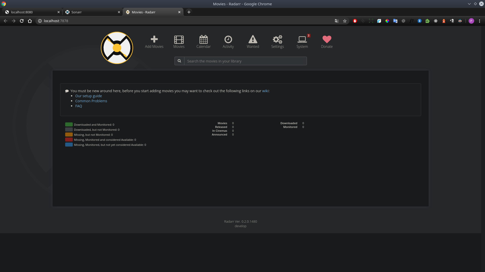

# 14.Docker.Logistics
## Automate task 13.Docker.Lading by Jenkins

### Dockerfile
```
FROM python:3.7-alpine3.11

WORKDIR /usr/src/app

EXPOSE 9090

COPY . .

CMD [ "python", "./pl.py" ]
```
### Jenkinsfile
```
pipeline {
    environment {
        registry = "ppavlov28/py_test"
        registryCredential = 'a7b649f1-4558-47ec-b8dd-37dba9bfe362'
    }
    agent {label 'master'}
    stages {
        stage('Clone Git Repo') {
            steps {
                git credentialsId: 'b2922652-0478-4a1d-8072-7083a8ef79f8', url: 'https://github.com/ppavlov28/13.docker'
            }
        }
        stage('Build image') {
            steps {
                script {
                    dockerImage = docker.build registry + ":$BUILD_NUMBER"
                }
            }
        }
        stage('Deploy image') {
            steps {
                script {
                    docker.withRegistry( '', registryCredential ) {
                        dockerImage.push()
                    }
                }
            }
        }
        stage('Remove docker image') {
            steps {
                sh "docker rmi $registry:$BUILD_NUMBER"
            }
        }
    }
}
```
### [Jenkins console output](Jenkins_console.output)

## Docker compose file for run web server, sonarr app, radarr app.
```
---
version: '3'
services:
  web:
    image: nginx:latest
    volumes:
      - ./html:/usr/share/nginx/html
    ports:
      - "8080:80"

  sonarr:
    image: linuxserver/sonarr
    container_name: sonarr
    environment:
      - PUID=1000
      - PGID=1000
      - TZ=Europe/London
      - UMASK_SET=022 #optional
    volumes:
      - ./sonarr/config:/config
      - ./sonarr/tv:/tv
      - ./sonarr/downloads:/downloads
    ports:
      - 8989:8989
    restart: unless-stopped  
  
  radarr:
    image: linuxserver/radarr
    container_name: radarr
    environment:
      - PUID=1000
      - PGID=1000
      - TZ=Europe/London
      - UMASK_SET=022 #optional
    volumes:
      - ./radarr/config:/config
      - ./radarr/tv:/tv
      - ./radarr/downloads:/downloads
    ports:
      - 7878:7878
    restart: unless-stopped
```
## Screenshots for running apps
### NGINX

### SONARR

### RADARR

