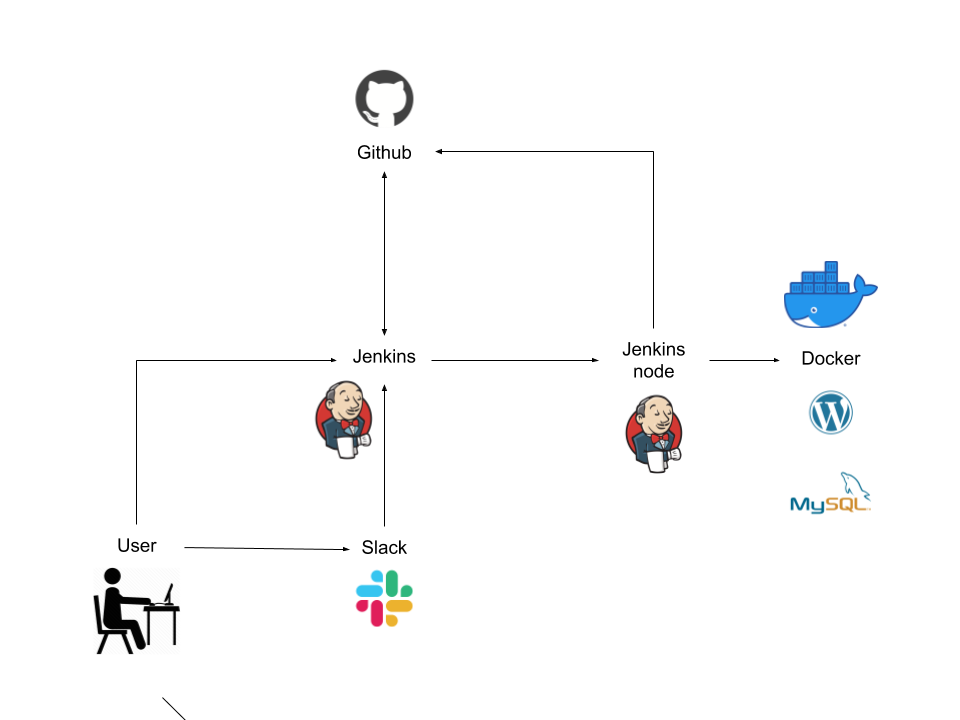

# 17.Project
### Deploy Wordpress
This project allows you to deploy Wordpress and MySQL. Project management is through Jenkins or Slack. The following operations are possible:
1. Deploy
2. Backup
3. Restore (only last backup in Slack)
4. Remove installation
### The project used
- Github
- Jenkins
- Docker (Wordpress & MySQL image)
- Slack
### Schema
