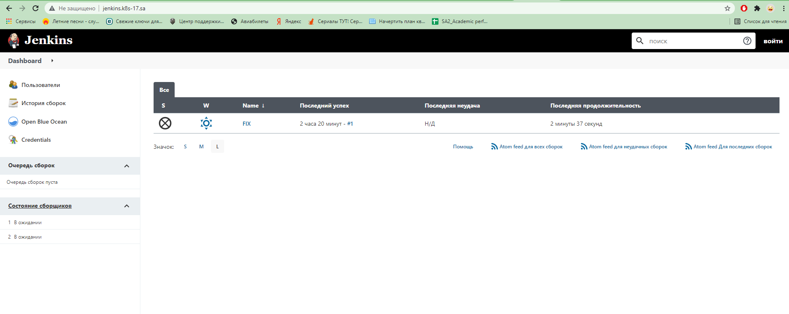
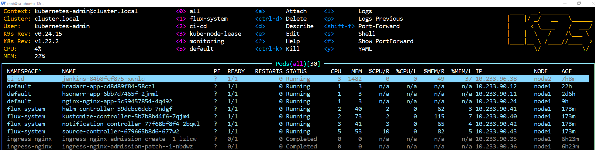
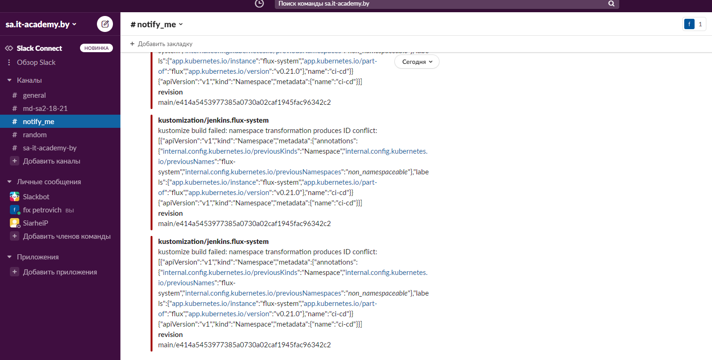

# 14.Kubernetes_application_deployment
## Succesfull application deployment

[Jenkins file](jenkins.yaml)

## Notification in slack (exists, but incorrect output)

## My flux repo:
https://github.com/FIXPETROVICH/flux_demo

## Nice task!
