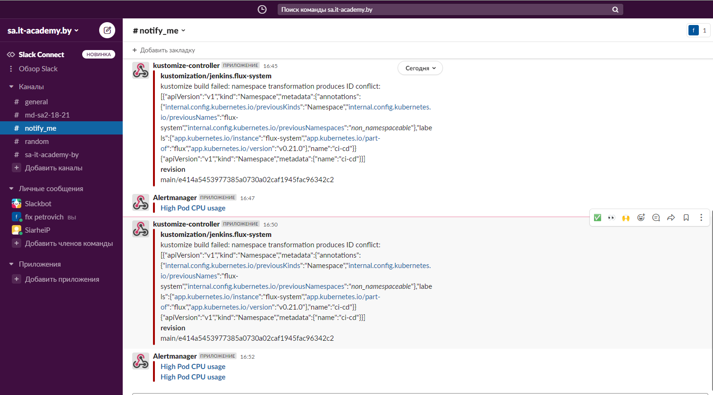
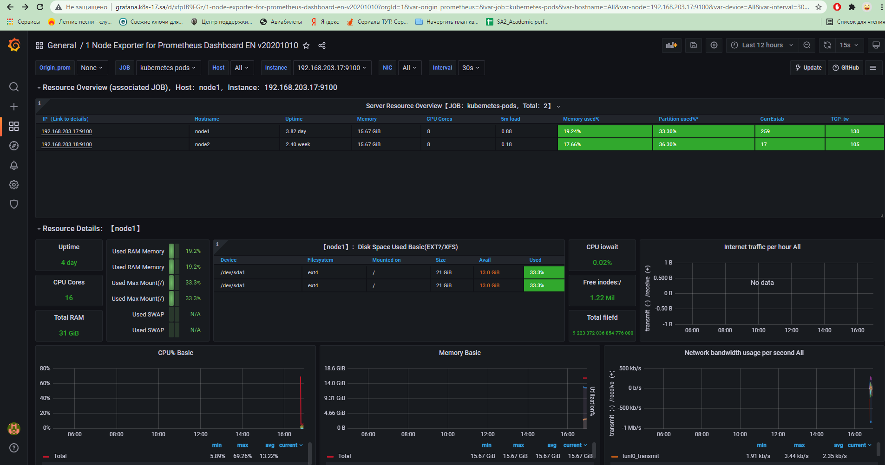
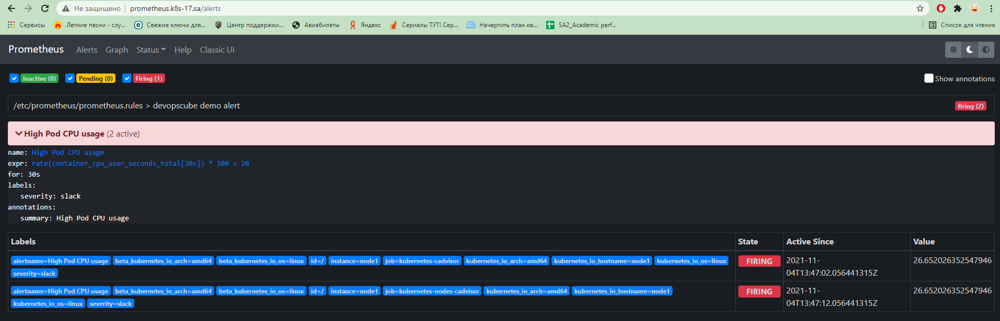
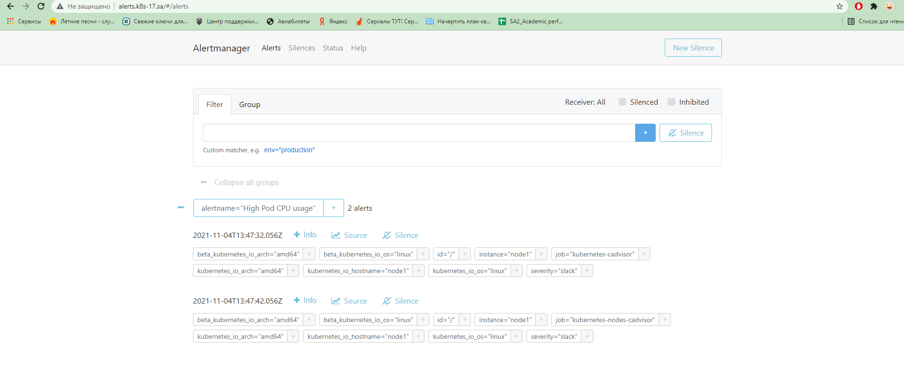

# 15.Technical_and_service_monitoring
## Change slack URL for flux
```bash
# remove old
kubectl -n flux-system  delete secret slack-url

# add new
kubectl -n flux-system create secret generic slack-url \
> --from-literal=address=https://hooks.slack.com/services/XXX
```
## Slack notification



## Grafana



## Prometheus


## Alertmanager


#
## Everything begins with choice
