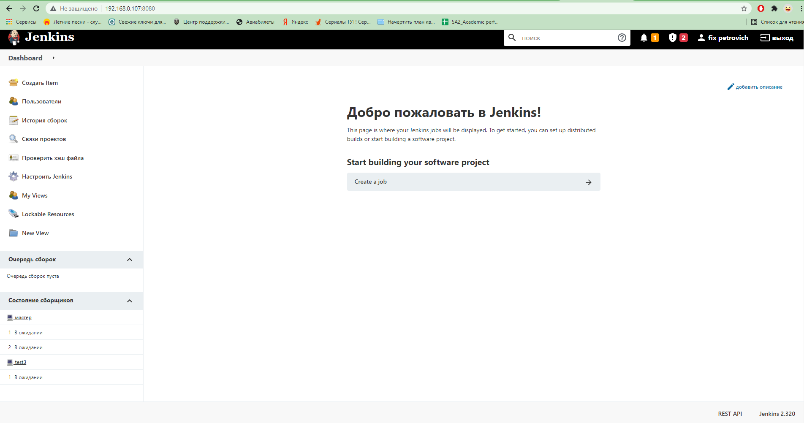
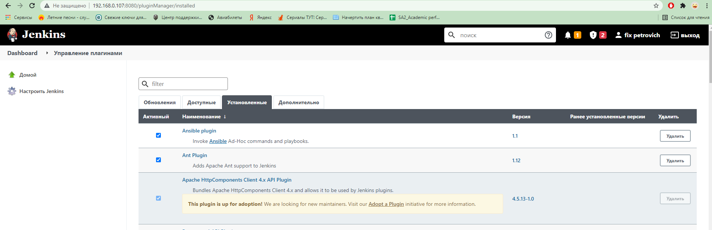
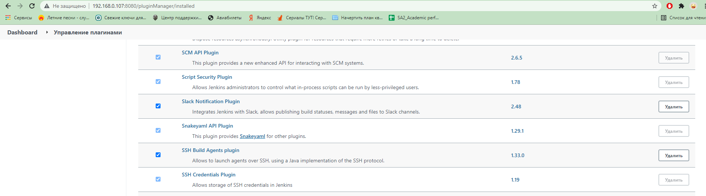

# 16.Jenkins.Start
## Screenshots
### Jenkins deployed



### Jenkins restricted user


### Installed plugins: Ansible, slack notification



## Setting up NGINX
```bash
yum install nginx
usermod -aG jenkins nginx
nano /etc/nginx/nginx.conf 
mkdir /var/log/nginx/jenkins/
systemctl restart nginx.service
semodule -i mynginx.pp
cat /var/log/audit/audit.log | grep nginx | grep denied | audit2allow -M mynginx
nano /etc/sysconfig/jenkins #JENKINS_LISTEN_ADDRESS
systemctl restart jenkins.service
```


