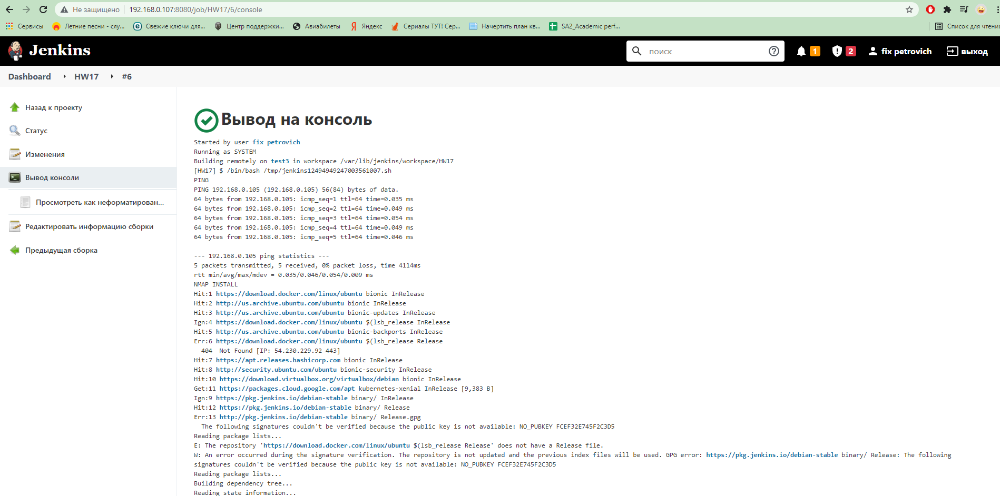

# 17.Jenkins.Routine
## Screenshots
### Jenkins Console output (short)



### Console output (full)
``` bash
Started by user fix petrovich
Running as SYSTEM
Building remotely on test3 in workspace /var/lib/jenkins/workspace/HW17
[HW17] $ /bin/bash /tmp/jenkins12494949247003561007.sh
PING
PING 192.168.0.105 (192.168.0.105) 56(84) bytes of data.
64 bytes from 192.168.0.105: icmp_seq=1 ttl=64 time=0.035 ms
64 bytes from 192.168.0.105: icmp_seq=2 ttl=64 time=0.049 ms
64 bytes from 192.168.0.105: icmp_seq=3 ttl=64 time=0.054 ms
64 bytes from 192.168.0.105: icmp_seq=4 ttl=64 time=0.049 ms
64 bytes from 192.168.0.105: icmp_seq=5 ttl=64 time=0.046 ms

--- 192.168.0.105 ping statistics ---
5 packets transmitted, 5 received, 0% packet loss, time 4114ms
rtt min/avg/max/mdev = 0.035/0.046/0.054/0.009 ms
NMAP INSTALL
Hit:1 https://download.docker.com/linux/ubuntu bionic InRelease
Hit:2 http://us.archive.ubuntu.com/ubuntu bionic InRelease
Hit:3 http://us.archive.ubuntu.com/ubuntu bionic-updates InRelease
Ign:4 https://download.docker.com/linux/ubuntu $(lsb_release InRelease
Hit:5 http://us.archive.ubuntu.com/ubuntu bionic-backports InRelease
Err:6 https://download.docker.com/linux/ubuntu $(lsb_release Release
  404  Not Found [IP: 54.230.229.92 443]
Hit:7 https://apt.releases.hashicorp.com bionic InRelease
Hit:8 http://security.ubuntu.com/ubuntu bionic-security InRelease
Hit:10 https://download.virtualbox.org/virtualbox/debian bionic InRelease
Get:11 https://packages.cloud.google.com/apt kubernetes-xenial InRelease [9,383 B]
Ign:9 https://pkg.jenkins.io/debian-stable binary/ InRelease
Hit:12 https://pkg.jenkins.io/debian-stable binary/ Release
Err:13 http://pkg.jenkins.io/debian-stable binary/ Release.gpg
  The following signatures couldn't be verified because the public key is not available: NO_PUBKEY FCEF32E745F2C3D5
Reading package lists...
E: The repository 'https://download.docker.com/linux/ubuntu $(lsb_release Release' does not have a Release file.
W: An error occurred during the signature verification. The repository is not updated and the previous index files will be used. GPG error: https://pkg.jenkins.io/debian-stable binary/ Release: The following signatures couldn't be verified because the public key is not available: NO_PUBKEY FCEF32E745F2C3D5
Reading package lists...
Building dependency tree...
Reading state information...
The following additional packages will be installed:
  libblas3 liblinear3 liblua5.3-0
Suggested packages:
  liblinear-tools liblinear-dev ndiff
The following NEW packages will be installed:
  libblas3 liblinear3 liblua5.3-0 nmap
0 upgraded, 4 newly installed, 0 to remove and 39 not upgraded.
Need to get 5,467 kB of archives.
After this operation, 25.0 MB of additional disk space will be used.
Get:1 http://us.archive.ubuntu.com/ubuntu bionic/main amd64 libblas3 amd64 3.7.1-4ubuntu1 [140 kB]
Get:2 http://us.archive.ubuntu.com/ubuntu bionic/main amd64 liblinear3 amd64 2.1.0+dfsg-2 [39.3 kB]
Get:3 http://us.archive.ubuntu.com/ubuntu bionic-updates/main amd64 liblua5.3-0 amd64 5.3.3-1ubuntu0.18.04.1 [115 kB]
Get:4 http://us.archive.ubuntu.com/ubuntu bionic/main amd64 nmap amd64 7.60-1ubuntu5 [5,174 kB]
debconf: unable to initialize frontend: Dialog
debconf: (Dialog frontend will not work on a dumb terminal, an emacs shell buffer, or without a controlling terminal.)
debconf: falling back to frontend: Readline
debconf: unable to initialize frontend: Readline
debconf: (This frontend requires a controlling tty.)
debconf: falling back to frontend: Teletype
dpkg-preconfigure: unable to re-open stdin: 
Fetched 5,467 kB in 2s (2,296 kB/s)
Selecting previously unselected package libblas3:amd64.
(Reading database ... 
(Reading database ... 5%
(Reading database ... 10%
(Reading database ... 15%
(Reading database ... 20%
(Reading database ... 25%
(Reading database ... 30%
(Reading database ... 35%
(Reading database ... 40%
(Reading database ... 45%
(Reading database ... 50%
(Reading database ... 55%
(Reading database ... 60%
(Reading database ... 65%
(Reading database ... 70%
(Reading database ... 75%
(Reading database ... 80%
(Reading database ... 85%
(Reading database ... 90%
(Reading database ... 95%
(Reading database ... 100%
(Reading database ... 143917 files and directories currently installed.)
Preparing to unpack .../libblas3_3.7.1-4ubuntu1_amd64.deb ...
Unpacking libblas3:amd64 (3.7.1-4ubuntu1) ...
Selecting previously unselected package liblinear3:amd64.
Preparing to unpack .../liblinear3_2.1.0+dfsg-2_amd64.deb ...
Unpacking liblinear3:amd64 (2.1.0+dfsg-2) ...
Selecting previously unselected package liblua5.3-0:amd64.
Preparing to unpack .../liblua5.3-0_5.3.3-1ubuntu0.18.04.1_amd64.deb ...
Unpacking liblua5.3-0:amd64 (5.3.3-1ubuntu0.18.04.1) ...
Selecting previously unselected package nmap.
Preparing to unpack .../nmap_7.60-1ubuntu5_amd64.deb ...
Unpacking nmap (7.60-1ubuntu5) ...
Setting up libblas3:amd64 (3.7.1-4ubuntu1) ...
update-alternatives: using /usr/lib/x86_64-linux-gnu/blas/libblas.so.3 to provide /usr/lib/x86_64-linux-gnu/libblas.so.3 (libblas.so.3-x86_64-linux-gnu) in auto mode
Setting up liblinear3:amd64 (2.1.0+dfsg-2) ...
Setting up liblua5.3-0:amd64 (5.3.3-1ubuntu0.18.04.1) ...
Setting up nmap (7.60-1ubuntu5) ...
Processing triggers for man-db (2.8.3-2ubuntu0.1) ...
Processing triggers for libc-bin (2.27-3ubuntu1.4) ...

Nmap version 7.60 ( https://nmap.org )
Platform: x86_64-pc-linux-gnu
Compiled with: liblua-5.3.3 openssl-1.1.0g nmap-libssh2-1.8.0 libz-1.2.8 libpcre-8.39 libpcap-1.8.1 nmap-libdnet-1.12 ipv6
Compiled without:
Available nsock engines: epoll poll select

Starting Nmap 7.60 ( https://nmap.org ) at 2021-11-15 12:33 UTC
Nmap scan report for ubuntu1804.localdomain (192.168.0.105)
Host is up (0.0000080s latency).
Not shown: 938 closed ports, 59 filtered ports
PORT     STATE SERVICE
22/tcp   open  ssh
111/tcp  open  rpcbind
8080/tcp open  http-proxy

Nmap scan report for 192.168.0.107
Host is up (0.00032s latency).
Not shown: 997 closed ports
PORT     STATE SERVICE
22/tcp   open  ssh
111/tcp  open  rpcbind
8080/tcp open  http-proxy
MAC Address: 08:00:27:7D:FA:4D (Oracle VirtualBox virtual NIC)

Nmap done: 2 IP addresses (2 hosts up) scanned in 3.39 seconds
Uninstall nmap from slave

WARNING: apt does not have a stable CLI interface. Use with caution in scripts.

Reading package lists...
Building dependency tree...
Reading state information...
The following packages were automatically installed and are no longer required:
  libblas3 liblinear3 liblua5.3-0
Use 'sudo apt autoremove' to remove them.
The following packages will be REMOVED:
  nmap
0 upgraded, 0 newly installed, 1 to remove and 39 not upgraded.
After this operation, 24.0 MB disk space will be freed.
(Reading database ... 
(Reading database ... 5%
(Reading database ... 10%
(Reading database ... 15%
(Reading database ... 20%
(Reading database ... 25%
(Reading database ... 30%
(Reading database ... 35%
(Reading database ... 40%
(Reading database ... 45%
(Reading database ... 50%
(Reading database ... 55%
(Reading database ... 60%
(Reading database ... 65%
(Reading database ... 70%
(Reading database ... 75%
(Reading database ... 80%
(Reading database ... 85%
(Reading database ... 90%
(Reading database ... 95%
(Reading database ... 100%
(Reading database ... 144749 files and directories currently installed.)
Removing nmap (7.60-1ubuntu5) ...
Processing triggers for man-db (2.8.3-2ubuntu0.1) ...
Finished: SUCCESS
```
## Mission complete!


