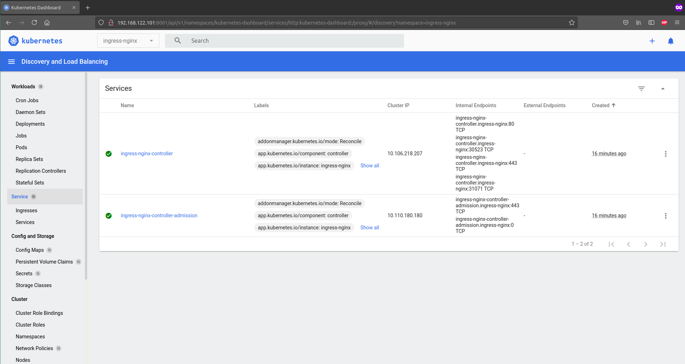

## 11. Kubernetes

### Start minikube with 2 CPUs and 1800 RAM
```bash
minikube start --cpus=2 --memory=1800
minikube status
minikube
type: Control Plane
host: Running
kubelet: Running
apiserver: Running
kubeconfig: Configured
```

### Enabled ingress plugin
```bash
minikube addons enable ingress\
minikube addons list
|-----------------------------|----------|--------------|-----------------------|
|         ADDON NAME          | PROFILE  |    STATUS    |      MAINTAINER       |
|-----------------------------|----------|--------------|-----------------------|
| ambassador                  | minikube | disabled     | unknown (third-party) |
| auto-pause                  | minikube | disabled     | google                |
| csi-hostpath-driver         | minikube | disabled     | kubernetes            |
| dashboard                   | minikube | enabled ✅   | kubernetes            |
| default-storageclass        | minikube | enabled ✅   | kubernetes            |
| efk                         | minikube | disabled     | unknown (third-party) |
| freshpod                    | minikube | disabled     | google                |
| gcp-auth                    | minikube | disabled     | google                |
| gvisor                      | minikube | disabled     | google                |
| helm-tiller                 | minikube | disabled     | unknown (third-party) |
| ingress                     | minikube | enabled ✅   | unknown (third-party) |
| ingress-dns                 | minikube | disabled     | unknown (third-party) |
| istio                       | minikube | disabled     | unknown (third-party) |
| istio-provisioner           | minikube | disabled     | unknown (third-party) |
| kubevirt                    | minikube | disabled     | unknown (third-party) |
| logviewer                   | minikube | disabled     | google                |
| metallb                     | minikube | disabled     | unknown (third-party) |
| metrics-server              | minikube | enabled ✅   | kubernetes            |
| nvidia-driver-installer     | minikube | disabled     | google                |
| nvidia-gpu-device-plugin    | minikube | disabled     | unknown (third-party) |
| olm                         | minikube | disabled     | unknown (third-party) |
| pod-security-policy         | minikube | disabled     | unknown (third-party) |
| registry                    | minikube | disabled     | google                |
| registry-aliases            | minikube | disabled     | unknown (third-party) |
| registry-creds              | minikube | disabled     | unknown (third-party) |
| storage-provisioner         | minikube | enabled ✅   | kubernetes            |
| storage-provisioner-gluster | minikube | disabled     | unknown (third-party) |
| volumesnapshots             | minikube | disabled     | kubernetes            |
|-----------------------------|----------|--------------|-----------------------|
```

Minikube dashboard:


### Installation k8s with helps kubespray
```bash
PLAY RECAP ***********************************************************************************************************
localhost                  : ok=4    changed=0    unreachable=0    failed=0    skipped=0    rescued=0    ignored=0   
node1                      : ok=540  changed=14   unreachable=0    failed=0    skipped=1156 rescued=0    ignored=1   
node2                      : ok=344  changed=5    unreachable=0    failed=0    skipped=638  rescued=0    ignored=1   

Sunday 01 August 2021  14:24:36 +0000 (0:00:00.106)       0:05:57.527 ********* 
=============================================================================== 
kubernetes/preinstall : Update package management cache (APT) ------------------------------------------------ 13.69s
container-engine/docker : ensure docker packages are installed ----------------------------------------------- 12.79s
download : download | Download files / images ----------------------------------------------------------------- 6.23s
kubernetes-apps/ansible : Kubernetes Apps | Start Resources --------------------------------------------------- 6.21s
kubernetes-apps/ansible : Kubernetes Apps | Lay Down CoreDNS templates ---------------------------------------- 5.30s
kubernetes/preinstall : Get current calico cluster version ---------------------------------------------------- 4.37s
download : download | Download files / images ----------------------------------------------------------------- 3.60s
download : download | Download files / images ----------------------------------------------------------------- 3.60s
download : download | Download files / images ----------------------------------------------------------------- 3.50s
download : download | Download files / images ----------------------------------------------------------------- 3.48s
download : download | Download files / images ----------------------------------------------------------------- 3.43s
network_plugin/calico : Calico | Create calico manifests ------------------------------------------------------ 3.33s
download : download_file | Download item ---------------------------------------------------------------------- 3.24s
network_plugin/calico : Start Calico resources ---------------------------------------------------------------- 2.98s
policy_controller/calico : Create calico-kube-controllers manifests ------------------------------------------- 2.24s
policy_controller/calico : Start of Calico kube controllers --------------------------------------------------- 2.04s
download : download | Download files / images ----------------------------------------------------------------- 1.97s
download : download | Download files / images ----------------------------------------------------------------- 1.83s
kubernetes/control-plane : Backup old certs and keys ---------------------------------------------------------- 1.83s
download : download | Download files / images ----------------------------------------------------------------- 1.82s

```
