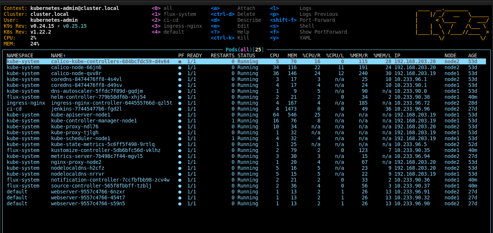
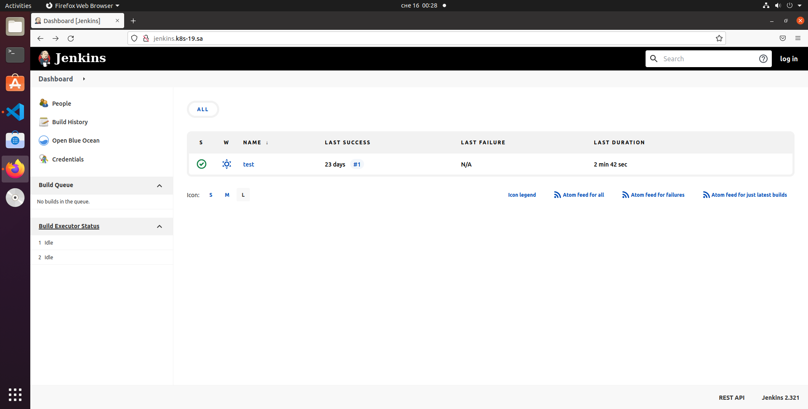

## Docker build and push

```bash
build -t jfrog.it-academy.by/public/jenkins-ci:rgurin .
docker push jjfrog.it-academy.by/public/jenkins-ci:rgurin
```

## Run test on Jenkins
### Output pipeline
```bash
Started by user admin
[Pipeline] Start of Pipeline
[Pipeline] echo
[WARNING] label option is deprecated. To use a static pod template, use the 'inheritFrom' option.
[Pipeline] podTemplate
[Pipeline] {
[Pipeline] node
Created Pod: kubernetes ci-cd/sample-app-344q7-hwww2
[Normal][ci-cd/sample-app-344q7-hwww2][Scheduled] Successfully assigned ci-cd/sample-app-344q7-hwww2 to node1
[Normal][ci-cd/sample-app-344q7-hwww2][Pulling] Pulling image "jfrog.it-academy.by/public/curl:spishchyk"
Still waiting to schedule task
‘sample-app-344q7-hwww2’ is offline
[Normal][ci-cd/sample-app-344q7-hwww2][Pulled] Successfully pulled image "jfrog.it-academy.by/public/curl:spishchyk" in 45.768176317s
[Normal][ci-cd/sample-app-344q7-hwww2][Created] Created container curltest
[Normal][ci-cd/sample-app-344q7-hwww2][Started] Started container curltest
[Normal][ci-cd/sample-app-344q7-hwww2][Pulling] Pulling image "jenkins/inbound-agent:4.3-4-jdk11"
Created Pod: kubernetes ci-cd/sample-app-344q7-lw77f
[Normal][ci-cd/sample-app-344q7-lw77f][Scheduled] Successfully assigned ci-cd/sample-app-344q7-lw77f to node1
[Normal][ci-cd/sample-app-344q7-lw77f][Pulled] Container image "jfrog.it-academy.by/public/curl:spishchyk" already present on machine
[Normal][ci-cd/sample-app-344q7-lw77f][Created] Created container curltest
[Normal][ci-cd/sample-app-344q7-lw77f][Started] Started container curltest
[Normal][ci-cd/sample-app-344q7-lw77f][Pulling] Pulling image "jenkins/inbound-agent:4.3-4-jdk11"
[Normal][ci-cd/sample-app-344q7-lw77f][Pulled] Successfully pulled image "jenkins/inbound-agent:4.3-4-jdk11" in 32.812412172s
[Normal][ci-cd/sample-app-344q7-lw77f][Created] Created container jnlp
[Normal][ci-cd/sample-app-344q7-lw77f][Started] Started container jnlp
Agent sample-app-344q7-lw77f is provisioned from template sample-app-344q7
---
apiVersion: "v1"
kind: "Pod"
metadata:
  annotations:
    buildUrl: "http://jenkins:8080/job/test/1/"
    runUrl: "job/test/1/"
  labels:
    jenkins: "slave"
    jenkins/label-digest: "e63233bec581b1d9effa6b6d4f0bca0985a05b55"
    jenkins/label: "sample-app"
  name: "sample-app-344q7-lw77f"
  namespace: "ci-cd"
spec:
  containers:
  - command:
    - "cat"
    image: "jfrog.it-academy.by/public/curl:spishchyk"
    imagePullPolicy: "IfNotPresent"
    name: "curltest"
    tty: true
    volumeMounts:
    - mountPath: "/home/jenkins/agent"
      name: "workspace-volume"
      readOnly: false
  - env:
    - name: "JENKINS_SECRET"
      value: "********"
    - name: "JENKINS_AGENT_NAME"
      value: "sample-app-344q7-lw77f"
    - name: "JENKINS_NAME"
      value: "sample-app-344q7-lw77f"
    - name: "JENKINS_AGENT_WORKDIR"
      value: "/home/jenkins/agent"
    - name: "JENKINS_URL"
      value: "http://jenkins:8080/"
    image: "jenkins/inbound-agent:4.3-4-jdk11"
    name: "jnlp"
    resources:
      limits: {}
      requests:
        memory: "256Mi"
        cpu: "100m"
    volumeMounts:
    - mountPath: "/home/jenkins/agent"
      name: "workspace-volume"
      readOnly: false
  nodeSelector:
    kubernetes.io/os: "linux"
  restartPolicy: "Always"
  volumes:
  - emptyDir:
      medium: ""
    name: "workspace-volume"

Running on sample-app-344q7-lw77f in /home/jenkins/agent/workspace/test
[Pipeline] {
[Pipeline] stage
[Pipeline] { (Test)
[Pipeline] container
[Pipeline] {
[Pipeline] sh
+ curl -S https://onliner.by
  % Total    % Received % Xferd  Average Speed   Time    Time     Time  Current
                                 Dload  Upload   Total   Spent    Left  Speed

  0     0    0     0    0     0      0      0 --:--:-- --:--:-- --:--:--     0<html>
<head><title>301 Moved Permanently</title></head>
<body>
<center><h1>301 Moved Permanently</h1></center>
<hr><center>nginx</center>
</body>
</html>

100   162  100   162    0     0    861      0 --:--:-- --:--:-- --:--:--   861
[Pipeline] }
[Pipeline] // container
[Pipeline] }
[Pipeline] // stage
[Pipeline] }
[Pipeline] // node
[Pipeline] }
[Pipeline] // podTemplate
[Pipeline] End of Pipeline
Finished: SUCCESS
```

## Deployment screenshots


