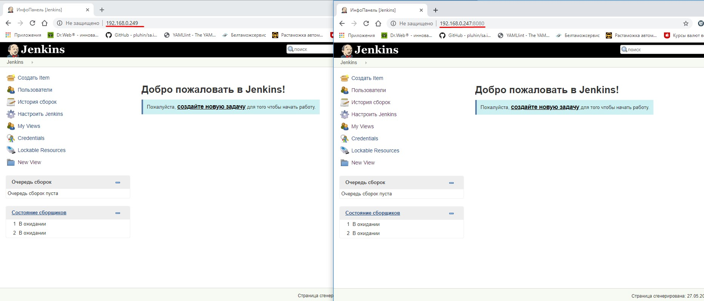

# 08. Jenkins. Start
Jenkins environment

- Created virtual mashine with Jenkins using Vagrant file+ bootstrap.sh (ip: 192.168.0.247:8080)
- Setup Jenkins using Access Key and created user and pwd
- Jenkins was hided behind nginx installed on other VM (ip: 192.168.0.249)
- All files that i used are stored in folder "Files"

Resault of using reverse proxy:

