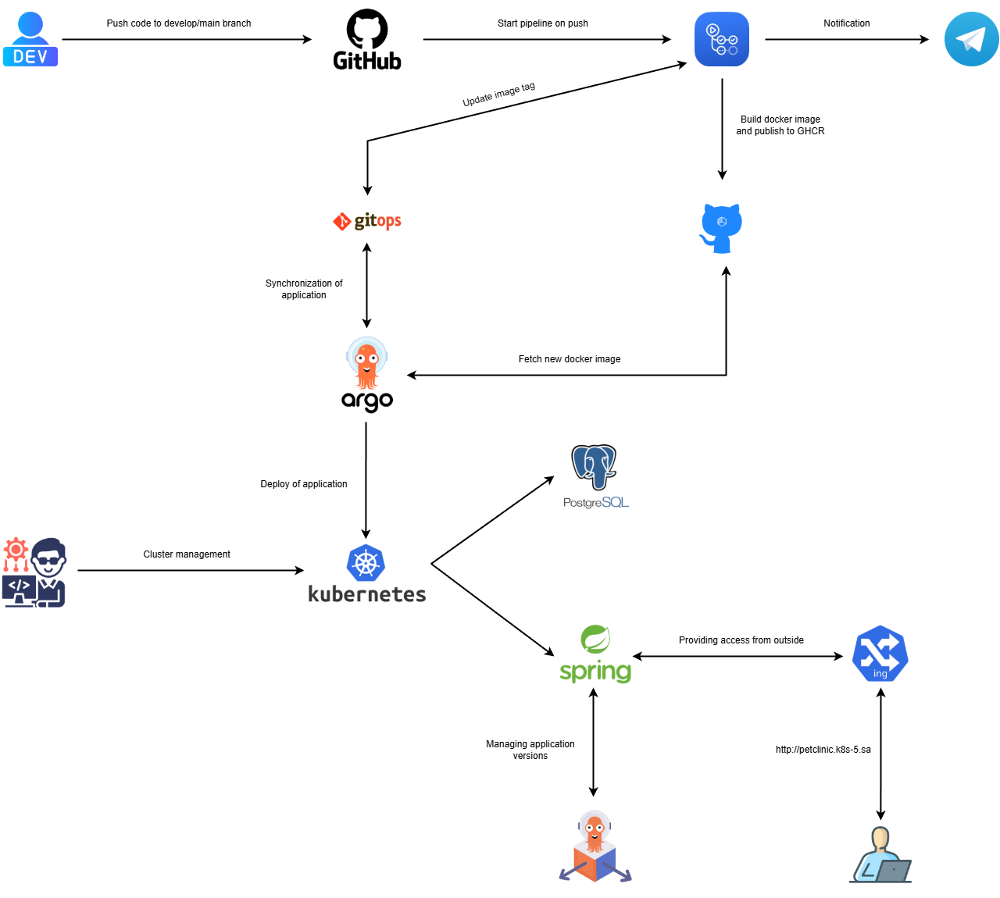

# Project Report: CI/CD for Spring Petclinic application

**Project Reporter**: Roman Gulyako  
**Group Number**: md-sa2-33-25

---

### 1. Application Description
- **Application name:** `Spring Petclinic`
- **Programming language(s):** `Java`
- **Database type:** `PostgreSQL`
- **Repository link:** 
	- [Spring Petclinic Repository](https://github.com/romangulyako/spring-petclinic) 
	- [GitOps Repository](https://github.com/romangulyako/petclinic-infra)`

---
### 2. Pipeline – High-Level Design

---
### 3. Technologies Used
- **Orchestration:** 
	- K8s 
	- ArgoCD
	- Argo Rollouts
    
- **Automation tools:** 
	- GitHub Actions
	- Helm
	- Bash
    
- **CI implementation:** 
	- Trigger type: Git push to develop/main
	- Tests: Unit tests
	- Checks: SpotBugs
	- Notification: Telegram
    
- **Deployment flows:**
    - **New deployment:**
		- Developers push code to `develop` or `main` branch.
		- GitHub Actions pipeline builds the application, runs tests, and builds a Docker image.
		- The Docker image is pushed to GitHub Container Registry (GHCR).
		- GitHub Actions updates the Helm values file in the GitOps repository for the respective environment (dev/prod).
		- ArgoCD detects changes in the GitOps repository and deploys the new version using Argo Rollouts.
	- **Upgrade deployment:**
		- The same process as new deployment, but with updated application code.
- **Rollback strategy:**
    - **Rollback process description:**
	    - Manual rollback using Argo Rollouts CLI.
	- **Trigger conditions:**
		- Manual intervention via CLI or UI.
	- **Implementation details:**
		- Argo Rollouts uses Blue-Green deployment strategy
		- Rollback can be initiated using `kubectl argo rollouts undo <rollout-name> -n <namespace>`

---

### 4. References & Links
**Pipeline code repository:**
- [Spring Petclinic Repository](https://github.com/romangulyako/spring-petclinic)

**GitOps repository:**
- [GitOps Repository](https://github.com/romangulyako/petclinic-infra)

**Additional resource 1:**
- [ArgoCD Documentation](https://argo-cd.readthedocs.io/)

**Additional resource 2:**
- [Argo Rollouts Documentation](https://argoproj.github.io/argo-rollouts/)

**Additional resource 3:**
- [Helm Documentation](https://helm.sh/docs/)