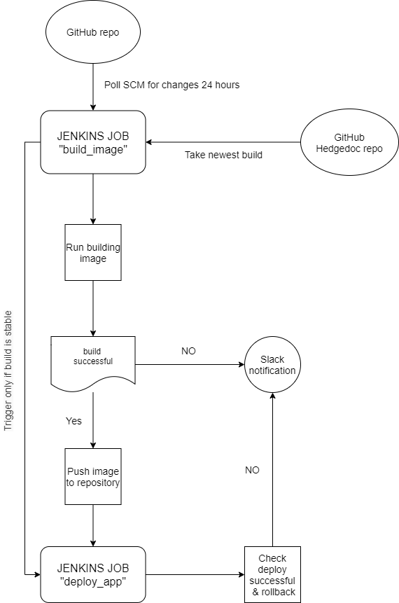

# Project report

Project's reporter: Roman, Lapitski

Group number: md-sa2-17-212

## Description of application for deployment

Name of application :[Hedgedoc](https://github.com/hedgedoc/hedgedoc)

Programming language: java script

DB: MariaDB

## Pipeline. High Level Design

## Technologies

### Orchestration:
Jenkins, Docker, cron

### Automation tools:
Bash, groovy, Docker

### CI description:
Schedule/poll, checks

### Deployment flow:
Jenkins polls project GIT repository every 24 hours. If a new commit is detected, Jenkins runs a job, which downloads new build from git "hedgedoc". Job builds docker image and pushes to public docker registry. Triger runs next job, which deploys new image to the node. If build or push or deploy is failed,then nofitication will be send to Slack.

### Rollback flow description:
Jenkins deploy job checks connection to the web application.If site is unreacheble, previous docker image will be redeployd.

## Links

[Hedgedoc GitHub](https://github.com/hedgedoc/hedgedoc)

[Jenkinsfile & Dockerfiles repo](https://github.com/romalap/hedgedoc)

[DockerHub repo](https://hub.docker.com/repository/docker/devvetton/hedgedoc)

