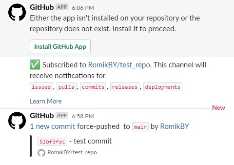

# 03.Git.Hosting

## URLs to my repositories

[GitHub](https://github.com/RomikBY/test_repo)

[GitLab](https://gitlab.com/r.navitsky/gitlab_test)

[BitBucket](https://bitbucket.org/r_navitsky/bitbucket_test)

## Slack integrations (screen)



## Push all script
```
#!/bin/bash 

git push github
git push gitlab
git push bitbucket

```