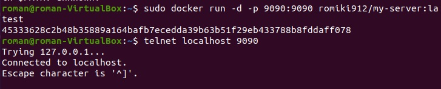

# 09.Docker

## URL to my Docker Hub

[DockerHub](https://hub.docker.com/repository/docker/romiki912/my-server)

## My DockerFile
```
FROM alpine:latest
MAINTAINER Roman Navitsky
RUN apk update && apk add python3 
ADD my-server.py /
CMD [ "python3", "./my-server.py" ]
EXPOSE 9090
```
## My Python PortBinding
```
import http.server
import socketserver

PORT = 9090
Handler = http.server.SimpleHTTPRequestHandler

with socketserver.TCPServer(("", PORT), Handler) as httpd:
    print("serving at port", PORT)
    httpd.serve_forever()
```
## GitHub action file
```
name: Docker build and push
on:
  push:
    branches:
    - main 
jobs:
  build:
    runs-on: ubuntu-latest 
    steps:
      - name: Login to Docker Hub
        uses: docker/login-action@v1
        with:
          username: ${{ secrets.DOCKER_LOGIN }}
          password: ${{ secrets.DOCKER_PASSWORD }}

      - name: Build and push
        uses: docker/build-push-action@v2
        with:
          push: true
          tags: romiki912/my-server:latest
```

## Run and test my Docker image (screen)

