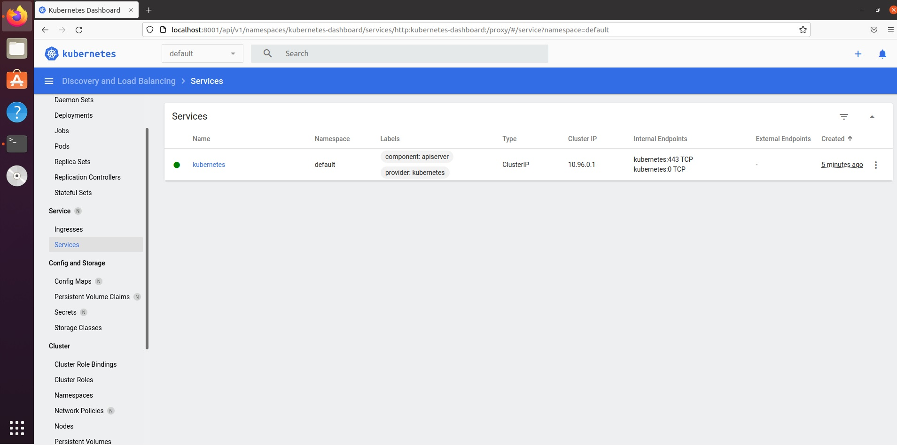
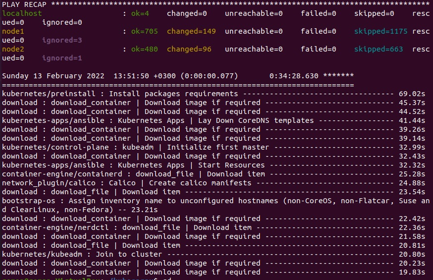

# 10.Kubernetes
## Run Minikube
```
roman@roman-VirtualBox:~$ minikube start
😄  minikube v1.25.1 on Ubuntu 20.04 (vbox/amd64)
✨  Automatically selected the docker driver

🧯  The requested memory allocation of 1977MiB does not leave room for system overhead (total system memory: 1977MiB). You may face stability issues.
💡  Suggestion: Start minikube with less memory allocated: 'minikube start --memory=1977mb'

👍  Starting control plane node minikube in cluster minikube
🚜  Pulling base image ...
🔥  Creating docker container (CPUs=2, Memory=1977MB) ...
🐳  Preparing Kubernetes v1.23.1 on Docker 20.10.12 ...
    ▪ kubelet.housekeeping-interval=5m
    ▪ Generating certificates and keys ...
    ▪ Booting up control plane ...
    ▪ Configuring RBAC rules ...
🔎  Verifying Kubernetes components...
    ▪ Using image gcr.io/k8s-minikube/storage-provisioner:v5
🌟  Enabled addons: default-storageclass, storage-provisioner
🏄  Done! kubectl is now configured to use "minikube" cluster and "default" namespace by default

```
## Enable plugin Dashboard
```
roman@roman-VirtualBox:~$ minikube addons enable dashboard
    ▪ Using image kubernetesui/metrics-scraper:v1.0.7
    ▪ Using image kubernetesui/dashboard:v2.3.1
💡  Some dashboard features require the metrics-server addon. To enable all features please run:

	minikube addons enable metrics-server	


🌟  The 'dashboard' addon is enabled
roman@roman-VirtualBox:~$ kubectl proxy --address='0.0.0.0' --disable-filter=true &
[1] 11243
roman@roman-VirtualBox:~$ W0214 23:26:37.838583   11243 proxy.go:175] Request filter disabled, your proxy is vulnerable to XSRF attacks, please be cautious
Starting to serve on [::]:8001
```


## Enable plugin Ingress
```
roman@roman-VirtualBox:~$ minikube addons enable ingress
    ▪ Using image k8s.gcr.io/ingress-nginx/kube-webhook-certgen:v1.1.1
    ▪ Using image k8s.gcr.io/ingress-nginx/controller:v1.1.0
    ▪ Using image k8s.gcr.io/ingress-nginx/kube-webhook-certgen:v1.1.1
🔎  Verifying ingress addon...
🌟  The 'ingress' addon is enabled
```
## Command for run Minikube with diffirent hardware options
```
minikube start --memory 8192 --cpus 2
```
## Final summary of ansible play
```
PLAY RECAP *************************************************************************************
localhost                  : ok=4    changed=0    unreachable=0    failed=0    skipped=0    rescued=0    ignored=0   
node1                      : ok=705  changed=149  unreachable=0    failed=0    skipped=1175 rescued=0    ignored=3   
node2                      : ok=480  changed=96   unreachable=0    failed=0    skipped=663  rescued=0    ignored=1   

Sunday 13 February 2022  13:51:50 +0300 (0:00:00.077)       0:34:28.630 ******* 
=============================================================================== 
kubernetes/preinstall : Install packages requirements ---------------------------------- 69.02s
download : download_container | Download image if required ----------------------------- 45.37s
download : download_container | Download image if required ----------------------------- 44.52s
kubernetes-apps/ansible : Kubernetes Apps | Lay Down CoreDNS templates ----------------- 41.44s
download : download_container | Download image if required ----------------------------- 39.26s
download : download_container | Download image if required ----------------------------- 39.14s
kubernetes/control-plane : kubeadm | Initialize first master --------------------------- 32.99s
download : download_container | Download image if required ----------------------------- 32.43s
kubernetes-apps/ansible : Kubernetes Apps | Start Resources ---------------------------- 32.32s
container-engine/containerd : download_file | Download item ---------------------------- 25.28s
network_plugin/calico : Calico | Create calico manifests ------------------------------- 24.88s
download : download_file | Download item ----------------------------------------------- 23.54s
bootstrap-os : Assign inventory name to unconfigured hostnames (non-CoreOS, non-Flatcar, Suse and ClearLinux, non-Fedora) -- 23.21s
download : download_container | Download image if required ----------------------------- 22.42s
container-engine/nerdctl : download_file | Download item ------------------------------- 22.36s
download : download_container | Download image if required ----------------------------- 21.58s
download : download_file | Download item ----------------------------------------------- 20.81s
kubernetes/kubeadm : Join to cluster --------------------------------------------------- 20.80s
download : download_container | Download image if required ----------------------------- 20.23s
download : download_container | Download image if required ----------------------------- 19.83s
```
