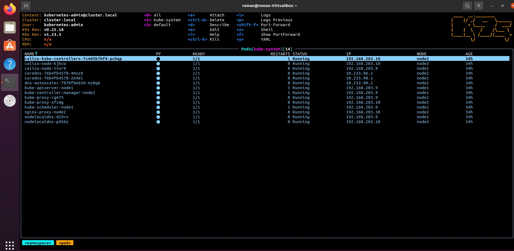

# 11.Kubernetes.Installation
## k9s with pods in kube-system namespace

## Kubectl show contexts
```
roman@roman-VirtualBox:~$ kubectl config get-contexts
CURRENT   NAME          CLUSTER       AUTHINFO           NAMESPACE
          k3s.cluster   k3s.cluster   default            
*         k8s.cluster   k8s.cluster   kubernetes-admin   
```
## K9s show contexts

## Switch to k8s (kubespray) cluster and show nodes
```
roman@roman-VirtualBox:~$ kubectl config use-context k8s.cluster
Switched to context "k8s.cluster".
roman@roman-VirtualBox:~$ kubectl get nodes
NAME    STATUS   ROLES                  AGE    VERSION
node1   Ready    control-plane,master   3d9h   v1.23.3
node2   Ready    <none>                 3d9h   v1.23.3
```
## k8s (Kubespray) Cluster Nodes at k9s
.jpg)
## Switch to k3s contexts and show nodes
```
roman@roman-VirtualBox:~$ kubectl config use-context k3s.cluster
Switched to context "k3s.cluster".
roman@roman-VirtualBox:~$ kubectl get nodes
NAME       STATUS   ROLES                  AGE     VERSION
debian10   Ready    control-plane,master   3h28m   v1.22.6+k3s1
```
## k3s Cluster Nodes at k9s
