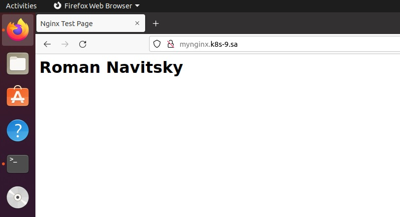

# 12. Kubernetes. First deployment
## My deployment for nginx service with 3 replicas and ingress controller:
```
---
kind: Namespace
apiVersion: v1
metadata:
  name: nginx
  labels:
    name: nginx
---
apiVersion: apps/v1
kind: Deployment
metadata:
  name: mynginx-deployment
  namespace: nginx
  labels:
    app: nginx
spec:
  replicas: 3
  selector:
    matchLabels:
      app: nginx
  template:
    metadata:
      labels:
        app: nginx
    spec:
      containers:
      - name: nginx
        image: nginx:latest
        ports:
        - containerPort: 80
        resources:
          requests:
            cpu: 100m
            memory: 100Mi
          limits:
            cpu: 200m
            memory: 200M
        volumeMounts:
        - name: nginx-index
          mountPath: /usr/share/nginx/html/index.html
          subPath: index.html
      volumes:
      - name: nginx-index
        configMap:
          name: nginx-index
---
apiVersion: v1
kind: ConfigMap
metadata:
  name: nginx-index
  namespace: nginx
data:
  index.html: |
    <html>
    <head>
    <title>Nginx Test Page</title>
    </head>
    <body>
    <h1>Roman Navitsky</h1>
    </body>
    </html>
---
apiVersion: v1
kind: Service
metadata:
  name: nginx-service
  namespace: nginx
  labels:
    run: nginx
spec:
  type: ClusterIP
  ports:
  - port: 80
    protocol: TCP
  selector:
    app: nginx
---
apiVersion: networking.k8s.io/v1
kind: Ingress
metadata:
  name: nginx-ingress
  namespace: nginx
  annotations:
    kubernetes.io/ingress.class: nginx
    nginx.ingress.kubernetes.io/server-alias: "mynginx.k8s-10.sa"
spec:
  rules:
    - host: mynginx.k8s-9.sa
      http:
        paths:
          - path: /
            pathType: Prefix
            backend:
              service:
                name: nginx-service
                port:
                  number: 80

```
## Screen my web page
