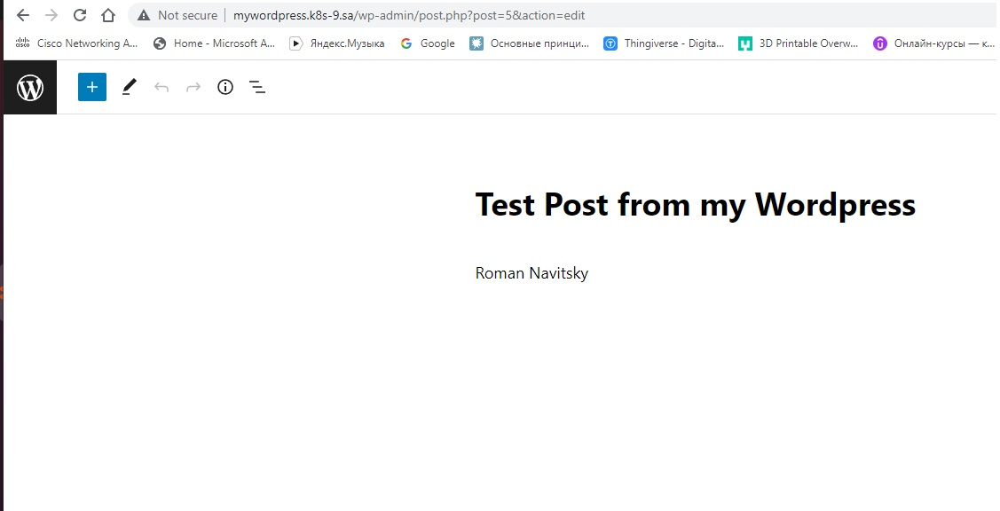
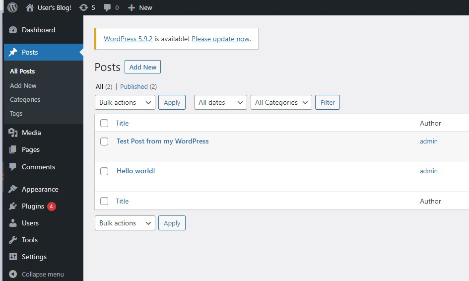
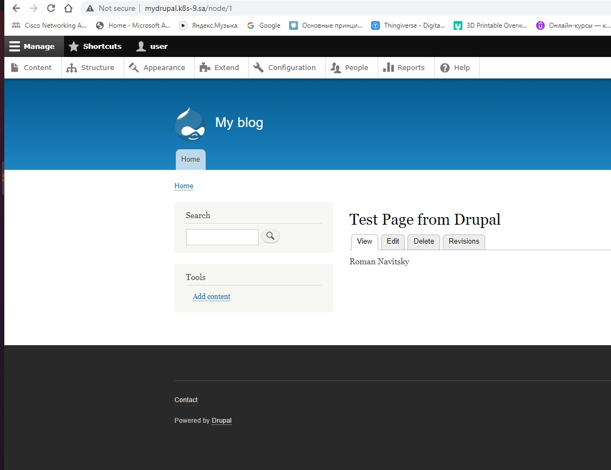

# 13.Kubernetes.Helm
## Install Wordpress
```
helm install mywordpress \
  -n wordpress \
  --set global.storageClass="storageclass" \
  --set wordpressEmail=r.navitsky@gmail.com \
  --set wordpressFirstName=Roman \
  --set wordpressLastName=Navitsky \
  --set service.type=ClusterIP \
  --set ingress.enabled=true \
  --set ingress.hostname=mywordpress.k8s-9.sa \
  --set ingress.ingressClassName="nginx" \
    bitnami/wordpress
```
### Screen my wordpress page



## Instal Drupal
```
helm install mydrupal \
  -n drupal \
  --set global.storageClass="storageclass" \
  --set service.type=ClusterIP \
  --set ingress.enabled=true \
  --set ingress.ingressClassName="nginx" \
  --set ingress.hostname=mydrupal.k8s-9.sa \
    bitnami/drupal
```
### Screen my drupal page
