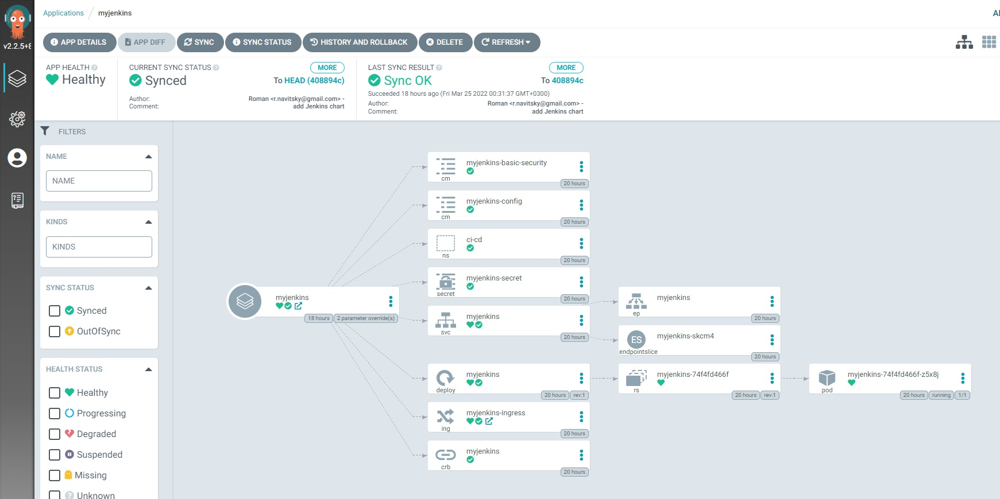
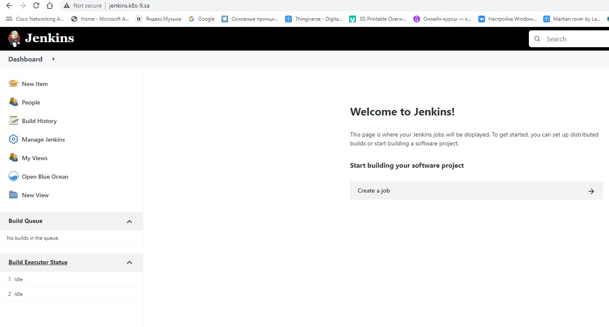

# 14. Kubernetes application deployment

## My Jenkins helm chart for deploying at ArgoCD
[GitHub](https://github.com/RomikBY/ci-test)
## ArgoCD - Jenkins application details

## ArgoCD - Jenkins application manifest
```
project: default
source:
  repoURL: 'https://github.com/RomikBY/ci-test.git'
  path: ./
  targetRevision: HEAD
  helm:
    parameters:
      - name: ingress.host
        value: myjenkins.k8s-9.sa
      - name: ingress.host-allias
        value: myjenkins.k8s-10.sa
destination:
  server: 'https://kubernetes.default.svc'
syncPolicy:
  automated: {}

```
## My Jenkins Dashboard 


