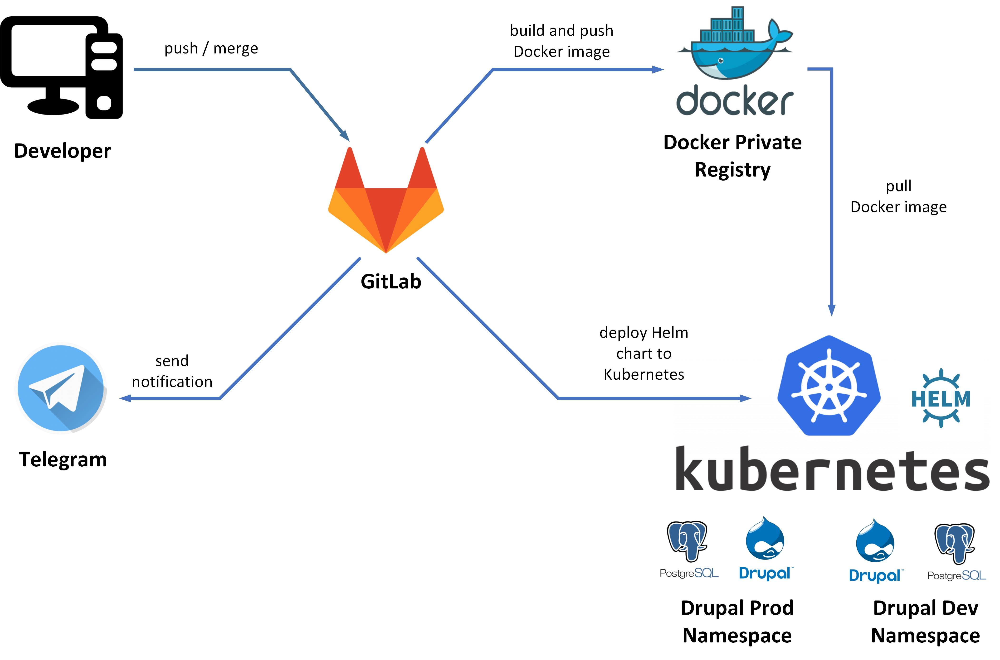
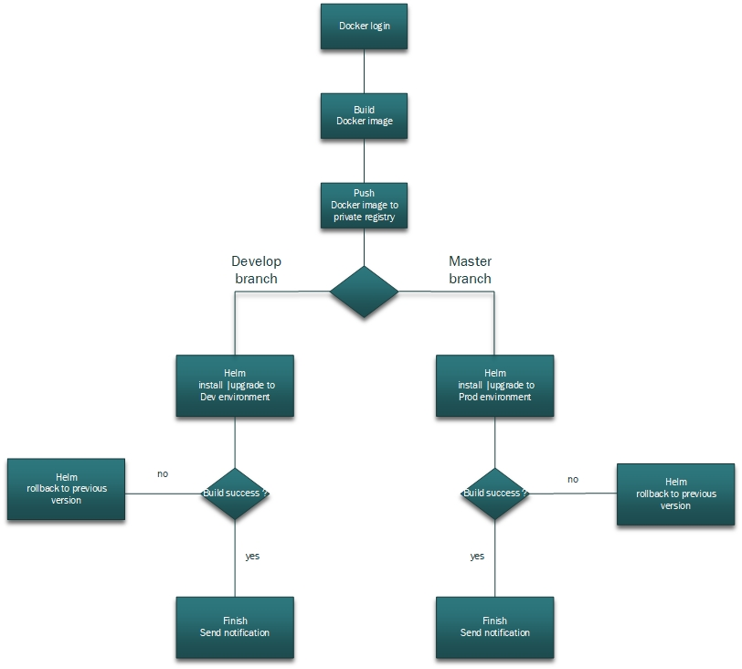

# My project
### **Project's reporter:** Roman Navitsky
### **Group number:** md-sa2-19-22

## Description of application for deployment:
- **Name:** Drupal
- **Application language:** PHP
- **Application Database:** PostgreSQL
- **[GitLab repository](https://gitlab.com/r.navitsky/my_project)**

## Project scheme:

## Technologies which was used in project:
- **Orchestration:** Kubernetes
- **Automation tools:** GitLab CI
- **Container:** Docker
- **SCM:** GitLab
- **Notification:** Telegram

## Pipeline scheme:
