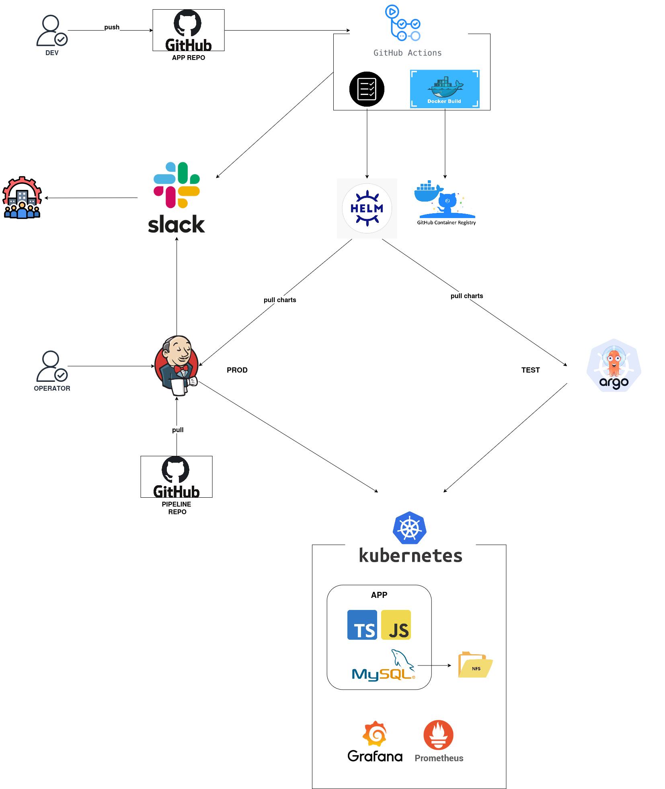
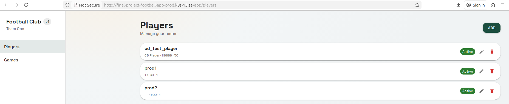
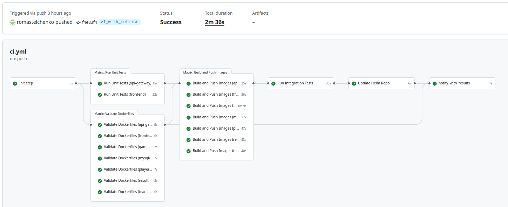
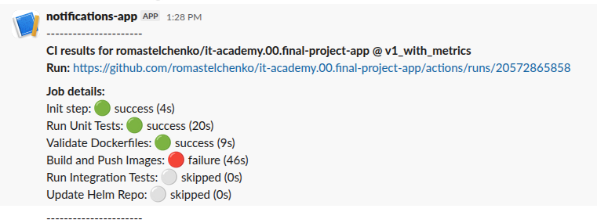
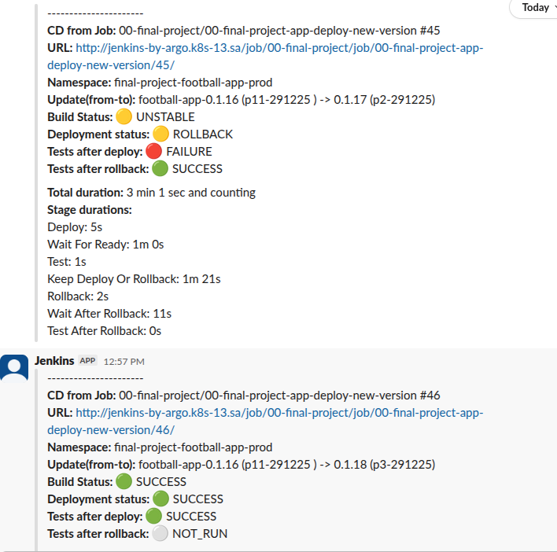
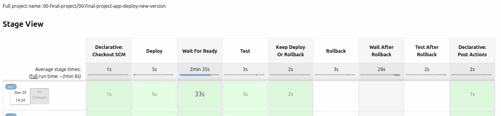
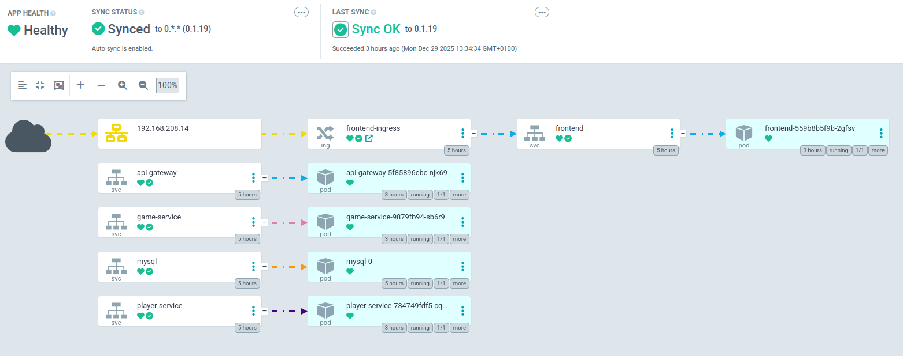

## Project Report

**Project Reporter:** Roman Stelchenko

**Group Number:** md-sa2-33-25

### 1. Application Description

* **Application name:** Football APP
* **Application description:** Football app for managing players, games, teams, and results. Includes a frontend UI, API gateway, and backend services with MySQL storage.
* **Programming language(s):** TypeScript/JavaScript
* **Database type:** MySQL 8.0
* **Application repository:** [romastelchenko/it-academy.00.final-project-app](https://github.com/romastelchenko/it-academy.00.final-project-app)

### 2. Pipeline – High-Level Design

### 3. Technologies Used

* **Orchestration:** Kubernetes, GitHub Actions, Jenkins , ArgoCD
* **Automation tools:** Bash, Docker, Docker Compose, Helm
* **CI implementation:**
  * GitHub Actions
  * Triggers: push/PR
  * Unit tests via matrix
  * Dockerfiles lint via hadolint matrix
  * Image build/push via matrix on tagged commits
  * Smoke tests via docker compose + bash script (integration tests)
  * Helm chart update/publish
  * Slack notification with job results

* **Deployment flows (Jenkins)**
  * **New deployment:** Launched manually in Jenkins. The pipeline runs helm upgrade --install against footbal-app-by-helm in HELM_NAMESPACE, creating the namespace if needed and optionally applying HELM_CHART_VERSION and HELM_SET_OVERRIDES from Job Params.
  * **Upgrade deployment:** Launched manually in Jenkins. The same helm upgrade --install path is used; the current chart/app versions are read from helm history, and the desired versions come from the requested chart version or the latest from the repo before
    upgrade.
  * **After deploy:** Job waits for rollout readiness across deployments/statefulsets/daemonsets, then runs smoke tests

* **Rollback strategy (Jenkins)**
  * **Rollback process description:** on failed tests, the pipeline prompts to keep or rollback; if rollback is selected, it computes the previous Helm revision and runs helm rollback, then waits for readiness and re-runs smoke tests
  * **Trigger conditions:** smoke tests fail and the operator chooses rollback; rollback is skipped if no previous revision exists
  * **Implementation details:** uses helm history to find current/previous revision, executes helm rollback <release> <prev_rev>, then runs the same readiness wait and smoke tests; Slack notifications are sent for the decision and final status summary.

* **Deployment and Rollback (ArgoCD)**
  * **Implementation details:** In addition, the Argo SD application has been deployed for testing, which is configured to automatically sync with the Helm repository and deploy the application to the test environment/namespace. Rollback must be performed manually from ArgoCD if necessary.

### 4. References & Links

Repo with application and github action: [romastelchenko/it-academy.00.final-project-app](https://github.com/romastelchenko/it-academy.00.final-project-app)

Repo with helm charts: [romastelchenko/it-academy.00.final-project-helm](https://github.com/romastelchenko/it-academy.00.final-project-helm)

Repo with jenkins pipeline: [romastelchenko/it-academy.00.final-project-jenkins](https://github.com/romastelchenko/it-academy.00.final-project-jenkins)

#### App page 

#### Github Action Run

#### CI Notification

#### CD Notification

#### Jenkins Job

#### Argo App

