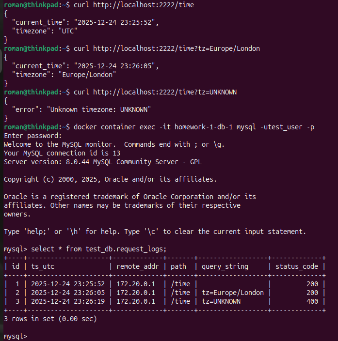
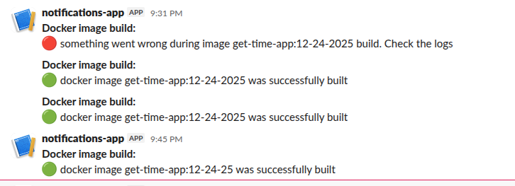

## Homework Assignment 1: Docker Compose for Application Stacks

**Description:** Created docker compose file that launches mysql db service and service with my application get_time_app, which uses this database to record the log(image of the service was created as part of the next task)

**Docker compose file:** [homework-1/docker-compose.yml](homework-1/docker-compose.yml)

#### Check of access to the application and data stored in DB

## Homework Assignment 2: Docker build automation (github action)

**Description:** In the frame of this task:
* application get_time_app from the "07. Docker" assignment was extended with a MySQL client libraries
* created multistage Dockerfile for the build
* created GitHub Action that builds docker image, pushes it to GitHub Registry, and sends the build result to Slack.
* for comparison, the image builded with multistage Dockerfile is 275 MB in size, while the image builded with a regular Dockerfile is 496 MB.

**App files:** [homework-2/app](homework-2/app)

**Dockerfile:** [homework-2/app/Dockerfile](homework-2/app/Dockerfile)

**Github action file:** [homework-2/workflows/build_docker_image.yaml](homework-2/workflows/build_docker_image.yaml)

**Repo with github action run:** [romastelchenko/it-academy.08-docker-docker-compose/actions/runs/20493606128](https://github.com/romastelchenko/it-academy.08-docker-docker-compose/actions/runs/20493606128)

#### Slack notification with build result

