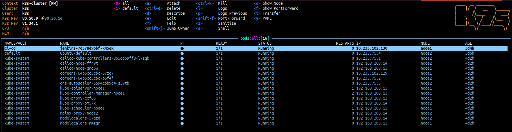
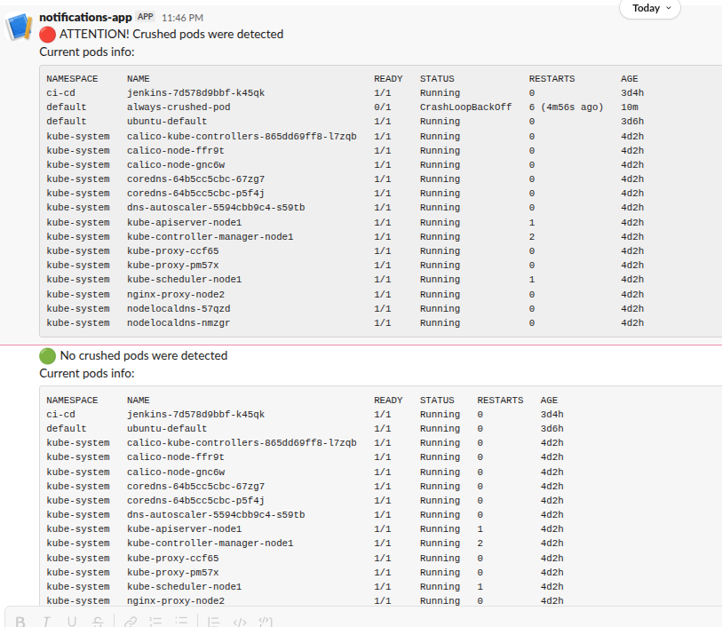

## Homework Assignment 1. K8s Installation

## K9S screenshot

## Gitub Action

Github action workflow file: *check_pods_status.yml*

[Repo with github action runs romastelchenko/it-academy.10-kubernetes-ws](https://github.com/romastelchenko/it-academy.10-kubernetes-ws)

Slack notification screenshot

