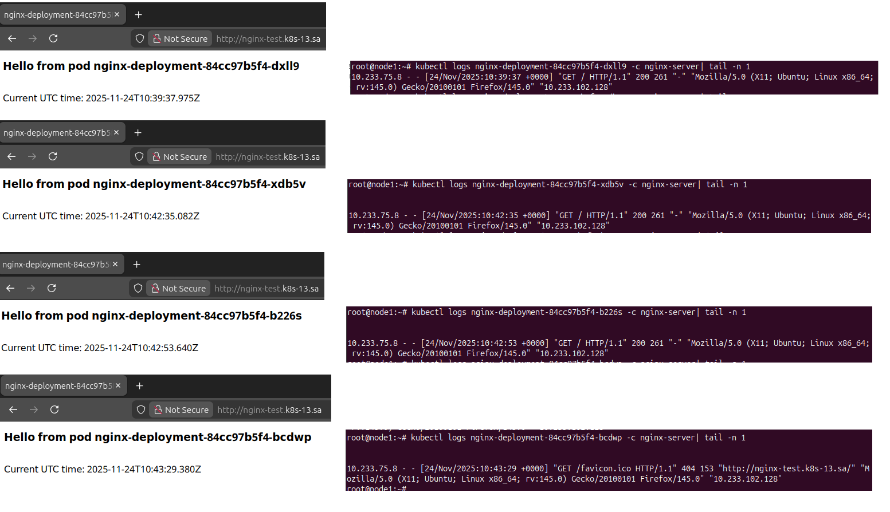

## Homework Assignment 1. Config maps and secrets
Nginx manifest file: *nginx_deployment.yml*

Secret manifest file: *sealed_secret_ssh_keys_pair.yaml*

Descripiton: For each nginx pod: 
* index.html is created with the name of this pod and the current time (using initContainers and ConfigMap)
* /root/.ssh is mounted with a pair of keys from sealed secret-ssh-keys-pair 

Sealed secret configuration:
```
#Installation
kubectl apply -f https://github.com/bitnami-labs/sealed-secrets/releases/download/v0.33.1/controller.yaml
curl -OL "https://github.com/bitnami-labs/sealed-secrets/releases/download/v0.33.1/kubeseal-0.33.1-linux-amd64.tar.gz"
tar -xvzf kubeseal-0.33.1-linux-amd64.tar.gz kubeseal
sudo install -m 755 kubeseal /usr/local/bin/kubeseal

#SSH keys generation
ssh-keygen -t rsa -b 4096 -f keys/fake_key -N ""

#Sealed secret generation for ssh keys pair
kubectl create secret generic secret-ssh-keys-pair \
  --from-file=fake_key=keys/fake_key \
  --from-file=fake_key.pub=keys/fake_key.pub \
  --dry-run=client \
  -o yaml \
| kubeseal --format yaml > sealed_secret_ssh_keys_pair.yaml
```

Validation results for index.html:



Validation results for secrets:
```
MD5 sum of original fake_key:
$ md5sum keys/fake_key
abe817f82bd5d54cd2bc7df89e46cbe1  keys/fake_key

MD5 sum of pod keys:
$ pods=$(kubectl get pods -l app=nginx-test -o custom-columns=POD_NAME:.metadata.name --no-headers)
$ for pod in $pods; do echo "Pod: $pod;  key md5sum: $(kubectl exec "$pod" -c nginx-server -- sh -c "md5sum /root/.ssh/fake_key")"; done

Pod: nginx-deployment-84cc97b5f4-b226s;  key md5sum: abe817f82bd5d54cd2bc7df89e46cbe1  /root/.ssh/fake_key
Pod: nginx-deployment-84cc97b5f4-bcdwp;  key md5sum: abe817f82bd5d54cd2bc7df89e46cbe1  /root/.ssh/fake_key
Pod: nginx-deployment-84cc97b5f4-dxll9;  key md5sum: abe817f82bd5d54cd2bc7df89e46cbe1  /root/.ssh/fake_key
Pod: nginx-deployment-84cc97b5f4-xdb5v;  key md5sum: abe817f82bd5d54cd2bc7df89e46cbe1  /root/.ssh/fake_key
```
