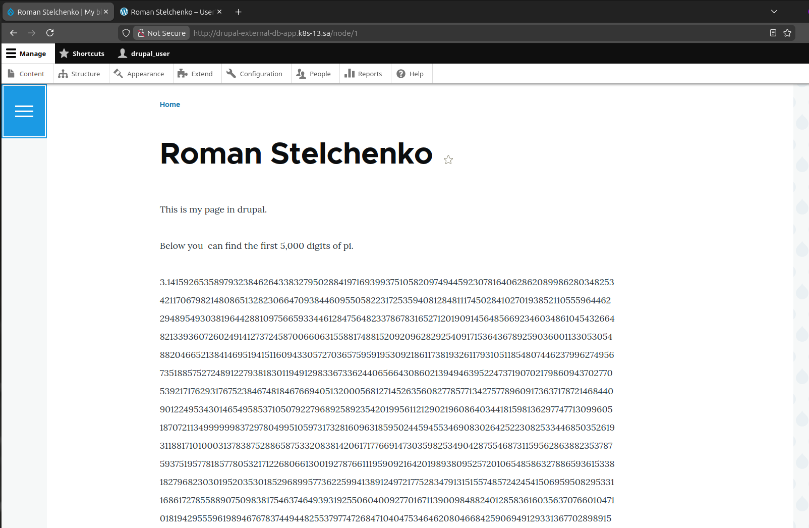
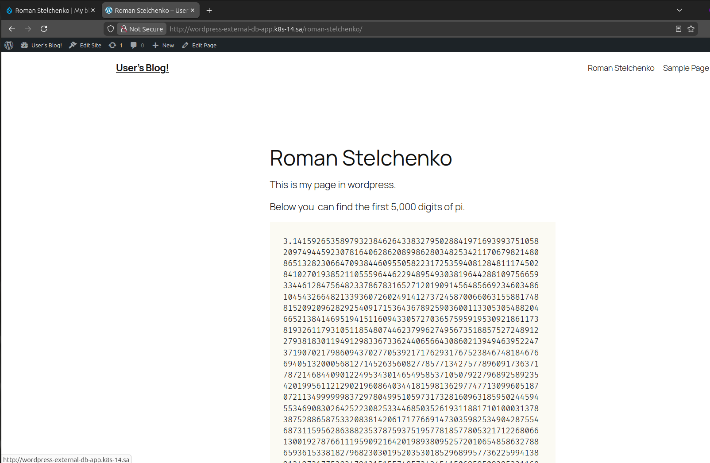

## Homework Assignment 1. Application deployment by Helm

Description: Deploy of drupal and wordpress using helm charts. With mariadb and external db on host 

Helm values directory: *values* 

Install drupal app with maria db:
```
helm install drupal-app \
  -f values/drupal_mariadb.yml \
  oci://registry-1.docker.io/bitnamicharts/drupal -n default
```

Install drupal app with external db:
```
helm install drupal-external-db-app \
  -f values/drupal_external_db.yml \
  oci://registry-1.docker.io/bitnamicharts/drupal -n default
```

Install wordpress app with maria db:
```
helm install wordpress-app \
  -f values/wordpress_mariadb.yml \
  oci://registry-1.docker.io/bitnamicharts/wordpress -n default
```

Install wordpress app with external db:
```
helm install wordpress-external-db-app \
  -f values/wordpress_external_db.yml \
  oci://registry-1.docker.io/bitnamicharts/wordpress -n default
```

Note: Before installation of drupal/wordpress with an external database, you must create a user and database for applications:
```
CREATE DATABASE drupal_db CHARACTER SET utf8mb4 COLLATE utf8mb4_unicode_ci;
CREATE USER 'drupal_user'@'%' IDENTIFIED BY 'drupal_pass';
GRANT ALL PRIVILEGES ON drupal_db.* TO 'drupal_user'@'%';

CREATE USER 'wordpress_user'@'%' IDENTIFIED BY 'wordpress_pass';
CREATE DATABASE wordpress_db CHARACTER SET utf8mb4 COLLATE utf8mb4_unicode_ci;
GRANT ALL PRIVILEGES ON wordpress_db.* TO 'wordpress_user'@'%';

FLUSH PRIVILEGES;
```

Drupal app screenshot:



Wordpress app screenshot:


