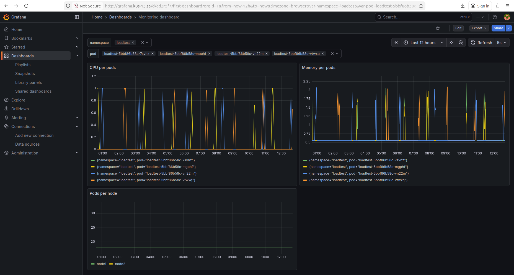
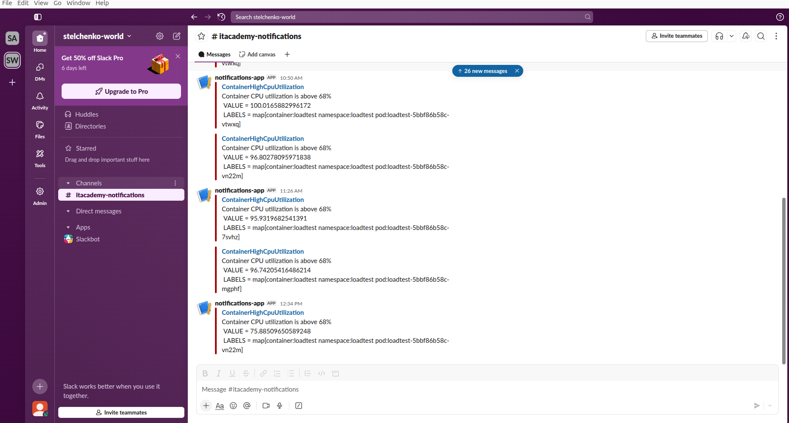

## Homework Assignment 1: Deploy and setup Prometheus Alertmanager && Homework Assignment 2: Use Grafana to display load of pods

Prometheus manifest file: [manifests/prometheus.yaml](manifests/prometheus.yaml)

Alertmanager manifest file: [manifests/alertmanager.yaml](manifests/alertmanager.yaml)

Grafana manifest file: [manifests/grafana.yaml](manifests/grafana.yaml)

Load pod manifest file(4 replicas with random bursts and sleeps): [manifests/load_pod.yaml](manifests/load_pod.yaml) 

Prometheus rule for CPU overload per pods:
```
  prometheus.rules: |-
    groups:
    - name: devopscube demo alert
      rules:
      - alert: ContainerHighCpuUtilization
        expr: (sum(rate(container_cpu_usage_seconds_total{container!=""}[5m])) by (pod, container, namespace) / sum(container_spec_cpu_quota{container!=""}/container_spec_cpu_period{container!=""}) by (pod, container, namespace) * 100) > 68
        for: 2m
        labels:
          severity: slack
        annotations:
          summary: Container High CPU utilization (namespace {{ $labels.namespace }})
          description: "Container CPU utilization is above 68%\n  VALUE = {{ $value }}\n  LABELS = {{ $labels }}"
```

#### Full repo: 
[Repo with monitoring apps romastelchenko/it-academy.15-kubernetes-ci-cd/monitoring](https://github.com/romastelchenko/it-academy.15-kubernetes-ci-cd/tree/main/monitoring)

#### Grafana board screenshot


#### Slack notification screenshot


