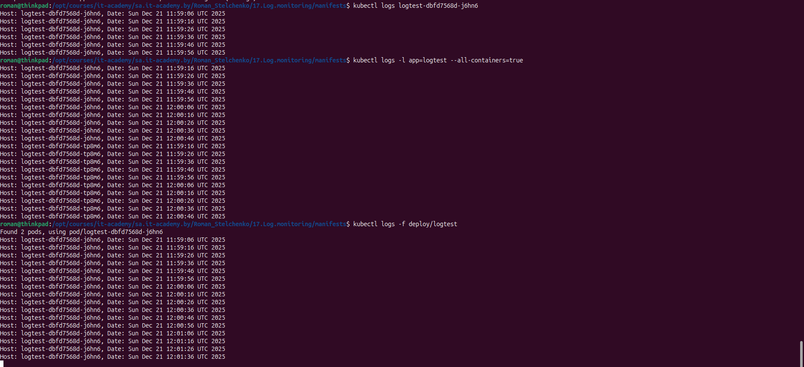
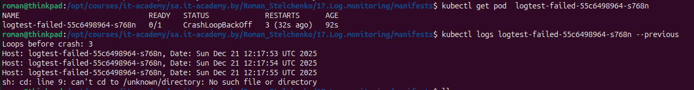
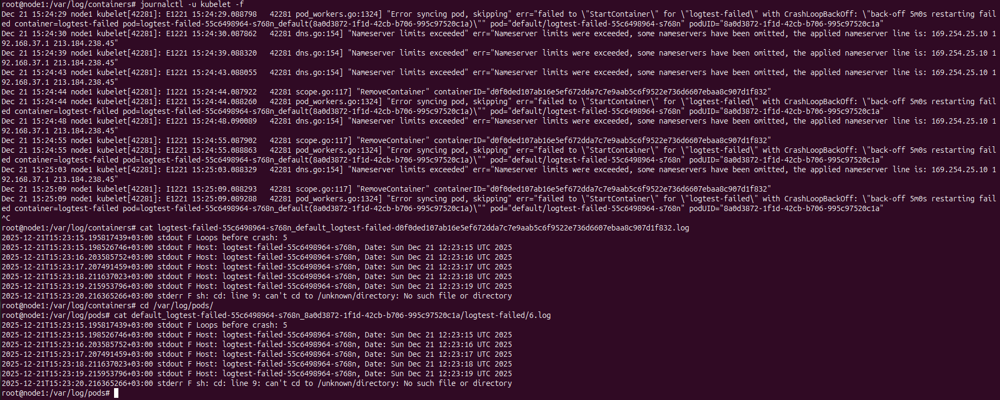

## Homework Assignment 1:

Log test pod manifest file(continuously to stdout): [manifests/log_pod.yaml](manifests/log_pod.yaml) 

Log test pod manifest file(always falls): [manifests/failed_pod.yaml](manifests/failed_pod.yaml)

#### Collect logs with kubectl

#### Logs from a failing Pod

#### Node-level logs

