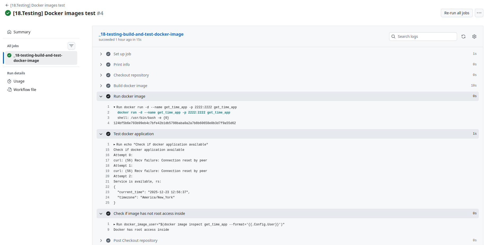
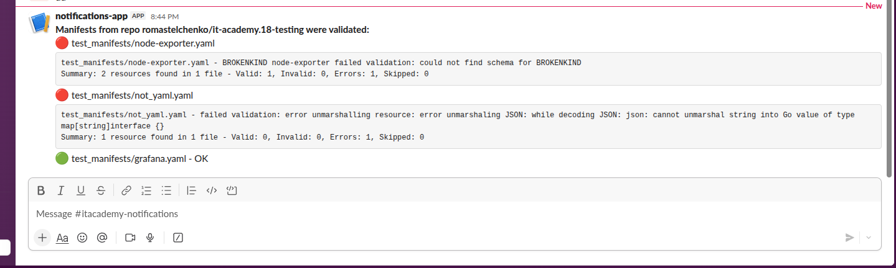

## Homework Assignment 1: Automate Docker images test by github action

**Description:** Added GitHub Action that:
* builds a Docker image from one of the previous tasks
* runs builed image
* sends requests to the running application until the attempt limit expires or a successful response is received
* сhecks whether the image has root access inside

**Github action file:** [workflows/build_and_test_docker_image.yml](workflows/build_and_test_docker_image.yml)

**Repo with github action:** [romastelchenko/it-academy.18-testing/actions/runs/20467930891](https://github.com/romastelchenko/it-academy.18-testing/actions/runs/20467930891)

#### Github action run screenshot

## Homework Assignment 2: Create CI for testing Kubernetes manifests using kubeconform by github action

**Description:** Added GitHub Action that:
* finds all *yaml manifests in the manifests directory
* runs parallel jobs for each manifest found using a matrix strategy
* validates each manifest with kubeconform and adds the validation result to an artifact
* summarizes the results from all artifacts and sends the summary to the slack channel

**Github action file:** [workflows/test_kubernetes_manifests.yml](workflows/test_kubernetes_manifests.yml)

**Repo with github action run:** [romastelchenko/it-academy.18-testing/actions/runs/20470067998](https://github.com/romastelchenko/it-academy.18-testing/actions/runs/20470067998)

#### Github action run screenshot   

#### Slack notifications with report

