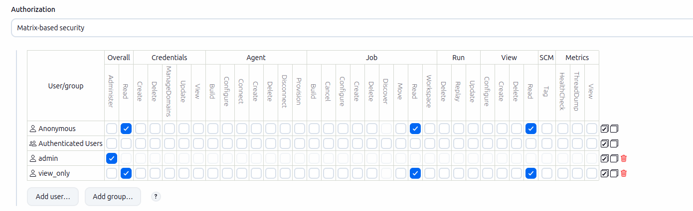
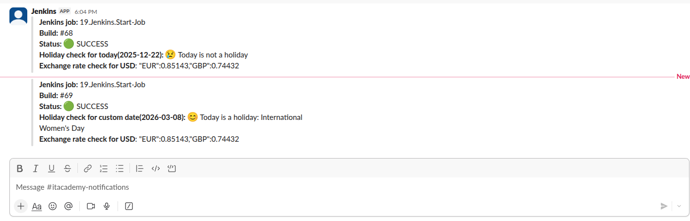

## Homework Assignment 1: Deploy Jenkins

#### Security table

## Homework Assignment 2: Create Job

Job config file: [config.xml](config.xml)

Job link: [http://jenkins-by-argo.k8s-13.sa/job/19.Jenkins.Start-Job/](http://jenkins-by-argo.k8s-13.sa/job/19.Jenkins.Start-Job/)

#### Slack notifications with report

