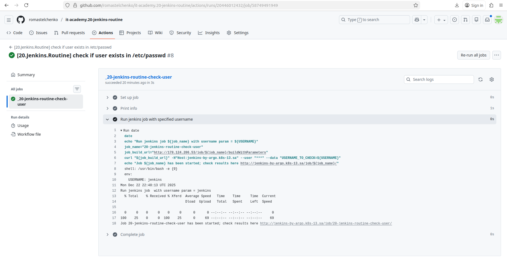
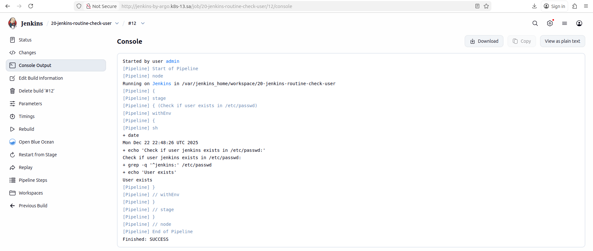
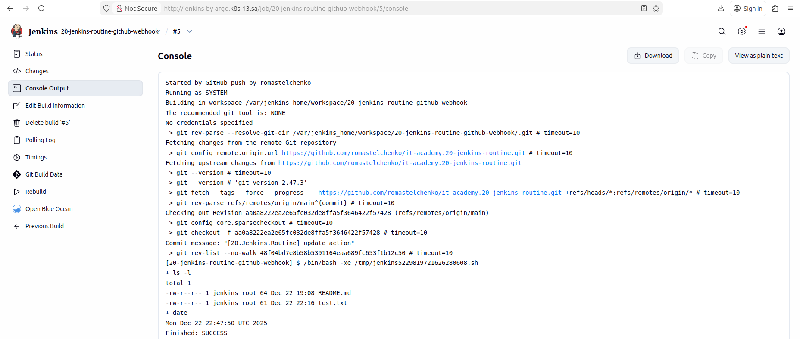

## Homework Assignment 1: Jenkins API

Repo with github action and webhook: [romastelchenko/it-academy.20-jenkins-routine](https://github.com/romastelchenko/it-academy.20-jenkins-routine)

#### Github action run:

#### Jenkins job created by github action:

## Homework Assignment 2: Webhook

#### Jenkins job created by github webhook after push

