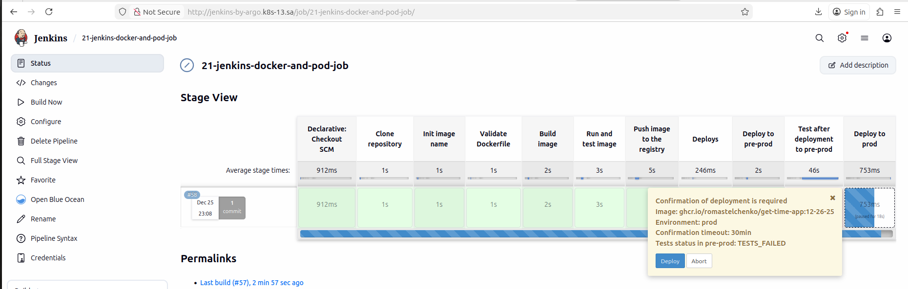
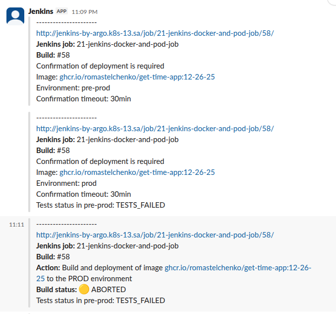
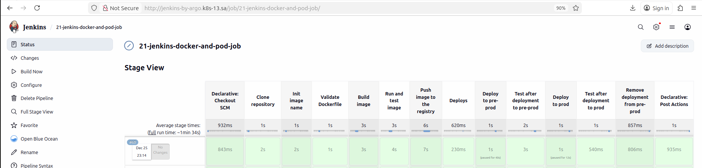
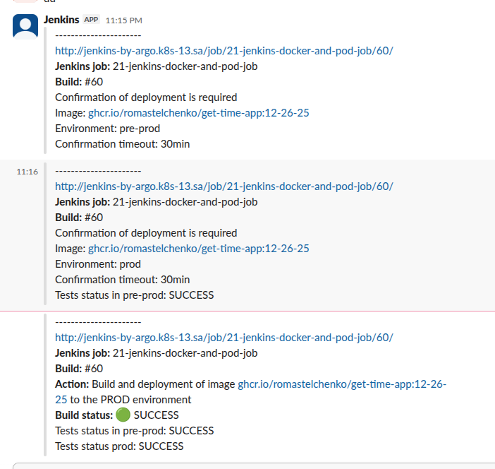
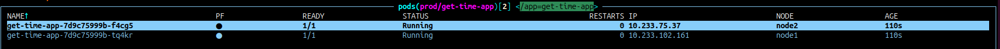

## Homework Assignment 1: 

**Preliminary setup:**
A Jenkins agent node 192.168.208.13 has been added, where:
* kubectl is installed
* docker is installed
* jenkins user is created
* added permissions for docker for jenkins user
* kubernetes configs are copied to the user’s home directory

**Pipeline description:**
A pipeline has been added with the following steps:
* repository checkout
* initialize image name for build
* validate the Dockerfile with hadolint
* build the Docker image, run it, and test it
* push the Docker image to the GitHub registry
* sequentially deploy and test the application with the built image to pre-prod and prod, with manual approval from the Jenkins Web UI
* remove the deployment from pre-prod
* slack notifications with results and manual-approval reminders

**Pipeline file:** [pipeline/Jenkinsfile](pipeline/Jenkinsfile)

**App files:** [docker_app/](docker_app/)

**Kubernetes deploy manifest:** [kubernetes_deploy/app.yaml](kubernetes_deploy/app.yaml)

**Job link**: [http://jenkins-by-argo.k8s-13.sa/job/21-jenkins-docker-and-pod-job/](http://jenkins-by-argo.k8s-13.sa/job/21-jenkins-docker-and-pod-job)

**Working repo with pipeline, manifest and app files:** [romastelchenko/it-academy.21-jenkins-docker-and-pod](https://github.com/romastelchenko/it-academy.21-jenkins-docker-and-pod)

### Flow with failed tests in pre-prod and manually rejected deployment to prod

#### Jenkins manual approve screenshot

#### Slack notifications for rejected deployment

### Flow with successful tests in pre-prod and manually approved deployment to prod.

#### Jenkins full success run screenshot

#### Slack notifications for approved deployment

#### Deployed pods in K8S screenshot

