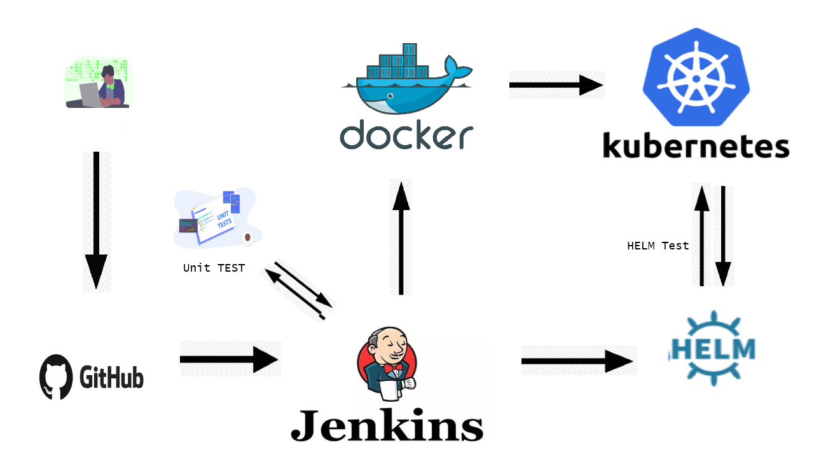

# Project creator: **Siargei, Kulina**

## IT-Academy Group number: **md-sa2-18-21**

## Description of pipeline (incl. app and deployment details)

> Build and pack application for the *Kubernetes* environment

> CI/CD tool used for the build and pack - *Jenkins*

> The application is written in - *Python* using *Django Framework*

> Database: SQLite with persistent storage using NFS

> Expose application via *Nginx Ingress controller*

## Build and deployment pipeline. High level overview

### Technologies used in the project

Container Orchestration and hosting: Kubernetes
CI/CD tools: Jenkins (hook/schedule/poll triggers from SCM)
SCM: git
SCM Hosting: Github
Other tools: Docker, Helm

### Deployment flows short description

Fist deployment application happens with Jenkins pipeline using trigger from SCM (Github). Start build and install (or upgrade) of application from github using GitHub-hook (push) and cron based settings. Jenkins pipeline runs clone of the github repo with a source code of application and related configuration files, runs unit tests, build Docker image with application, pushes it to the Docker Registry, if all steps before successed pipeline starts process of application upgrade in Kubernetes using Helm, last step inscludes helm tests using helm annotations. If all tests are complete, pipeline will send success Slack notification/message, along with if pipeline will fail, we will receive an alert notification/message in Slack.

### Rollback flow description and implementation

If unit test are fail the docker image will not build and pipeline will fail and new release won't build. If Helm test are failed helm will run rollback step which includes rollback of application to the previous helm release. All failed steps will be send to Slack from Jenkins pipeline.

## Links used in the project

- [Links repository of Pipeline](https://github.com/Kulinych/Project)
  - [Jenkinsfile](https://github.com/Kulinych/Project/blob/master/Jenkinsfile)
  - [Dockerfile](https://github.com/Kulinych/Project/blob/master/Dockerfile)
  - [Helm chart](https://github.com/Kulinych/Project/tree/master/helm-chart)
  
- [Django-Todolist application](https://github.com/rtzll/django-todolist)
- [Helm hooks](https://helm.sh/docs/topics/charts_hooks/)
