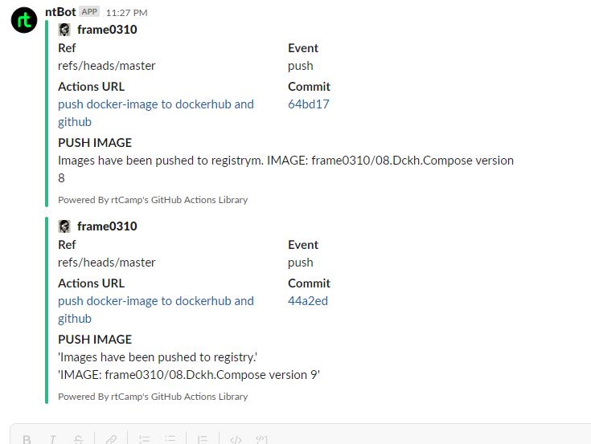

# 08.Docker.Compose

## Workflow
```yaml
name: push docker-image to dockerhub and github

on:
  release:
    types: [published]
  push:
    branches:
      - "master"
jobs:
  build_and_push:
    name: push
    runs-on: ubuntu-latest
    permissions:
      packages: write
      contents: read
    steps:
      - name: checkout repo
        uses: actions/checkout@v3

      - name: Set up Docker Buildx
        uses: docker/setup-buildx-action@v2
        
      - name: Login to Docker Hub
        uses: docker/login-action@v2
        with:
          username: ${{ github.actor }}
          password: ${{ secrets.DCHK_TOKEN }}
          
      - name: Build and push
        uses: docker/build-push-action@v3
        with:
          context: .
          push: true
          tags: frame0310/08.docker-compose:${{ github.run_number }}    

      - name: login on ghcr
        uses: docker/login-action@v2
        with:
          registry: ghcr.io
          username: ${{ github.actor }}
          password: ${{ secrets.CR_TOKEN }}

      - name: build-push image
        uses: docker/build-push-action@v2
        with:
          context: .
          push: true
          tags: ghcr.io/frame0310/08.docker-compose:${{ github.run_number }}

      - name: slack Notification
        uses: rtCamp/action-slack-notify@v2 
        env:
          SLACK_CHANNEL: github_notifications
          SLACK_TITLE: 'PUSH IMAGE'
          SLACK_COLOR: ${{ job.status }}
          LACK_ICON: https://github.com/rtCamp.png?size=48
          SLACK_MESSAGE: |
            'Images have been pushed to registry.'
            'IMAGE: ${{ github.repository }} version ${{ github.run_number }}'
          SLACK_USERNAME: ntBot
          SLACK_WEBHOOK: ${{ secrets.SLACK_WEBHOOK }}
```

## Link to repositories
[docker.io](https://hub.docker.com/repository/docker/frame0310/08.docker-compose/general)

[ghcr.io](https://github.com/users/frame0310/packages/container/package/08.docker-compose)


## Link to GithubAction
[GithubAction](https://github.com/frame0310/08.Dckh.Compose/actions/runs/3905805203)

## Slack notification



## Flask report
```sh
I am FLASK! Hello!
REPOSITORY   TAG        IMAGE ID       CREATED          SIZE
flask        1.0        bd369f64b9b0   30 minutes ago   71.1MB
python       3-alpine   18ccdc39ea28   6 days ago       52.4MB
```